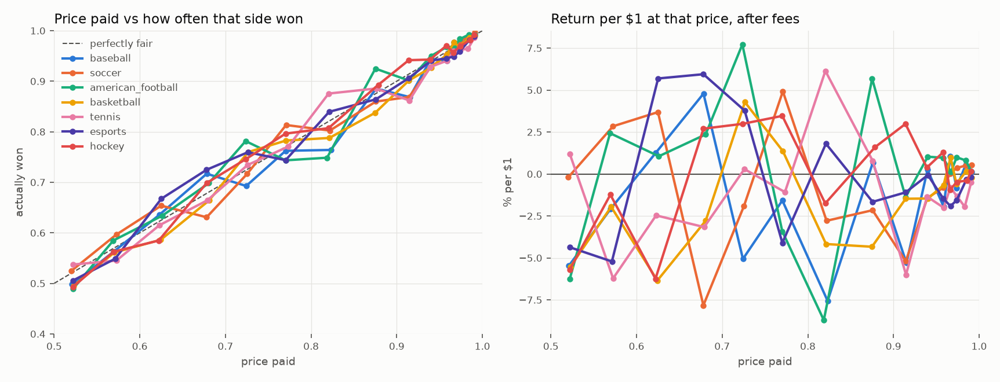

# The breaking point: price vs. reality, by sport

Every taker fill in 17,810 sports markets (35,797,865 fills, 2025-01..2026-09), where the price paid is known and the outcome is known. Markets are selected on PREGAME volume only (>= $25,000), never on total volume, which is outcome-correlated. Voids excluded.

`won_pct` is dollar-weighted: of every $1 spent at that price, how much came back as a winner. `edge_pts` = won_pct - avg_price (positive means the side won more often than it cost). `roi_after_fee` is the return per $1 including the market's actual taker fee, with a 95% CI clustered by game.

## 1. All sports together

| bucket        |   fills |           usd |   avg_price |   won_pct |   edge_pts |   roi_after_fee |   ci_lo |   ci_hi |
|:--------------|--------:|--------------:|------------:|----------:|-----------:|----------------:|--------:|--------:|
| [0.5, 0.55)   | 2995814 | 715756096.000 |       0.521 |     0.508 |     -0.014 |          -0.034 |  -0.078 |   0.006 |
| [0.55, 0.6)   | 2854436 | 722371776.000 |       0.571 |     0.572 |      0.001 |          -0.007 |  -0.053 |   0.037 |
| [0.6, 0.65)   | 2934473 | 809092352.000 |       0.624 |     0.631 |      0.007 |           0.004 |  -0.046 |   0.050 |
| [0.65, 0.7)   | 2185411 | 580585472.000 |       0.679 |     0.665 |     -0.014 |          -0.027 |  -0.080 |   0.023 |
| [0.7, 0.75)   | 1515741 | 420074144.000 |       0.726 |     0.741 |      0.015 |           0.015 |  -0.029 |   0.053 |
| [0.75, 0.8)   | 1664596 | 472320832.000 |       0.771 |     0.782 |      0.011 |           0.010 |  -0.027 |   0.043 |
| [0.8, 0.85)   | 1573961 | 427120448.000 |       0.821 |     0.799 |     -0.022 |          -0.030 |  -0.072 |   0.006 |
| [0.85, 0.9)   | 1533333 | 460542336.000 |       0.875 |     0.866 |     -0.010 |          -0.014 |  -0.045 |   0.012 |
| [0.9, 0.925)  |  518846 | 155679312.000 |       0.914 |     0.886 |     -0.029 |          -0.033 |  -0.077 |   0.001 |
| [0.925, 0.95) |  702943 | 224529312.000 |       0.940 |     0.933 |     -0.007 |          -0.008 |  -0.027 |   0.008 |
| [0.95, 0.96)  |  214243 |  74053280.000 |       0.958 |     0.951 |     -0.007 |          -0.008 |  -0.023 |   0.005 |
| [0.96, 0.97)  |  108337 |  45425008.000 |       0.966 |     0.967 |      0.001 |           0.000 |  -0.013 |   0.012 |
| [0.97, 0.98)  |  215133 |  98247144.000 |       0.974 |     0.971 |     -0.003 |          -0.004 |  -0.013 |   0.005 |
| [0.98, 0.99)  |  224736 | 124006112.000 |       0.985 |     0.985 |      0.001 |           0.000 |  -0.005 |   0.004 |
| [0.99, 1.0)   |  165749 | 101660224.000 |       0.991 |     0.991 |      0.000 |           0.000 |  -0.004 |   0.003 |

## 2. By sport (all fills, pregame and in-play)

| sport             | bucket        |   fills |           usd |   avg_price |   won_pct |   edge_pts |   roi_after_fee |   ci_lo |   ci_hi |
|:------------------|:--------------|--------:|--------------:|------------:|----------:|-----------:|----------------:|--------:|--------:|
| tennis            | [0.5, 0.55)   |  278913 |  45492080.000 |       0.522 |     0.537 |      0.015 |           0.012 |  -0.067 |   0.094 |
| tennis            | [0.55, 0.6)   |  276100 |  52440616.000 |       0.573 |     0.545 |     -0.028 |          -0.062 |  -0.133 |   0.006 |
| tennis            | [0.6, 0.65)   |  318276 |  61889464.000 |       0.623 |     0.615 |     -0.008 |          -0.025 |  -0.094 |   0.041 |
| tennis            | [0.65, 0.7)   |  238092 |  50998296.000 |       0.679 |     0.664 |     -0.015 |          -0.032 |  -0.105 |   0.034 |
| tennis            | [0.7, 0.75)   |  177323 |  40061648.000 |       0.726 |     0.734 |      0.008 |           0.003 |  -0.061 |   0.061 |
| tennis            | [0.75, 0.8)   |  191633 |  48592904.000 |       0.773 |     0.771 |     -0.003 |          -0.011 |  -0.099 |   0.062 |
| tennis            | [0.8, 0.85)   |  185689 |  60669068.000 |       0.820 |     0.876 |      0.055 |           0.061 |  -0.004 |   0.105 |
| tennis            | [0.85, 0.9)   |  183274 |  57701828.000 |       0.876 |     0.886 |      0.010 |           0.008 |  -0.033 |   0.041 |
| tennis            | [0.9, 0.925)  |   81158 |  20607352.000 |       0.915 |     0.862 |     -0.053 |          -0.060 |  -0.165 |   0.012 |
| tennis            | [0.925, 0.95) |   87905 |  29144842.000 |       0.939 |     0.928 |     -0.011 |          -0.013 |  -0.042 |   0.010 |
| tennis            | [0.95, 0.96)  |   25656 |   9254434.000 |       0.959 |     0.941 |     -0.018 |          -0.020 |  -0.054 |   0.006 |
| tennis            | [0.96, 0.97)  |   12977 |   5672328.500 |       0.966 |     0.960 |     -0.007 |          -0.008 |  -0.049 |   0.021 |
| tennis            | [0.97, 0.98)  |   25129 |  12518825.000 |       0.974 |     0.962 |     -0.012 |          -0.013 |  -0.047 |   0.010 |
| tennis            | [0.98, 0.99)  |   24793 |  11590151.000 |       0.983 |     0.965 |     -0.019 |          -0.020 |  -0.057 |   0.004 |
| tennis            | [0.99, 1.0)   |   11669 |   5774454.000 |       0.991 |     0.986 |     -0.005 |          -0.005 |  -0.019 |   0.004 |
| esports           | [0.5, 0.55)   |  445162 |  77881672.000 |       0.522 |     0.506 |     -0.016 |          -0.044 |  -0.106 |   0.017 |
| esports           | [0.55, 0.6)   |  440099 |  88194432.000 |       0.571 |     0.549 |     -0.023 |          -0.052 |  -0.128 |   0.021 |
| esports           | [0.6, 0.65)   |  485481 | 101877808.000 |       0.625 |     0.668 |      0.042 |           0.057 |  -0.005 |   0.117 |
| esports           | [0.65, 0.7)   |  375352 |  78674392.000 |       0.678 |     0.725 |      0.047 |           0.059 |   0.012 |   0.105 |
| esports           | [0.7, 0.75)   |  266235 |  61476064.000 |       0.726 |     0.760 |      0.033 |           0.038 |  -0.014 |   0.085 |
| esports           | [0.75, 0.8)   |  282491 |  62794600.000 |       0.770 |     0.744 |     -0.026 |          -0.041 |  -0.093 |   0.008 |
| esports           | [0.8, 0.85)   |  247339 |  55618700.000 |       0.821 |     0.839 |      0.018 |           0.018 |  -0.015 |   0.050 |
| esports           | [0.85, 0.9)   |  244711 |  63523040.000 |       0.876 |     0.864 |     -0.011 |          -0.017 |  -0.073 |   0.026 |
| esports           | [0.9, 0.925)  |   70978 |  18976188.000 |       0.914 |     0.906 |     -0.008 |          -0.011 |  -0.046 |   0.020 |
| esports           | [0.925, 0.95) |   97604 |  27867996.000 |       0.940 |     0.941 |      0.001 |          -0.001 |  -0.025 |   0.019 |
| esports           | [0.95, 0.96)  |   26204 |   7673343.000 |       0.958 |     0.945 |     -0.013 |          -0.015 |  -0.043 |   0.009 |
| esports           | [0.96, 0.97)  |   12715 |   5667557.000 |       0.967 |     0.949 |     -0.018 |          -0.019 |  -0.067 |   0.013 |
| esports           | [0.97, 0.98)  |   24343 |  10480043.000 |       0.974 |     0.959 |     -0.015 |          -0.016 |  -0.043 |   0.007 |
| esports           | [0.98, 0.99)  |   27581 |  17308500.000 |       0.985 |     0.982 |     -0.003 |          -0.003 |  -0.015 |   0.006 |
| esports           | [0.99, 1.0)   |   18448 |  13116616.000 |       0.991 |     0.989 |     -0.002 |          -0.002 |  -0.012 |   0.006 |
| basketball        | [0.5, 0.55)   |  582022 | 125029248.000 |       0.522 |     0.495 |     -0.027 |          -0.055 |  -0.134 |   0.019 |
| basketball        | [0.55, 0.6)   |  601221 | 135875952.000 |       0.570 |     0.561 |     -0.009 |          -0.020 |  -0.109 |   0.061 |
| basketball        | [0.6, 0.65)   |  665415 | 153440064.000 |       0.624 |     0.586 |     -0.038 |          -0.063 |  -0.136 |   0.010 |
| basketball        | [0.65, 0.7)   |  569784 | 148370976.000 |       0.681 |     0.664 |     -0.017 |          -0.028 |  -0.107 |   0.053 |
| basketball        | [0.7, 0.75)   |  369217 | 102934368.000 |       0.727 |     0.760 |      0.033 |           0.043 |  -0.023 |   0.104 |
| basketball        | [0.75, 0.8)   |  408674 | 121370736.000 |       0.771 |     0.783 |      0.012 |           0.014 |  -0.049 |   0.070 |
| basketball        | [0.8, 0.85)   |  392462 | 112986480.000 |       0.821 |     0.788 |     -0.034 |          -0.042 |  -0.100 |   0.014 |
| basketball        | [0.85, 0.9)   |  360701 | 122770640.000 |       0.875 |     0.838 |     -0.037 |          -0.043 |  -0.097 |   0.003 |
| basketball        | [0.9, 0.925)  |  109615 |  38426648.000 |       0.914 |     0.901 |     -0.013 |          -0.015 |  -0.056 |   0.018 |
| basketball        | [0.925, 0.95) |  144352 |  54264608.000 |       0.940 |     0.927 |     -0.013 |          -0.015 |  -0.061 |   0.019 |
| basketball        | [0.95, 0.96)  |   36960 |  17245664.000 |       0.958 |     0.952 |     -0.006 |          -0.007 |  -0.032 |   0.014 |
| basketball        | [0.96, 0.97)  |   15978 |   8993056.000 |       0.967 |     0.977 |      0.010 |           0.010 |  -0.005 |   0.021 |
| basketball        | [0.97, 0.98)  |   39453 |  20795066.000 |       0.973 |     0.968 |     -0.005 |          -0.006 |  -0.025 |   0.010 |
| basketball        | [0.98, 0.99)  |   48543 |  33752740.000 |       0.985 |     0.986 |      0.002 |           0.002 |  -0.006 |   0.008 |
| basketball        | [0.99, 1.0)   |   45229 |  31682476.000 |       0.991 |     0.989 |     -0.002 |          -0.002 |  -0.012 |   0.005 |
| american_football | [0.5, 0.55)   |   98373 |  46118692.000 |       0.522 |     0.489 |     -0.033 |          -0.062 |  -0.232 |   0.104 |
| american_football | [0.55, 0.6)   |   93300 |  48494128.000 |       0.569 |     0.585 |      0.016 |           0.024 |  -0.151 |   0.188 |
| american_football | [0.6, 0.65)   |  117186 |  65818560.000 |       0.626 |     0.634 |      0.008 |           0.011 |  -0.153 |   0.156 |
| american_football | [0.65, 0.7)   |   91674 |  46589844.000 |       0.681 |     0.698 |      0.018 |           0.024 |  -0.171 |   0.175 |
| american_football | [0.7, 0.75)   |   56406 |  33094712.000 |       0.724 |     0.782 |      0.058 |           0.077 |  -0.054 |   0.184 |
| american_football | [0.75, 0.8)   |   70470 |  46692824.000 |       0.770 |     0.743 |     -0.027 |          -0.034 |  -0.155 |   0.074 |
| american_football | [0.8, 0.85)   |   58248 |  32277244.000 |       0.819 |     0.749 |     -0.070 |          -0.087 |  -0.198 |   0.014 |
| american_football | [0.85, 0.9)   |   51472 |  35338144.000 |       0.875 |     0.925 |      0.050 |           0.057 |   0.011 |   0.092 |
| american_football | [0.9, 0.925)  |   14562 |   9866564.000 |       0.914 |     0.901 |     -0.013 |          -0.014 |  -0.092 |   0.047 |
| american_football | [0.925, 0.95) |   20579 |  13717402.000 |       0.940 |     0.950 |      0.010 |           0.010 |  -0.029 |   0.038 |
| american_football | [0.95, 0.96)  |    6290 |   3909792.000 |       0.958 |     0.968 |      0.009 |           0.010 |  -0.022 |   0.032 |
| american_football | [0.96, 0.97)  |    2180 |   2238378.250 |       0.967 |     0.968 |      0.001 |           0.001 |  -0.047 |   0.032 |
| american_football | [0.97, 0.98)  |    5569 |   4460994.500 |       0.974 |     0.983 |      0.010 |           0.010 |  -0.007 |   0.022 |
| american_football | [0.98, 0.99)  |    6922 |   7753343.500 |       0.984 |     0.992 |      0.008 |           0.008 |  -0.001 |   0.014 |
| american_football | [0.99, 1.0)   |    5581 |   7205277.000 |       0.991 |     0.992 |      0.002 |           0.002 |  -0.007 |   0.008 |
| soccer            | [0.5, 0.55)   |  780135 | 218201728.000 |       0.520 |     0.525 |      0.005 |          -0.002 |  -0.111 |   0.104 |
| soccer            | [0.55, 0.6)   |  748662 | 212340704.000 |       0.573 |     0.597 |      0.024 |           0.028 |  -0.097 |   0.152 |
| soccer            | [0.6, 0.65)   |  778986 | 279924832.000 |       0.625 |     0.654 |      0.029 |           0.037 |  -0.094 |   0.155 |
| soccer            | [0.65, 0.7)   |  583599 | 180987104.000 |       0.678 |     0.631 |     -0.047 |          -0.078 |  -0.221 |   0.052 |
| soccer            | [0.7, 0.75)   |  423473 | 134773056.000 |       0.725 |     0.717 |     -0.009 |          -0.019 |  -0.125 |   0.082 |
| soccer            | [0.75, 0.8)   |  472765 | 152072704.000 |       0.771 |     0.813 |      0.042 |           0.049 |  -0.036 |   0.120 |
| soccer            | [0.8, 0.85)   |  453725 | 124445920.000 |       0.822 |     0.802 |     -0.020 |          -0.028 |  -0.122 |   0.051 |
| soccer            | [0.85, 0.9)   |  451264 | 136768736.000 |       0.876 |     0.860 |     -0.016 |          -0.022 |  -0.103 |   0.042 |
| soccer            | [0.9, 0.925)  |  152930 |  50829992.000 |       0.914 |     0.869 |     -0.046 |          -0.052 |  -0.172 |   0.030 |
| soccer            | [0.925, 0.95) |  223374 |  73169856.000 |       0.940 |     0.928 |     -0.012 |          -0.014 |  -0.058 |   0.023 |
| soccer            | [0.95, 0.96)  |   77189 |  27230730.000 |       0.958 |     0.951 |     -0.007 |          -0.008 |  -0.044 |   0.018 |
| soccer            | [0.96, 0.97)  |   46076 |  17748432.000 |       0.966 |     0.967 |      0.001 |           0.000 |  -0.030 |   0.020 |
| soccer            | [0.97, 0.98)  |   81595 |  38660376.000 |       0.974 |     0.978 |      0.004 |           0.004 |  -0.015 |   0.016 |
| soccer            | [0.98, 0.99)  |   78459 |  38626168.000 |       0.984 |     0.990 |      0.005 |           0.005 |  -0.003 |   0.011 |
| soccer            | [0.99, 1.0)   |   55326 |  31358268.000 |       0.991 |     0.997 |      0.005 |           0.005 |   0.002 |   0.008 |
| cricket           | [0.5, 0.55)   |   48703 |   5132174.000 |       0.521 |     0.556 |      0.035 |           0.053 |  -0.036 |   0.141 |
| cricket           | [0.55, 0.6)   |   45330 |   5573078.500 |       0.571 |     0.577 |      0.006 |          -0.001 |  -0.134 |   0.128 |
| cricket           | [0.6, 0.65)   |   42665 |   6287605.500 |       0.624 |     0.618 |     -0.007 |          -0.019 |  -0.138 |   0.097 |
| cricket           | [0.65, 0.7)   |   33741 |   5049039.500 |       0.680 |     0.696 |      0.016 |           0.014 |  -0.100 |   0.133 |
| cricket           | [0.7, 0.75)   |   22985 |   3974950.500 |       0.724 |     0.738 |      0.014 |           0.013 |  -0.095 |   0.117 |
| cricket           | [0.75, 0.8)   |   26715 |   4812802.500 |       0.772 |     0.785 |      0.013 |           0.011 |  -0.083 |   0.106 |
| cricket           | [0.8, 0.85)   |   25598 |   5557355.000 |       0.821 |     0.858 |      0.037 |           0.041 |  -0.045 |   0.112 |
| cricket           | [0.85, 0.9)   |   30846 |   7668680.000 |       0.877 |     0.917 |      0.040 |           0.042 |  -0.018 |   0.093 |
| cricket           | [0.9, 0.925)  |    9413 |   2706822.000 |       0.914 |     0.901 |     -0.014 |          -0.017 |  -0.123 |   0.061 |
| cricket           | [0.925, 0.95) |   13679 |   4784493.500 |       0.940 |     0.982 |      0.042 |           0.043 |   0.026 |   0.057 |
| cricket           | [0.95, 0.96)  |    4879 |   1986872.125 |       0.959 |     0.985 |      0.026 |           0.027 |   0.002 |   0.042 |
| cricket           | [0.96, 0.97)  |    2981 |   1260939.500 |       0.967 |     0.998 |      0.032 |           0.032 |   0.029 |   0.034 |
| cricket           | [0.97, 0.98)  |    5639 |   2930794.000 |       0.974 |     0.977 |      0.003 |           0.003 |  -0.028 |   0.025 |
| cricket           | [0.98, 0.99)  |    6116 |   3998266.500 |       0.984 |     0.989 |      0.005 |           0.005 |  -0.010 |   0.016 |
| cricket           | [0.99, 1.0)   |    4658 |   3801616.000 |       0.991 |     1.000 |      0.009 |           0.008 |   0.008 |   0.009 |
| baseball          | [0.5, 0.55)   |  341504 | 102003880.000 |       0.521 |     0.498 |     -0.023 |          -0.055 |  -0.114 |   0.003 |
| baseball          | [0.55, 0.6)   |  294871 |  94230128.000 |       0.570 |     0.563 |     -0.007 |          -0.021 |  -0.094 |   0.049 |
| baseball          | [0.6, 0.65)   |  250165 |  76278680.000 |       0.623 |     0.635 |      0.013 |           0.013 |  -0.054 |   0.077 |
| baseball          | [0.65, 0.7)   |  152823 |  37800076.000 |       0.678 |     0.717 |      0.039 |           0.048 |  -0.040 |   0.131 |
| baseball          | [0.7, 0.75)   |  101790 |  19655964.000 |       0.724 |     0.693 |     -0.032 |          -0.051 |  -0.126 |   0.020 |
| baseball          | [0.75, 0.8)   |  117386 |  18920134.000 |       0.770 |     0.762 |     -0.008 |          -0.016 |  -0.086 |   0.045 |
| baseball          | [0.8, 0.85)   |  126460 |  20094448.000 |       0.823 |     0.764 |     -0.059 |          -0.076 |  -0.203 |   0.013 |
| baseball          | [0.85, 0.9)   |  131669 |  23608496.000 |       0.876 |     0.885 |      0.009 |           0.007 |  -0.024 |   0.032 |
| baseball          | [0.9, 0.925)  |   45830 |   9017000.000 |       0.915 |     0.869 |     -0.047 |          -0.053 |  -0.153 |   0.018 |
| baseball          | [0.925, 0.95) |   75670 |  14892036.000 |       0.940 |     0.944 |      0.004 |           0.003 |  -0.023 |   0.023 |
| baseball          | [0.95, 0.96)  |   25036 |   4675165.000 |       0.958 |     0.941 |     -0.018 |          -0.019 |  -0.056 |   0.009 |
| baseball          | [0.96, 0.97)  |   10990 |   2553889.000 |       0.966 |     0.977 |      0.011 |           0.010 |  -0.009 |   0.024 |
| baseball          | [0.97, 0.98)  |   22431 |   5430422.500 |       0.974 |     0.966 |     -0.007 |          -0.008 |  -0.027 |   0.008 |
| baseball          | [0.98, 0.99)  |   19983 |   5673423.000 |       0.984 |     0.990 |      0.006 |           0.005 |  -0.002 |   0.010 |
| baseball          | [0.99, 1.0)   |   13955 |   3922228.000 |       0.991 |     0.992 |      0.001 |           0.001 |  -0.006 |   0.006 |
| hockey            | [0.5, 0.55)   |  381794 |  85752648.000 |       0.522 |     0.493 |     -0.029 |          -0.057 |  -0.139 |   0.018 |
| hockey            | [0.55, 0.6)   |  324852 |  77509200.000 |       0.569 |     0.563 |     -0.007 |          -0.012 |  -0.114 |   0.087 |
| hockey            | [0.6, 0.65)   |  249595 |  56286380.000 |       0.622 |     0.585 |     -0.037 |          -0.062 |  -0.160 |   0.029 |
| hockey            | [0.65, 0.7)   |  116638 |  21941024.000 |       0.678 |     0.699 |      0.021 |           0.027 |  -0.077 |   0.128 |
| hockey            | [0.7, 0.75)   |   79423 |  14477479.000 |       0.724 |     0.746 |      0.022 |           0.030 |  -0.090 |   0.135 |
| hockey            | [0.75, 0.8)   |   76695 |  10191492.000 |       0.770 |     0.796 |      0.026 |           0.035 |  -0.077 |   0.117 |
| hockey            | [0.8, 0.85)   |   62800 |   7725925.500 |       0.820 |     0.807 |     -0.013 |          -0.018 |  -0.104 |   0.060 |
| hockey            | [0.85, 0.9)   |   66747 |   9177266.000 |       0.878 |     0.893 |      0.014 |           0.016 |  -0.021 |   0.046 |
| hockey            | [0.9, 0.925)  |   29917 |   3949459.000 |       0.914 |     0.942 |      0.028 |           0.030 |   0.002 |   0.051 |
| hockey            | [0.925, 0.95) |   34884 |   5546525.500 |       0.939 |     0.943 |      0.004 |           0.004 |  -0.038 |   0.032 |
| hockey            | [0.95, 0.96)  |   10413 |   1780771.750 |       0.958 |     0.971 |      0.013 |           0.013 |  -0.009 |   0.029 |
| hockey            | [0.96, 0.97)  |    3773 |    983346.375 |       0.966 |     0.957 |     -0.009 |          -0.009 |  -0.051 |   0.022 |
| hockey            | [0.97, 0.98)  |    9640 |   2461802.500 |       0.974 |     0.969 |     -0.005 |          -0.005 |  -0.027 |   0.012 |
| hockey            | [0.98, 0.99)  |   10775 |   4504467.000 |       0.986 |     0.982 |     -0.004 |          -0.004 |  -0.014 |   0.004 |
| hockey            | [0.99, 1.0)   |    9411 |   3564836.500 |       0.991 |     0.992 |      0.001 |           0.001 |  -0.004 |   0.006 |
| mma_boxing        | [0.5, 0.55)   |   28526 |   8958242.000 |       0.517 |     0.443 |     -0.073 |          -0.152 |  -0.420 |   0.207 |
| mma_boxing        | [0.55, 0.6)   |   19335 |   6280024.000 |       0.573 |     0.632 |      0.059 |           0.091 |  -0.302 |   0.368 |
| mma_boxing        | [0.6, 0.65)   |   17740 |   6116185.000 |       0.623 |     0.639 |      0.016 |           0.012 |  -0.316 |   0.272 |
| mma_boxing        | [0.65, 0.7)   |   17250 |   9027538.000 |       0.682 |     0.407 |     -0.275 |          -0.401 |  -0.709 |   0.107 |
| mma_boxing        | [0.7, 0.75)   |   14564 |   8642120.000 |       0.728 |     0.759 |      0.031 |           0.033 |  -0.397 |   0.273 |
| mma_boxing        | [0.75, 0.8)   |   11332 |   4980315.500 |       0.769 |     0.690 |     -0.079 |          -0.105 |  -0.446 |   0.181 |
| mma_boxing        | [0.8, 0.85)   |   16957 |   6775551.000 |       0.814 |     0.200 |     -0.613 |          -0.757 |  -0.905 |   0.115 |
| mma_boxing        | [0.85, 0.9)   |    6764 |   2844714.500 |       0.876 |     0.857 |     -0.019 |          -0.023 |  -0.233 |   0.106 |
| mma_boxing        | [0.9, 0.925)  |    2067 |    801141.375 |       0.912 |     0.937 |      0.025 |           0.026 |  -0.084 |   0.078 |
| mma_boxing        | [0.925, 0.95) |    2311 |    669117.438 |       0.939 |     0.866 |     -0.073 |          -0.078 |  -0.220 |   0.030 |
| mma_boxing        | [0.95, 0.96)  |     725 |    163412.062 |       0.959 |     0.922 |     -0.037 |          -0.039 |  -0.125 |   0.029 |
| mma_boxing        | [0.96, 0.97)  |     229 |    173449.000 |       0.966 |     0.971 |      0.005 |           0.004 |  -0.058 |   0.035 |
| mma_boxing        | [0.97, 0.98)  |     501 |    293076.312 |       0.973 |     0.874 |     -0.099 |          -0.102 |  -0.245 |   0.025 |
| mma_boxing        | [0.98, 0.99)  |     654 |    535186.250 |       0.985 |     0.976 |     -0.008 |          -0.009 |  -0.061 |   0.015 |
| mma_boxing        | [0.99, 1.0)   |     693 |    731570.375 |       0.990 |     0.882 |     -0.108 |          -0.110 |  -0.270 |   0.010 |
| other             | [0.5, 0.55)   |   10682 |   1185750.250 |       0.523 |     0.530 |      0.007 |           0.012 |  -0.283 |   0.335 |
| other             | [0.55, 0.6)   |   10666 |   1433480.000 |       0.571 |     0.693 |      0.122 |           0.211 |  -0.160 |   0.517 |
| other             | [0.6, 0.65)   |    8964 |   1172719.750 |       0.626 |     0.660 |      0.034 |           0.057 |  -0.290 |   0.379 |
| other             | [0.65, 0.7)   |    6458 |   1147234.750 |       0.678 |     0.509 |     -0.169 |          -0.248 |  -0.668 |   0.310 |
| other             | [0.7, 0.75)   |    4325 |    983798.188 |       0.719 |     0.629 |     -0.090 |          -0.129 |  -0.590 |   0.338 |
| other             | [0.75, 0.8)   |    6435 |   1892334.125 |       0.774 |     0.977 |      0.204 |           0.263 |   0.198 |   0.288 |
| other             | [0.8, 0.85)   |    4683 |    969765.312 |       0.822 |     0.967 |      0.145 |           0.176 |   0.106 |   0.212 |
| other             | [0.85, 0.9)   |    5885 |   1140784.500 |       0.874 |     0.921 |      0.047 |           0.054 |  -0.081 |   0.133 |
| other             | [0.9, 0.925)  |    2376 |    498148.719 |       0.914 |     0.954 |      0.041 |           0.044 |  -0.015 |   0.092 |
| other             | [0.925, 0.95) |    2585 |    472438.688 |       0.938 |     0.990 |      0.051 |           0.055 |   0.031 |   0.067 |
| other             | [0.95, 0.96)  |     891 |    133100.891 |       0.957 |     0.969 |      0.012 |           0.012 |  -0.062 |   0.044 |
| other             | [0.96, 0.97)  |     438 |    133633.516 |       0.967 |     0.997 |      0.031 |           0.032 |   0.023 |   0.036 |
| other             | [0.97, 0.98)  |     833 |    215745.656 |       0.975 |     0.976 |      0.001 |           0.000 |  -0.068 |   0.026 |
| other             | [0.98, 0.99)  |     910 |    263866.406 |       0.984 |     0.965 |     -0.019 |          -0.019 |  -0.106 |   0.017 |
| other             | [0.99, 1.0)   |     779 |    502886.562 |       0.991 |     0.984 |     -0.007 |          -0.007 |  -0.100 |   0.010 |

## 3. Pregame only

| sport             | bucket        |   fills |           usd |   avg_price |   won_pct |   edge_pts |   roi_after_fee |   ci_lo |   ci_hi |
|:------------------|:--------------|--------:|--------------:|------------:|----------:|-----------:|----------------:|--------:|--------:|
| tennis            | [0.5, 0.55)   |   71989 |  15601263.000 |       0.522 |     0.583 |      0.061 |           0.097 |  -0.075 |   0.267 |
| tennis            | [0.55, 0.6)   |   82061 |  20961080.000 |       0.573 |     0.540 |     -0.033 |          -0.072 |  -0.205 |   0.056 |
| tennis            | [0.6, 0.65)   |   91527 |  26945934.000 |       0.622 |     0.600 |     -0.021 |          -0.045 |  -0.174 |   0.072 |
| tennis            | [0.65, 0.7)   |   64371 |  21084634.000 |       0.679 |     0.672 |     -0.007 |          -0.020 |  -0.161 |   0.101 |
| tennis            | [0.7, 0.75)   |   45299 |  14381950.000 |       0.727 |     0.721 |     -0.006 |          -0.016 |  -0.157 |   0.106 |
| tennis            | [0.75, 0.8)   |   40774 |  19187428.000 |       0.775 |     0.811 |      0.036 |           0.039 |  -0.128 |   0.148 |
| tennis            | [0.8, 0.85)   |   37569 |  30643076.000 |       0.819 |     0.921 |      0.102 |           0.118 |   0.012 |   0.167 |
| tennis            | [0.85, 0.9)   |   26636 |  16709118.000 |       0.873 |     0.922 |      0.049 |           0.053 |  -0.028 |   0.104 |
| tennis            | [0.9, 0.925)  |    9983 |   4771411.500 |       0.916 |     0.717 |     -0.199 |          -0.218 |  -0.524 |   0.053 |
| tennis            | [0.925, 0.95) |    8782 |   5053476.500 |       0.938 |     0.975 |      0.037 |           0.038 |   0.005 |   0.057 |
| tennis            | [0.95, 0.96)  |    2530 |   1233422.125 |       0.959 |     0.990 |      0.032 |           0.032 |   0.016 |   0.040 |
| tennis            | [0.96, 0.97)  |    1706 |   1224768.000 |       0.966 |     0.993 |      0.027 |           0.027 |   0.012 |   0.034 |
| tennis            | [0.97, 0.98)  |    2007 |   1307498.750 |       0.975 |     0.903 |     -0.072 |          -0.075 |  -0.267 |   0.026 |
| tennis            | [0.98, 0.99)  |     904 |    592413.250 |       0.984 |     0.944 |     -0.040 |          -0.041 |  -0.202 |   0.017 |
| tennis            | [0.99, 1.0)   |     261 |    242897.594 |       0.991 |     1.000 |      0.009 |           0.009 |   0.008 |   0.010 |
| esports           | [0.5, 0.55)   |  132672 |  34063536.000 |       0.522 |     0.490 |     -0.032 |          -0.072 |  -0.185 |   0.031 |
| esports           | [0.55, 0.6)   |  134725 |  39976572.000 |       0.570 |     0.515 |     -0.056 |          -0.111 |  -0.248 |   0.024 |
| esports           | [0.6, 0.65)   |  155294 |  49004232.000 |       0.625 |     0.691 |      0.066 |           0.095 |  -0.010 |   0.187 |
| esports           | [0.65, 0.7)   |  109571 |  30431214.000 |       0.678 |     0.734 |      0.056 |           0.073 |   0.003 |   0.142 |
| esports           | [0.7, 0.75)   |   72592 |  25059192.000 |       0.726 |     0.754 |      0.028 |           0.031 |  -0.069 |   0.123 |
| esports           | [0.75, 0.8)   |   70809 |  25294726.000 |       0.767 |     0.696 |     -0.071 |          -0.098 |  -0.203 |   0.000 |
| esports           | [0.8, 0.85)   |   51716 |  18928366.000 |       0.821 |     0.844 |      0.023 |           0.025 |  -0.059 |   0.089 |
| esports           | [0.85, 0.9)   |   44625 |  18791432.000 |       0.873 |     0.790 |     -0.083 |          -0.099 |  -0.233 |   0.015 |
| esports           | [0.9, 0.925)  |    9962 |   3727305.000 |       0.914 |     0.897 |     -0.017 |          -0.021 |  -0.144 |   0.063 |
| esports           | [0.925, 0.95) |    7885 |   3665693.500 |       0.940 |     0.913 |     -0.027 |          -0.030 |  -0.142 |   0.040 |
| esports           | [0.95, 0.96)  |    1109 |    412644.312 |       0.958 |     0.935 |     -0.022 |          -0.024 |  -0.169 |   0.043 |
| esports           | [0.96, 0.97)  |     561 |    352025.844 |       0.965 |     1.000 |      0.035 |           0.036 |   0.032 |   0.037 |
| esports           | [0.97, 0.98)  |     586 |    201823.094 |       0.974 |     0.997 |      0.023 |           0.023 |   0.011 |   0.027 |
| esports           | [0.98, 0.99)  |     740 |    404001.188 |       0.984 |     0.999 |      0.015 |           0.015 |  -0.005 |   0.017 |
| esports           | [0.99, 1.0)   |     237 |     28490.926 |       0.990 |     0.999 |      0.009 |           0.009 |   0.005 |   0.010 |
| basketball        | [0.5, 0.55)   |  329666 |  79668912.000 |       0.523 |     0.492 |     -0.031 |          -0.062 |  -0.162 |   0.037 |
| basketball        | [0.55, 0.6)   |  362346 |  90337744.000 |       0.570 |     0.554 |     -0.015 |          -0.030 |  -0.148 |   0.077 |
| basketball        | [0.6, 0.65)   |  382283 |  98290464.000 |       0.624 |     0.571 |     -0.053 |          -0.086 |  -0.188 |   0.013 |
| basketball        | [0.65, 0.7)   |  331916 |  93047968.000 |       0.681 |     0.671 |     -0.010 |          -0.018 |  -0.126 |   0.092 |
| basketball        | [0.7, 0.75)   |  194987 |  62245600.000 |       0.727 |     0.795 |      0.068 |           0.091 |  -0.004 |   0.176 |
| basketball        | [0.75, 0.8)   |  199880 |  65874420.000 |       0.770 |     0.786 |      0.016 |           0.020 |  -0.075 |   0.106 |
| basketball        | [0.8, 0.85)   |  185984 |  57571020.000 |       0.821 |     0.763 |     -0.058 |          -0.070 |  -0.165 |   0.018 |
| basketball        | [0.85, 0.9)   |  153404 |  55426412.000 |       0.873 |     0.822 |     -0.051 |          -0.059 |  -0.149 |   0.024 |
| basketball        | [0.9, 0.925)  |   30797 |  10183072.000 |       0.914 |     0.958 |      0.044 |           0.047 |  -0.011 |   0.088 |
| basketball        | [0.925, 0.95) |   26054 |   8122651.000 |       0.939 |     0.993 |      0.053 |           0.056 |   0.043 |   0.064 |
| basketball        | [0.95, 0.96)  |     978 |    365372.375 |       0.960 |     1.000 |      0.040 |           0.041 |   0.041 |   0.043 |
| basketball        | [0.96, 0.97)  |    1336 |    264478.438 |       0.967 |     1.000 |      0.033 |           0.033 |   0.032 |   0.035 |
| basketball        | [0.97, 0.98)  |    2698 |    899862.875 |       0.974 |     1.000 |      0.026 |           0.026 |   0.024 |   0.028 |
| basketball        | [0.98, 0.99)  |     951 |    635636.250 |       0.986 |     1.000 |      0.014 |           0.014 |   0.014 |   0.018 |
| american_football | [0.5, 0.55)   |   48792 |  31957056.000 |       0.523 |     0.481 |     -0.041 |          -0.078 |  -0.319 |   0.156 |
| american_football | [0.55, 0.6)   |   47181 |  34752196.000 |       0.568 |     0.612 |      0.044 |           0.072 |  -0.161 |   0.275 |
| american_football | [0.6, 0.65)   |   59475 |  48294392.000 |       0.626 |     0.634 |      0.008 |           0.010 |  -0.200 |   0.203 |
| american_football | [0.65, 0.7)   |   45288 |  31989780.000 |       0.681 |     0.700 |      0.019 |           0.025 |  -0.247 |   0.211 |
| american_football | [0.7, 0.75)   |   21196 |  21200996.000 |       0.722 |     0.785 |      0.063 |           0.084 |  -0.115 |   0.239 |
| american_football | [0.75, 0.8)   |   31233 |  30422428.000 |       0.770 |     0.751 |     -0.019 |          -0.024 |  -0.181 |   0.121 |
| american_football | [0.8, 0.85)   |   20393 |  16812620.000 |       0.816 |     0.730 |     -0.085 |          -0.107 |  -0.288 |   0.072 |
| american_football | [0.85, 0.9)   |   14245 |  16988860.000 |       0.874 |     0.953 |      0.079 |           0.090 |   0.017 |   0.135 |
| american_football | [0.9, 0.925)  |    1822 |   2164546.750 |       0.913 |     0.861 |     -0.053 |          -0.057 |  -0.353 |   0.097 |
| american_football | [0.925, 0.95) |    1899 |   3175960.500 |       0.938 |     0.952 |      0.015 |           0.016 |  -0.118 |   0.068 |
| american_football | [0.95, 0.96)  |     344 |    236380.766 |       0.956 |     1.000 |      0.044 |           0.046 |   0.041 |   0.050 |
| soccer            | [0.5, 0.55)   |  509048 | 169057296.000 |       0.520 |     0.525 |      0.005 |          -0.002 |  -0.150 |   0.145 |
| soccer            | [0.55, 0.6)   |  504995 | 170086272.000 |       0.573 |     0.591 |      0.019 |           0.019 |  -0.135 |   0.161 |
| soccer            | [0.6, 0.65)   |  479479 | 218487328.000 |       0.624 |     0.667 |      0.043 |           0.059 |  -0.095 |   0.200 |
| soccer            | [0.65, 0.7)   |  327067 | 131018456.000 |       0.678 |     0.622 |     -0.056 |          -0.091 |  -0.280 |   0.086 |
| soccer            | [0.7, 0.75)   |  213079 |  88211504.000 |       0.725 |     0.722 |     -0.004 |          -0.012 |  -0.167 |   0.132 |
| soccer            | [0.75, 0.8)   |  214665 |  93393776.000 |       0.770 |     0.831 |      0.061 |           0.073 |  -0.048 |   0.168 |
| soccer            | [0.8, 0.85)   |  184653 |  64281348.000 |       0.822 |     0.807 |     -0.015 |          -0.022 |  -0.169 |   0.107 |
| soccer            | [0.85, 0.9)   |  144247 |  55589160.000 |       0.874 |     0.845 |     -0.029 |          -0.036 |  -0.204 |   0.084 |
| soccer            | [0.9, 0.925)  |   36444 |  17037708.000 |       0.915 |     0.808 |     -0.107 |          -0.119 |  -0.414 |   0.075 |
| soccer            | [0.925, 0.95) |   44348 |  20232332.000 |       0.939 |     0.942 |      0.003 |           0.001 |  -0.116 |   0.059 |
| soccer            | [0.95, 0.96)  |   16840 |   6921499.500 |       0.958 |     0.998 |      0.040 |           0.040 |   0.036 |   0.042 |
| soccer            | [0.96, 0.97)  |   15445 |   5080780.000 |       0.965 |     0.994 |      0.029 |           0.029 |   0.013 |   0.036 |
| soccer            | [0.97, 0.98)  |   12178 |   8781622.000 |       0.974 |     0.999 |      0.025 |           0.024 |   0.021 |   0.027 |
| soccer            | [0.98, 0.99)  |    6562 |   2754420.000 |       0.983 |     1.000 |      0.017 |           0.016 |   0.015 |   0.018 |
| soccer            | [0.99, 1.0)   |    1310 |    402628.688 |       0.992 |     1.000 |      0.008 |           0.008 |   0.007 |   0.009 |
| cricket           | [0.5, 0.55)   |   14711 |   1504828.125 |       0.521 |     0.496 |     -0.025 |          -0.063 |  -0.294 |   0.168 |
| cricket           | [0.55, 0.6)   |   13116 |   1452970.625 |       0.570 |     0.514 |     -0.056 |          -0.111 |  -0.387 |   0.165 |
| cricket           | [0.6, 0.65)   |    7897 |   1047775.875 |       0.618 |     0.481 |     -0.138 |          -0.229 |  -0.514 |   0.100 |
| cricket           | [0.65, 0.7)   |    4873 |    625822.938 |       0.675 |     0.540 |     -0.135 |          -0.207 |  -0.599 |   0.270 |
| cricket           | [0.7, 0.75)   |    2990 |    441747.312 |       0.723 |     0.789 |      0.066 |           0.089 |  -0.375 |   0.380 |
| cricket           | [0.75, 0.8)   |    1257 |    193849.562 |       0.770 |     0.621 |     -0.149 |          -0.192 |  -0.587 |   0.212 |
| cricket           | [0.8, 0.85)   |    1230 |    243318.344 |       0.826 |     0.896 |      0.071 |           0.081 |  -0.190 |   0.207 |
| cricket           | [0.85, 0.9)   |    3110 |    668543.375 |       0.881 |     0.982 |      0.100 |           0.111 |   0.054 |   0.135 |
| cricket           | [0.9, 0.925)  |     721 |    226908.562 |       0.915 |     0.485 |     -0.430 |          -0.470 |  -0.808 |   0.095 |
| cricket           | [0.925, 0.95) |    1022 |    368268.344 |       0.942 |     0.993 |      0.051 |           0.053 |   0.025 |   0.067 |
| cricket           | [0.95, 0.96)  |     412 |    111487.562 |       0.958 |     1.000 |      0.042 |           0.044 |   0.043 |   0.045 |
| cricket           | [0.96, 0.97)  |     391 |     72020.953 |       0.966 |     1.000 |      0.034 |           0.035 |   0.033 |   0.037 |
| cricket           | [0.97, 0.98)  |     377 |     66938.781 |       0.976 |     1.000 |      0.024 |           0.025 |   0.023 |   0.027 |
| cricket           | [0.98, 0.99)  |     236 |    127368.469 |       0.984 |     1.000 |      0.016 |           0.016 |   0.012 |   0.017 |
| baseball          | [0.5, 0.55)   |  118161 |  69547600.000 |       0.521 |     0.495 |     -0.026 |          -0.059 |  -0.138 |   0.019 |
| baseball          | [0.55, 0.6)   |   96354 |  65270600.000 |       0.569 |     0.556 |     -0.013 |          -0.031 |  -0.129 |   0.067 |
| baseball          | [0.6, 0.65)   |   58359 |  47448276.000 |       0.622 |     0.628 |      0.006 |           0.004 |  -0.096 |   0.097 |
| baseball          | [0.65, 0.7)   |   21469 |  17755580.000 |       0.677 |     0.710 |      0.033 |           0.040 |  -0.122 |   0.177 |
| baseball          | [0.7, 0.75)   |    6250 |   6024318.000 |       0.721 |     0.649 |     -0.072 |          -0.104 |  -0.308 |   0.094 |
| baseball          | [0.75, 0.8)   |    1570 |   1196845.875 |       0.756 |     0.909 |      0.153 |           0.200 |  -0.001 |   0.293 |
| baseball          | [0.8, 0.85)   |     690 |    160829.781 |       0.818 |     0.485 |     -0.333 |          -0.404 |  -0.950 |   0.197 |
| baseball          | [0.85, 0.9)   |     493 |    118070.641 |       0.857 |     0.246 |     -0.612 |          -0.718 |  -0.963 |   0.139 |
| baseball          | [0.9, 0.925)  |     211 |     61311.594 |       0.916 |     0.363 |     -0.554 |          -0.604 |  -0.951 |   0.092 |
| baseball          | [0.925, 0.95) |     301 |     93221.328 |       0.942 |     0.553 |     -0.389 |          -0.412 |  -0.840 |   0.065 |
| baseball          | [0.98, 0.99)  |     203 |    138884.797 |       0.987 |     0.994 |      0.006 |           0.007 |  -0.465 |   0.013 |
| hockey            | [0.5, 0.55)   |  241845 |  69201728.000 |       0.522 |     0.482 |     -0.040 |          -0.077 |  -0.163 |   0.009 |
| hockey            | [0.55, 0.6)   |  209001 |  65789340.000 |       0.569 |     0.567 |     -0.002 |          -0.004 |  -0.117 |   0.099 |
| hockey            | [0.6, 0.65)   |  153165 |  46864596.000 |       0.622 |     0.576 |     -0.046 |          -0.076 |  -0.187 |   0.032 |
| hockey            | [0.65, 0.7)   |   51112 |  14509751.000 |       0.677 |     0.686 |      0.009 |           0.010 |  -0.144 |   0.143 |
| hockey            | [0.7, 0.75)   |   24299 |   7902965.500 |       0.723 |     0.748 |      0.025 |           0.034 |  -0.166 |   0.193 |
| hockey            | [0.75, 0.8)   |   10426 |   3286686.500 |       0.770 |     0.841 |      0.071 |           0.097 |  -0.209 |   0.288 |
| hockey            | [0.8, 0.85)   |    2667 |    804992.062 |       0.815 |     0.753 |     -0.062 |          -0.081 |  -0.636 |   0.227 |
| hockey            | [0.85, 0.9)   |    4243 |   1304351.000 |       0.883 |     1.000 |      0.117 |           0.133 |   0.117 |   0.148 |
| hockey            | [0.9, 0.925)  |    1729 |    641181.625 |       0.914 |     1.000 |      0.086 |           0.094 |   0.092 |   0.098 |
| hockey            | [0.925, 0.95) |    1158 |    746453.250 |       0.936 |     1.000 |      0.064 |           0.068 |   0.062 |   0.073 |
| hockey            | [0.95, 0.96)  |     260 |    189221.094 |       0.958 |     1.000 |      0.042 |           0.043 | nan     | nan     |
| hockey            | [0.97, 0.98)  |     255 |     61955.281 |       0.974 |     1.000 |      0.026 |           0.026 | nan     | nan     |
| hockey            | [0.98, 0.99)  |     509 |     87650.523 |       0.986 |     1.000 |      0.014 |           0.014 | nan     | nan     |
| mma_boxing        | [0.5, 0.55)   |    8974 |   1833246.500 |       0.514 |     0.315 |     -0.199 |          -0.394 |  -0.595 |   0.013 |
| mma_boxing        | [0.55, 0.6)   |    7436 |   2384428.500 |       0.574 |     0.728 |      0.154 |           0.251 |  -0.382 |   0.545 |
| mma_boxing        | [0.6, 0.65)   |    5147 |   1459010.625 |       0.622 |     0.539 |     -0.083 |          -0.145 |  -0.433 |   0.178 |
| mma_boxing        | [0.65, 0.7)   |    6269 |   2223414.000 |       0.681 |     0.578 |     -0.103 |          -0.153 |  -0.601 |   0.301 |
| mma_boxing        | [0.7, 0.75)   |    4265 |   1786599.750 |       0.731 |     0.856 |      0.125 |           0.165 |  -0.372 |   0.324 |
| mma_boxing        | [0.75, 0.8)   |    4136 |   2292394.500 |       0.766 |     0.853 |      0.086 |           0.106 |  -0.221 |   0.260 |
| mma_boxing        | [0.8, 0.85)   |    6962 |   2401783.000 |       0.819 |     0.233 |     -0.586 |          -0.719 |  -0.920 |   0.182 |
| mma_boxing        | [0.85, 0.9)   |    1549 |    731122.312 |       0.872 |     0.674 |     -0.198 |          -0.224 |  -0.645 |   0.143 |
| mma_boxing        | [0.9, 0.925)  |     486 |     71705.367 |       0.910 |     0.881 |     -0.028 |          -0.032 | nan     | nan     |
| other             | [0.5, 0.55)   |    6670 |    788291.188 |       0.522 |     0.498 |     -0.024 |          -0.045 |  -0.389 |   0.403 |
| other             | [0.55, 0.6)   |    8038 |   1233222.500 |       0.572 |     0.710 |      0.138 |           0.240 |  -0.164 |   0.587 |
| other             | [0.6, 0.65)   |    6483 |    955945.250 |       0.626 |     0.661 |      0.035 |           0.060 |  -0.369 |   0.418 |
| other             | [0.65, 0.7)   |    4608 |    884775.500 |       0.679 |     0.467 |     -0.211 |          -0.309 |  -0.827 |   0.401 |
| other             | [0.7, 0.75)   |    2684 |    733566.812 |       0.718 |     0.655 |     -0.063 |          -0.092 |  -0.681 |   0.391 |
| other             | [0.75, 0.8)   |    4252 |   1573871.375 |       0.774 |     0.986 |      0.212 |           0.274 |   0.204 |   0.304 |
| other             | [0.8, 0.85)   |    1308 |    553345.188 |       0.823 |     1.000 |      0.177 |           0.216 |   0.209 |   0.228 |
| other             | [0.85, 0.9)   |    2217 |    650234.312 |       0.873 |     1.000 |      0.127 |           0.145 |   0.134 |   0.152 |
| other             | [0.9, 0.925)  |     996 |    260448.672 |       0.913 |     1.000 |      0.087 |           0.095 |   0.090 |   0.099 |
| other             | [0.925, 0.95) |     580 |    188768.766 |       0.936 |     1.000 |      0.064 |           0.068 |   0.062 |   0.073 |
| other             | [0.95, 0.96)  |     267 |     31325.973 |       0.957 |     1.000 |      0.043 |           0.045 | nan     | nan     |

## 4. In-play only

| sport             | bucket        |   fills |          usd |   avg_price |   won_pct |   edge_pts |   roi_after_fee |   ci_lo |   ci_hi |
|:------------------|:--------------|--------:|-------------:|------------:|----------:|-----------:|----------------:|--------:|--------:|
| tennis            | [0.5, 0.55)   |  206924 | 29890816.000 |       0.522 |     0.514 |     -0.008 |          -0.032 |  -0.101 |   0.025 |
| tennis            | [0.55, 0.6)   |  194039 | 31479540.000 |       0.572 |     0.548 |     -0.024 |          -0.056 |  -0.122 |   0.007 |
| tennis            | [0.6, 0.65)   |  226749 | 34943528.000 |       0.624 |     0.626 |      0.003 |          -0.009 |  -0.071 |   0.050 |
| tennis            | [0.65, 0.7)   |  173721 | 29913660.000 |       0.679 |     0.659 |     -0.020 |          -0.040 |  -0.097 |   0.015 |
| tennis            | [0.7, 0.75)   |  132024 | 25679700.000 |       0.725 |     0.742 |      0.016 |           0.014 |  -0.033 |   0.055 |
| tennis            | [0.75, 0.8)   |  150859 | 29405474.000 |       0.772 |     0.744 |     -0.028 |          -0.043 |  -0.113 |   0.016 |
| tennis            | [0.8, 0.85)   |  148120 | 30025992.000 |       0.822 |     0.830 |      0.008 |           0.003 |  -0.032 |   0.035 |
| tennis            | [0.85, 0.9)   |  156638 | 40992712.000 |       0.877 |     0.871 |     -0.006 |          -0.011 |  -0.048 |   0.021 |
| tennis            | [0.9, 0.925)  |   71175 | 15835941.000 |       0.914 |     0.906 |     -0.009 |          -0.012 |  -0.045 |   0.014 |
| tennis            | [0.925, 0.95) |   79123 | 24091366.000 |       0.939 |     0.918 |     -0.021 |          -0.024 |  -0.055 |   0.003 |
| tennis            | [0.95, 0.96)  |   23126 |  8021012.500 |       0.959 |     0.933 |     -0.026 |          -0.028 |  -0.065 |   0.003 |
| tennis            | [0.96, 0.97)  |   11271 |  4447560.000 |       0.966 |     0.950 |     -0.016 |          -0.018 |  -0.068 |   0.019 |
| tennis            | [0.97, 0.98)  |   23122 | 11211326.000 |       0.974 |     0.969 |     -0.005 |          -0.006 |  -0.035 |   0.012 |
| tennis            | [0.98, 0.99)  |   23889 | 10997738.000 |       0.983 |     0.966 |     -0.018 |          -0.018 |  -0.049 |   0.003 |
| tennis            | [0.99, 1.0)   |   11408 |  5531557.000 |       0.991 |     0.985 |     -0.005 |          -0.006 |  -0.020 |   0.004 |
| esports           | [0.5, 0.55)   |  312490 | 43818140.000 |       0.522 |     0.518 |     -0.004 |          -0.022 |  -0.068 |   0.028 |
| esports           | [0.55, 0.6)   |  305374 | 48217856.000 |       0.572 |     0.577 |      0.005 |          -0.003 |  -0.056 |   0.050 |
| esports           | [0.6, 0.65)   |  330187 | 52873576.000 |       0.625 |     0.646 |      0.020 |           0.022 |  -0.037 |   0.076 |
| esports           | [0.65, 0.7)   |  265781 | 48243176.000 |       0.678 |     0.719 |      0.041 |           0.051 |  -0.003 |   0.100 |
| esports           | [0.7, 0.75)   |  193643 | 36416868.000 |       0.726 |     0.763 |      0.037 |           0.042 |  -0.003 |   0.085 |
| esports           | [0.75, 0.8)   |  211682 | 37499872.000 |       0.772 |     0.776 |      0.004 |          -0.002 |  -0.040 |   0.035 |
| esports           | [0.8, 0.85)   |  195623 | 36690332.000 |       0.821 |     0.837 |      0.016 |           0.014 |  -0.017 |   0.044 |
| esports           | [0.85, 0.9)   |  200086 | 44731608.000 |       0.877 |     0.895 |      0.019 |           0.018 |  -0.009 |   0.040 |
| esports           | [0.9, 0.925)  |   61016 | 15248882.000 |       0.914 |     0.909 |     -0.006 |          -0.009 |  -0.045 |   0.020 |
| esports           | [0.925, 0.95) |   89719 | 24202302.000 |       0.940 |     0.945 |      0.005 |           0.004 |  -0.019 |   0.021 |
| esports           | [0.95, 0.96)  |   25095 |  7260698.500 |       0.958 |     0.946 |     -0.012 |          -0.014 |  -0.043 |   0.010 |
| esports           | [0.96, 0.97)  |   12154 |  5315531.000 |       0.967 |     0.946 |     -0.021 |          -0.023 |  -0.072 |   0.012 |
| esports           | [0.97, 0.98)  |   23757 | 10278220.000 |       0.974 |     0.958 |     -0.015 |          -0.016 |  -0.046 |   0.007 |
| esports           | [0.98, 0.99)  |   26841 | 16904500.000 |       0.985 |     0.982 |     -0.003 |          -0.004 |  -0.016 |   0.006 |
| esports           | [0.99, 1.0)   |   18211 | 13088126.000 |       0.991 |     0.989 |     -0.002 |          -0.002 |  -0.012 |   0.006 |
| basketball        | [0.5, 0.55)   |  252356 | 45360332.000 |       0.521 |     0.501 |     -0.021 |          -0.043 |  -0.115 |   0.015 |
| basketball        | [0.55, 0.6)   |  238875 | 45538200.000 |       0.572 |     0.575 |      0.003 |           0.001 |  -0.057 |   0.059 |
| basketball        | [0.6, 0.65)   |  283132 | 55149604.000 |       0.625 |     0.613 |     -0.012 |          -0.023 |  -0.081 |   0.035 |
| basketball        | [0.65, 0.7)   |  237868 | 55323000.000 |       0.680 |     0.652 |     -0.028 |          -0.045 |  -0.101 |   0.013 |
| basketball        | [0.7, 0.75)   |  174230 | 40688760.000 |       0.726 |     0.706 |     -0.020 |          -0.031 |  -0.087 |   0.020 |
| basketball        | [0.75, 0.8)   |  208794 | 55496324.000 |       0.772 |     0.779 |      0.007 |           0.007 |  -0.042 |   0.052 |
| basketball        | [0.8, 0.85)   |  206478 | 55415468.000 |       0.822 |     0.814 |     -0.008 |          -0.012 |  -0.049 |   0.024 |
| basketball        | [0.85, 0.9)   |  207297 | 67344224.000 |       0.876 |     0.851 |     -0.026 |          -0.030 |  -0.078 |   0.009 |
| basketball        | [0.9, 0.925)  |   78818 | 28243576.000 |       0.914 |     0.881 |     -0.033 |          -0.037 |  -0.083 |  -0.001 |
| basketball        | [0.925, 0.95) |  118298 | 46141960.000 |       0.940 |     0.916 |     -0.025 |          -0.027 |  -0.077 |   0.012 |
| basketball        | [0.95, 0.96)  |   35982 | 16880292.000 |       0.958 |     0.951 |     -0.007 |          -0.008 |  -0.035 |   0.013 |
| basketball        | [0.96, 0.97)  |   14642 |  8728577.000 |       0.967 |     0.976 |      0.009 |           0.009 |  -0.006 |   0.020 |
| basketball        | [0.97, 0.98)  |   36755 | 19895204.000 |       0.973 |     0.967 |     -0.007 |          -0.007 |  -0.028 |   0.009 |
| basketball        | [0.98, 0.99)  |   47592 | 33117104.000 |       0.985 |     0.986 |      0.001 |           0.001 |  -0.006 |   0.008 |
| basketball        | [0.99, 1.0)   |   45062 | 31663384.000 |       0.991 |     0.989 |     -0.002 |          -0.002 |  -0.011 |   0.005 |
| american_football | [0.5, 0.55)   |   49581 | 14161636.000 |       0.521 |     0.507 |     -0.014 |          -0.026 |  -0.107 |   0.052 |
| american_football | [0.55, 0.6)   |   46119 | 13741931.000 |       0.571 |     0.517 |     -0.055 |          -0.097 |  -0.207 |   0.017 |
| american_football | [0.6, 0.65)   |   57711 | 17524170.000 |       0.625 |     0.633 |      0.008 |           0.011 |  -0.090 |   0.103 |
| american_football | [0.65, 0.7)   |   46386 | 14600064.000 |       0.679 |     0.694 |      0.015 |           0.021 |  -0.077 |   0.111 |
| american_football | [0.7, 0.75)   |   35210 | 11893714.000 |       0.726 |     0.775 |      0.048 |           0.065 |  -0.005 |   0.128 |
| american_football | [0.75, 0.8)   |   39237 | 16270394.000 |       0.770 |     0.729 |     -0.040 |          -0.053 |  -0.152 |   0.041 |
| american_football | [0.8, 0.85)   |   37855 | 15464624.000 |       0.822 |     0.768 |     -0.053 |          -0.066 |  -0.155 |   0.016 |
| american_football | [0.85, 0.9)   |   37227 | 18349280.000 |       0.876 |     0.899 |      0.023 |           0.026 |  -0.033 |   0.070 |
| american_football | [0.9, 0.925)  |   12740 |  7702017.000 |       0.914 |     0.913 |     -0.002 |          -0.002 |  -0.066 |   0.049 |
| american_football | [0.925, 0.95) |   18680 | 10541442.000 |       0.941 |     0.949 |      0.008 |           0.009 |  -0.025 |   0.034 |
| american_football | [0.95, 0.96)  |    5946 |  3673411.500 |       0.958 |     0.965 |      0.007 |           0.007 |  -0.025 |   0.032 |
| american_football | [0.96, 0.97)  |    1997 |  1863540.250 |       0.967 |     0.962 |     -0.005 |          -0.006 |  -0.059 |   0.031 |
| american_football | [0.97, 0.98)  |    5445 |  4246047.000 |       0.974 |     0.983 |      0.009 |           0.009 |  -0.009 |   0.021 |
| american_football | [0.98, 0.99)  |    6809 |  7508214.500 |       0.984 |     0.992 |      0.008 |           0.008 |  -0.001 |   0.014 |
| american_football | [0.99, 1.0)   |    5544 |  6875606.000 |       0.991 |     0.992 |      0.001 |           0.001 |  -0.008 |   0.008 |
| soccer            | [0.5, 0.55)   |  271087 | 49144436.000 |       0.521 |     0.526 |      0.005 |          -0.003 |  -0.088 |   0.080 |
| soccer            | [0.55, 0.6)   |  243667 | 42254444.000 |       0.571 |     0.617 |      0.046 |           0.067 |  -0.010 |   0.138 |
| soccer            | [0.6, 0.65)   |  299507 | 61437512.000 |       0.627 |     0.606 |     -0.021 |          -0.041 |  -0.162 |   0.072 |
| soccer            | [0.65, 0.7)   |  256532 | 49968640.000 |       0.679 |     0.655 |     -0.024 |          -0.044 |  -0.146 |   0.055 |
| soccer            | [0.7, 0.75)   |  210394 | 46561556.000 |       0.725 |     0.707 |     -0.018 |          -0.032 |  -0.115 |   0.044 |
| soccer            | [0.75, 0.8)   |  258100 | 58678928.000 |       0.772 |     0.785 |      0.013 |           0.011 |  -0.060 |   0.078 |
| soccer            | [0.8, 0.85)   |  269072 | 60164564.000 |       0.822 |     0.797 |     -0.025 |          -0.035 |  -0.098 |   0.025 |
| soccer            | [0.85, 0.9)   |  307017 | 81179568.000 |       0.877 |     0.870 |     -0.007 |          -0.011 |  -0.060 |   0.030 |
| soccer            | [0.9, 0.925)  |  116486 | 33792280.000 |       0.914 |     0.900 |     -0.014 |          -0.018 |  -0.061 |   0.023 |
| soccer            | [0.925, 0.95) |  179026 | 52937532.000 |       0.940 |     0.922 |     -0.018 |          -0.020 |  -0.071 |   0.021 |
| soccer            | [0.95, 0.96)  |   60349 | 20309230.000 |       0.958 |     0.936 |     -0.023 |          -0.025 |  -0.068 |   0.010 |
| soccer            | [0.96, 0.97)  |   30631 | 12667650.000 |       0.966 |     0.957 |     -0.010 |          -0.011 |  -0.047 |   0.017 |
| soccer            | [0.97, 0.98)  |   69417 | 29878752.000 |       0.974 |     0.972 |     -0.002 |          -0.002 |  -0.024 |   0.013 |
| soccer            | [0.98, 0.99)  |   71897 | 35871744.000 |       0.984 |     0.989 |      0.005 |           0.004 |  -0.005 |   0.011 |
| soccer            | [0.99, 1.0)   |   54016 | 30955638.000 |       0.991 |     0.997 |      0.005 |           0.005 |   0.002 |   0.007 |
| cricket           | [0.5, 0.55)   |   33992 |  3627346.000 |       0.521 |     0.581 |      0.060 |           0.101 |   0.012 |   0.186 |
| cricket           | [0.55, 0.6)   |   32214 |  4120108.000 |       0.571 |     0.599 |      0.029 |           0.037 |  -0.095 |   0.171 |
| cricket           | [0.6, 0.65)   |   34768 |  5239830.000 |       0.625 |     0.645 |      0.020 |           0.023 |  -0.085 |   0.130 |
| cricket           | [0.65, 0.7)   |   28868 |  4423216.500 |       0.681 |     0.718 |      0.037 |           0.045 |  -0.065 |   0.148 |
| cricket           | [0.7, 0.75)   |   19995 |  3533203.000 |       0.724 |     0.732 |      0.008 |           0.004 |  -0.107 |   0.107 |
| cricket           | [0.75, 0.8)   |   25458 |  4618953.000 |       0.772 |     0.792 |      0.020 |           0.019 |  -0.077 |   0.113 |
| cricket           | [0.8, 0.85)   |   24368 |  5314037.000 |       0.821 |     0.856 |      0.035 |           0.039 |  -0.046 |   0.112 |
| cricket           | [0.85, 0.9)   |   27736 |  7000136.500 |       0.877 |     0.911 |      0.035 |           0.036 |  -0.027 |   0.090 |
| cricket           | [0.9, 0.925)  |    8692 |  2479913.250 |       0.914 |     0.939 |      0.024 |           0.025 |  -0.034 |   0.068 |
| cricket           | [0.925, 0.95) |   12657 |  4416225.000 |       0.940 |     0.982 |      0.041 |           0.042 |   0.023 |   0.056 |
| cricket           | [0.95, 0.96)  |    4467 |  1875384.625 |       0.959 |     0.984 |      0.025 |           0.025 |   0.001 |   0.041 |
| cricket           | [0.96, 0.97)  |    2590 |  1188918.625 |       0.967 |     0.998 |      0.032 |           0.032 |   0.029 |   0.034 |
| cricket           | [0.97, 0.98)  |    5262 |  2863855.500 |       0.974 |     0.977 |      0.003 |           0.002 |  -0.030 |   0.025 |
| cricket           | [0.98, 0.99)  |    5880 |  3870898.000 |       0.984 |     0.989 |      0.005 |           0.004 |  -0.013 |   0.016 |
| cricket           | [0.99, 1.0)   |    4617 |  3790679.750 |       0.991 |     1.000 |      0.009 |           0.008 |   0.008 |   0.009 |
| baseball          | [0.5, 0.55)   |  223343 | 32456280.000 |       0.521 |     0.504 |     -0.017 |          -0.045 |  -0.112 |   0.021 |
| baseball          | [0.55, 0.6)   |  198517 | 28959534.000 |       0.571 |     0.579 |      0.008 |           0.001 |  -0.049 |   0.056 |
| baseball          | [0.6, 0.65)   |  191806 | 28830406.000 |       0.624 |     0.648 |      0.024 |           0.027 |  -0.030 |   0.080 |
| baseball          | [0.65, 0.7)   |  131354 | 20044496.000 |       0.679 |     0.723 |      0.044 |           0.055 |  -0.013 |   0.122 |
| baseball          | [0.7, 0.75)   |   95540 | 13631646.000 |       0.726 |     0.712 |     -0.013 |          -0.027 |  -0.077 |   0.022 |
| baseball          | [0.75, 0.8)   |  115816 | 17723288.000 |       0.771 |     0.752 |     -0.019 |          -0.030 |  -0.102 |   0.035 |
| baseball          | [0.8, 0.85)   |  125770 | 19933618.000 |       0.823 |     0.766 |     -0.057 |          -0.073 |  -0.201 |   0.017 |
| baseball          | [0.85, 0.9)   |  131176 | 23490426.000 |       0.876 |     0.889 |      0.013 |           0.011 |  -0.017 |   0.037 |
| baseball          | [0.9, 0.925)  |   45619 |  8955688.000 |       0.915 |     0.872 |     -0.043 |          -0.049 |  -0.152 |   0.020 |
| baseball          | [0.925, 0.95) |   75369 | 14798814.000 |       0.940 |     0.946 |      0.006 |           0.005 |  -0.018 |   0.024 |
| baseball          | [0.95, 0.96)  |   24927 |  4664879.000 |       0.958 |     0.941 |     -0.017 |          -0.019 |  -0.056 |   0.012 |
| baseball          | [0.96, 0.97)  |   10976 |  2541365.750 |       0.966 |     0.977 |      0.011 |           0.010 |  -0.009 |   0.023 |
| baseball          | [0.97, 0.98)  |   22399 |  5419038.000 |       0.974 |     0.966 |     -0.007 |          -0.008 |  -0.028 |   0.008 |
| baseball          | [0.98, 0.99)  |   19780 |  5534537.500 |       0.984 |     0.990 |      0.006 |           0.005 |  -0.001 |   0.011 |
| baseball          | [0.99, 1.0)   |   13934 |  3884982.500 |       0.991 |     0.993 |      0.002 |           0.001 |  -0.006 |   0.006 |
| hockey            | [0.5, 0.55)   |  139949 | 16550921.000 |       0.521 |     0.537 |      0.016 |           0.027 |  -0.074 |   0.126 |
| hockey            | [0.55, 0.6)   |  115851 | 11719864.000 |       0.571 |     0.538 |     -0.033 |          -0.058 |  -0.158 |   0.041 |
| hockey            | [0.6, 0.65)   |   96430 |  9421784.000 |       0.623 |     0.630 |      0.006 |           0.007 |  -0.085 |   0.092 |
| hockey            | [0.65, 0.7)   |   65526 |  7431272.500 |       0.681 |     0.724 |      0.043 |           0.060 |  -0.029 |   0.138 |
| hockey            | [0.7, 0.75)   |   55124 |  6574514.000 |       0.725 |     0.743 |      0.019 |           0.024 |  -0.077 |   0.112 |
| hockey            | [0.75, 0.8)   |   66269 |  6904805.500 |       0.771 |     0.775 |      0.005 |           0.005 |  -0.059 |   0.062 |
| hockey            | [0.8, 0.85)   |   60133 |  6920933.500 |       0.821 |     0.813 |     -0.007 |          -0.010 |  -0.077 |   0.055 |
| hockey            | [0.85, 0.9)   |   62504 |  7872915.500 |       0.878 |     0.875 |     -0.003 |          -0.003 |  -0.039 |   0.029 |
| hockey            | [0.9, 0.925)  |   28188 |  3308277.750 |       0.914 |     0.930 |      0.016 |           0.017 |  -0.010 |   0.040 |
| hockey            | [0.925, 0.95) |   33726 |  4800072.000 |       0.939 |     0.934 |     -0.005 |          -0.006 |  -0.054 |   0.027 |
| hockey            | [0.95, 0.96)  |   10153 |  1591550.750 |       0.958 |     0.967 |      0.009 |           0.009 |  -0.015 |   0.027 |
| hockey            | [0.96, 0.97)  |    3673 |   937819.625 |       0.966 |     0.955 |     -0.011 |          -0.012 |  -0.054 |   0.021 |
| hockey            | [0.97, 0.98)  |    9385 |  2399847.500 |       0.974 |     0.969 |     -0.005 |          -0.006 |  -0.028 |   0.012 |
| hockey            | [0.98, 0.99)  |   10266 |  4416816.000 |       0.986 |     0.982 |     -0.004 |          -0.004 |  -0.014 |   0.004 |
| hockey            | [0.99, 1.0)   |    9411 |  3564836.500 |       0.991 |     0.992 |      0.001 |           0.001 |  -0.004 |   0.006 |
| mma_boxing        | [0.5, 0.55)   |   19552 |  7124995.000 |       0.518 |     0.477 |     -0.041 |          -0.090 |  -0.371 |   0.268 |
| mma_boxing        | [0.55, 0.6)   |   11899 |  3895596.000 |       0.572 |     0.572 |      0.001 |          -0.007 |  -0.409 |   0.297 |
| mma_boxing        | [0.6, 0.65)   |   12593 |  4657175.000 |       0.624 |     0.671 |      0.047 |           0.061 |  -0.322 |   0.335 |
| mma_boxing        | [0.65, 0.7)   |   10981 |  6804124.000 |       0.683 |     0.351 |     -0.332 |          -0.482 |  -0.775 |   0.033 |
| mma_boxing        | [0.7, 0.75)   |   10299 |  6855520.000 |       0.727 |     0.733 |      0.006 |          -0.001 |  -0.487 |   0.273 |
| mma_boxing        | [0.75, 0.8)   |    7196 |  2687921.000 |       0.772 |     0.552 |     -0.220 |          -0.286 |  -0.588 |   0.098 |
| mma_boxing        | [0.8, 0.85)   |    9995 |  4373767.500 |       0.811 |     0.182 |     -0.629 |          -0.778 |  -0.910 |   0.079 |
| mma_boxing        | [0.85, 0.9)   |    5215 |  2113592.000 |       0.877 |     0.920 |      0.043 |           0.046 |  -0.065 |   0.108 |
| mma_boxing        | [0.9, 0.925)  |    1581 |   729436.062 |       0.912 |     0.942 |      0.030 |           0.032 |  -0.056 |   0.076 |
| mma_boxing        | [0.925, 0.95) |    2310 |   662119.750 |       0.939 |     0.865 |     -0.075 |          -0.080 |  -0.221 |   0.029 |
| mma_boxing        | [0.95, 0.96)  |     725 |   163412.062 |       0.959 |     0.922 |     -0.037 |          -0.039 |  -0.125 |   0.029 |
| mma_boxing        | [0.96, 0.97)  |     229 |   173449.000 |       0.966 |     0.971 |      0.005 |           0.004 |  -0.058 |   0.035 |
| mma_boxing        | [0.97, 0.98)  |     501 |   293076.312 |       0.973 |     0.874 |     -0.099 |          -0.102 |  -0.245 |   0.025 |
| mma_boxing        | [0.98, 0.99)  |     654 |   535186.250 |       0.985 |     0.976 |     -0.008 |          -0.009 |  -0.061 |   0.015 |
| mma_boxing        | [0.99, 1.0)   |     693 |   731570.375 |       0.990 |     0.882 |     -0.108 |          -0.110 |  -0.270 |   0.010 |
| other             | [0.5, 0.55)   |    4012 |   397459.125 |       0.526 |     0.593 |      0.067 |           0.123 |  -0.336 |   0.494 |
| other             | [0.55, 0.6)   |    2628 |   200257.375 |       0.569 |     0.587 |      0.018 |           0.034 |  -0.286 |   0.382 |
| other             | [0.6, 0.65)   |    2481 |   216774.562 |       0.628 |     0.658 |      0.030 |           0.046 |  -0.211 |   0.304 |
| other             | [0.65, 0.7)   |    1850 |   262459.250 |       0.676 |     0.650 |     -0.026 |          -0.041 |  -0.369 |   0.247 |
| other             | [0.7, 0.75)   |    1641 |   250231.422 |       0.724 |     0.555 |     -0.169 |          -0.238 |  -0.613 |   0.253 |
| other             | [0.75, 0.8)   |    2183 |   318462.750 |       0.774 |     0.936 |      0.162 |           0.209 |   0.137 |   0.257 |
| other             | [0.8, 0.85)   |    3375 |   416420.094 |       0.821 |     0.922 |      0.101 |           0.124 |   0.016 |   0.207 |
| other             | [0.85, 0.9)   |    3668 |   490550.219 |       0.876 |     0.816 |     -0.059 |          -0.067 |  -0.263 |   0.113 |
| other             | [0.9, 0.925)  |    1380 |   237700.031 |       0.914 |     0.904 |     -0.010 |          -0.011 |  -0.128 |   0.091 |
| other             | [0.925, 0.95) |    2005 |   283669.906 |       0.940 |     0.983 |      0.043 |           0.046 |   0.011 |   0.064 |
| other             | [0.95, 0.96)  |     624 |   101774.922 |       0.957 |     0.959 |      0.002 |           0.002 |  -0.080 |   0.043 |
| other             | [0.96, 0.97)  |     389 |   118833.852 |       0.967 |     0.997 |      0.030 |           0.031 |   0.020 |   0.035 |
| other             | [0.97, 0.98)  |     803 |   210048.656 |       0.975 |     0.975 |     -0.000 |          -0.000 |  -0.070 |   0.026 |
| other             | [0.98, 0.99)  |     910 |   263866.406 |       0.984 |     0.965 |     -0.019 |          -0.019 |  -0.106 |   0.017 |
| other             | [0.99, 1.0)   |     779 |   502886.562 |       0.991 |     0.984 |     -0.007 |          -0.007 |  -0.100 |   0.010 |

## 5. The tradable version: buy the first price at or beyond a threshold

One bet per market at the first executable print at/above the threshold (or at/below its mirror), $100 flat, held to resolution, actual fees. `dev` is before 2026-07-01, `holdout` after.

| side            |   threshold | period   |   bets |   avg_price |   won_pct |   edge_pts |    roi |   ci_lo |   ci_hi |   in_play_share |
|:----------------|------------:|:---------|-------:|------------:|----------:|-----------:|-------:|--------:|--------:|----------------:|
| favorite >= 60% |       0.600 | dev      |  13767 |       0.689 |     0.679 |     -0.010 | -0.017 |  -0.029 |  -0.005 |           0.289 |
| favorite >= 60% |       0.600 | holdout  |   4026 |       0.675 |     0.675 |     -0.001 | -0.016 |  -0.038 |   0.006 |           0.318 |
| favorite >= 60% |       0.600 | all      |  17793 |       0.686 |     0.678 |     -0.008 | -0.016 |  -0.027 |  -0.006 |           0.295 |
| underdog <= 40% |       0.600 | dev      |  13752 |       0.321 |     0.314 |     -0.007 | -0.037 |  -0.065 |  -0.009 |           0.333 |
| underdog <= 40% |       0.600 | holdout  |   4026 |       0.329 |     0.317 |     -0.012 | -0.061 |  -0.109 |  -0.011 |           0.361 |
| underdog <= 40% |       0.600 | all      |  17778 |       0.323 |     0.315 |     -0.008 | -0.042 |  -0.066 |  -0.018 |           0.340 |
| favorite >= 70% |       0.700 | dev      |  13734 |       0.752 |     0.739 |     -0.013 | -0.018 |  -0.027 |  -0.008 |           0.595 |
| favorite >= 70% |       0.700 | holdout  |   4040 |       0.741 |     0.735 |     -0.006 | -0.020 |  -0.038 |  -0.002 |           0.636 |
| favorite >= 70% |       0.700 | all      |  17774 |       0.750 |     0.738 |     -0.011 | -0.018 |  -0.027 |  -0.010 |           0.604 |
| underdog <= 30% |       0.700 | dev      |  13701 |       0.255 |     0.245 |     -0.011 | -0.049 |  -0.082 |  -0.016 |           0.630 |
| underdog <= 30% |       0.700 | holdout  |   4035 |       0.260 |     0.251 |     -0.008 | -0.058 |  -0.113 |  -0.003 |           0.669 |
| underdog <= 30% |       0.700 | all      |  17736 |       0.256 |     0.246 |     -0.010 | -0.051 |  -0.078 |  -0.024 |           0.639 |
| favorite >= 80% |       0.800 | dev      |  13713 |       0.829 |     0.812 |     -0.017 | -0.021 |  -0.028 |  -0.012 |           0.795 |
| favorite >= 80% |       0.800 | holdout  |   4049 |       0.821 |     0.815 |     -0.007 | -0.016 |  -0.031 |  -0.000 |           0.822 |
| favorite >= 80% |       0.800 | all      |  17762 |       0.827 |     0.813 |     -0.014 | -0.020 |  -0.027 |  -0.012 |           0.801 |
| underdog <= 20% |       0.800 | dev      |  13630 |       0.174 |     0.166 |     -0.007 | -0.046 |  -0.085 |  -0.006 |           0.821 |
| underdog <= 20% |       0.800 | holdout  |   4037 |       0.177 |     0.167 |     -0.009 | -0.084 |  -0.151 |  -0.017 |           0.840 |
| underdog <= 20% |       0.800 | all      |  17667 |       0.174 |     0.167 |     -0.008 | -0.054 |  -0.089 |  -0.019 |           0.826 |
| favorite >= 85% |       0.850 | dev      |  13703 |       0.871 |     0.855 |     -0.016 | -0.019 |  -0.026 |  -0.012 |           0.868 |
| favorite >= 85% |       0.850 | holdout  |   4048 |       0.866 |     0.863 |     -0.003 | -0.010 |  -0.022 |   0.003 |           0.885 |
| favorite >= 85% |       0.850 | all      |  17751 |       0.870 |     0.857 |     -0.013 | -0.017 |  -0.023 |  -0.011 |           0.872 |
| underdog <= 15% |       0.850 | dev      |  13532 |       0.130 |     0.124 |     -0.006 | -0.049 |  -0.096 |  -0.004 |           0.887 |
| underdog <= 15% |       0.850 | holdout  |   4027 |       0.132 |     0.125 |     -0.007 | -0.083 |  -0.158 |  -0.006 |           0.895 |
| underdog <= 15% |       0.850 | all      |  17559 |       0.131 |     0.124 |     -0.006 | -0.057 |  -0.097 |  -0.017 |           0.889 |
| favorite >= 90% |       0.900 | dev      |  13680 |       0.913 |     0.899 |     -0.013 | -0.015 |  -0.021 |  -0.010 |           0.924 |
| favorite >= 90% |       0.900 | holdout  |   4049 |       0.910 |     0.906 |     -0.004 | -0.009 |  -0.019 |   0.002 |           0.932 |
| favorite >= 90% |       0.900 | all      |  17729 |       0.912 |     0.901 |     -0.011 | -0.014 |  -0.018 |  -0.009 |           0.926 |
| underdog <= 10% |       0.900 | dev      |  13226 |       0.086 |     0.080 |     -0.006 | -0.080 |  -0.137 |  -0.024 |           0.941 |
| underdog <= 10% |       0.900 | holdout  |   3951 |       0.086 |     0.083 |     -0.003 | -0.086 |  -0.185 |   0.017 |           0.942 |
| underdog <= 10% |       0.900 | all      |  17177 |       0.086 |     0.081 |     -0.006 | -0.082 |  -0.129 |  -0.030 |           0.941 |
| favorite >= 92% |       0.925 | dev      |  13643 |       0.939 |     0.925 |     -0.013 | -0.015 |  -0.019 |  -0.010 |           0.951 |
| favorite >= 92% |       0.925 | holdout  |   4047 |       0.938 |     0.930 |     -0.008 | -0.011 |  -0.021 |  -0.003 |           0.955 |
| favorite >= 92% |       0.925 | all      |  17690 |       0.938 |     0.926 |     -0.012 | -0.014 |  -0.018 |  -0.010 |           0.952 |
| underdog <= 7%  |       0.925 | dev      |  12764 |       0.061 |     0.055 |     -0.007 | -0.101 |  -0.167 |  -0.032 |           0.963 |
| underdog <= 7%  |       0.925 | holdout  |   3838 |       0.061 |     0.059 |     -0.002 | -0.091 |  -0.213 |   0.029 |           0.963 |
| underdog <= 7%  |       0.925 | all      |  16602 |       0.061 |     0.056 |     -0.006 | -0.099 |  -0.160 |  -0.037 |           0.963 |
| favorite >= 95% |       0.950 | dev      |  13598 |       0.957 |     0.947 |     -0.009 | -0.010 |  -0.014 |  -0.006 |           0.967 |
| favorite >= 95% |       0.950 | holdout  |   4034 |       0.956 |     0.950 |     -0.006 | -0.008 |  -0.015 |  -0.001 |           0.970 |
| favorite >= 95% |       0.950 | all      |  17632 |       0.956 |     0.948 |     -0.009 | -0.010 |  -0.014 |  -0.006 |           0.968 |
| underdog <= 5%  |       0.950 | dev      |  11887 |       0.043 |     0.041 |     -0.002 | -0.046 |  -0.134 |   0.044 |           0.974 |
| underdog <= 5%  |       0.950 | holdout  |   3648 |       0.043 |     0.043 |      0.000 | -0.059 |  -0.206 |   0.105 |           0.976 |
| underdog <= 5%  |       0.950 | all      |  15535 |       0.043 |     0.041 |     -0.002 | -0.049 |  -0.127 |   0.027 |           0.975 |
| favorite >= 97% |       0.970 | dev      |  13424 |       0.975 |     0.965 |     -0.010 | -0.010 |  -0.014 |  -0.007 |           0.980 |
| favorite >= 97% |       0.970 | holdout  |   3978 |       0.974 |     0.967 |     -0.007 | -0.009 |  -0.015 |  -0.003 |           0.984 |
| favorite >= 97% |       0.970 | all      |  17402 |       0.975 |     0.965 |     -0.009 | -0.010 |  -0.013 |  -0.007 |           0.981 |
| underdog <= 3%  |       0.970 | dev      |  10039 |       0.028 |     0.026 |     -0.002 | -0.056 |  -0.175 |   0.060 |           0.986 |
| underdog <= 3%  |       0.970 | holdout  |   3100 |       0.028 |     0.026 |     -0.002 | -0.114 |  -0.311 |   0.087 |           0.985 |
| underdog <= 3%  |       0.970 | all      |  13139 |       0.028 |     0.026 |     -0.002 | -0.069 |  -0.171 |   0.030 |           0.986 |
| favorite >= 98% |       0.980 | dev      |  13186 |       0.983 |     0.975 |     -0.007 | -0.008 |  -0.011 |  -0.005 |           0.986 |
| favorite >= 98% |       0.980 | holdout  |   3919 |       0.983 |     0.978 |     -0.004 | -0.005 |  -0.010 |  -0.001 |           0.992 |
| favorite >= 98% |       0.980 | all      |  17105 |       0.983 |     0.976 |     -0.007 | -0.007 |  -0.010 |  -0.005 |           0.987 |
| underdog <= 2%  |       0.980 | dev      |   6111 |       0.020 |     0.019 |     -0.001 | -0.037 |  -0.207 |   0.152 |           0.989 |
| underdog <= 2%  |       0.980 | holdout  |   1660 |       0.020 |     0.019 |     -0.001 | -0.107 |  -0.420 |   0.244 |           0.992 |
| underdog <= 2%  |       0.980 | all      |   7771 |       0.020 |     0.019 |     -0.001 | -0.052 |  -0.206 |   0.108 |           0.990 |
| favorite >= 99% |       0.990 | dev      |  11581 |       0.990 |     0.985 |     -0.005 | -0.005 |  -0.008 |  -0.003 |           0.990 |
| favorite >= 99% |       0.990 | holdout  |   3371 |       0.990 |     0.988 |     -0.003 | -0.003 |  -0.007 |   0.000 |           0.996 |
| favorite >= 99% |       0.990 | all      |  14952 |       0.990 |     0.986 |     -0.005 | -0.005 |  -0.007 |  -0.003 |           0.992 |

### Per sport (holdout)

| side            |   threshold | sport             |   bets |   avg_price |   won_pct |   edge_pts |    roi |   ci_lo |   ci_hi |
|:----------------|------------:|:------------------|-------:|------------:|----------:|-----------:|-------:|--------:|--------:|
| favorite >= 60% |       0.600 | tennis            |    858 |       0.681 |     0.698 |      0.017 |  0.011 |  -0.035 |   0.060 |
| favorite >= 60% |       0.600 | esports           |    995 |       0.680 |     0.655 |     -0.024 | -0.048 |  -0.091 |  -0.006 |
| favorite >= 60% |       0.600 | basketball        |     94 |       0.681 |     0.702 |      0.021 |  0.007 |  -0.132 |   0.140 |
| favorite >= 60% |       0.600 | american_football |     65 |       0.692 |     0.569 |     -0.122 | -0.202 |  -0.377 |  -0.023 |
| favorite >= 60% |       0.600 | soccer            |   1278 |       0.692 |     0.692 |     -0.000 | -0.019 |  -0.054 |   0.016 |
| favorite >= 60% |       0.600 | baseball          |    668 |       0.625 |     0.648 |      0.023 |  0.020 |  -0.041 |   0.078 |
| favorite >= 60% |       0.600 | mma_boxing        |     43 |       0.686 |     0.628 |     -0.059 | -0.082 |  -0.300 |   0.118 |
| underdog <= 40% |       0.600 | tennis            |    859 |       0.323 |     0.303 |     -0.020 | -0.066 |  -0.187 |   0.066 |
| underdog <= 40% |       0.600 | esports           |    997 |       0.330 |     0.332 |      0.002 |  0.025 |  -0.078 |   0.130 |
| underdog <= 40% |       0.600 | basketball        |     93 |       0.318 |     0.301 |     -0.017 | -0.169 |  -0.421 |   0.096 |
| underdog <= 40% |       0.600 | american_football |     65 |       0.311 |     0.415 |      0.104 |  0.351 |  -0.147 |   0.974 |
| underdog <= 40% |       0.600 | soccer            |   1276 |       0.312 |     0.299 |     -0.013 | -0.114 |  -0.195 |  -0.030 |
| underdog <= 40% |       0.600 | baseball          |    668 |       0.374 |     0.341 |     -0.033 | -0.123 |  -0.216 |  -0.022 |
| underdog <= 40% |       0.600 | mma_boxing        |     43 |       0.314 |     0.372 |      0.058 |  0.371 |  -0.186 |   1.055 |
| favorite >= 70% |       0.700 | tennis            |    863 |       0.738 |     0.736 |     -0.002 | -0.016 |  -0.055 |   0.023 |
| favorite >= 70% |       0.700 | esports           |   1001 |       0.737 |     0.720 |     -0.016 | -0.031 |  -0.071 |   0.006 |
| favorite >= 70% |       0.700 | basketball        |     93 |       0.735 |     0.796 |      0.061 |  0.066 |  -0.045 |   0.169 |
| favorite >= 70% |       0.700 | american_football |     65 |       0.752 |     0.631 |     -0.121 | -0.176 |  -0.335 |  -0.025 |
| favorite >= 70% |       0.700 | soccer            |   1279 |       0.757 |     0.757 |      0.000 | -0.012 |  -0.043 |   0.018 |
| favorite >= 70% |       0.700 | baseball          |    671 |       0.722 |     0.718 |     -0.003 | -0.017 |  -0.065 |   0.029 |
| favorite >= 70% |       0.700 | mma_boxing        |     43 |       0.740 |     0.651 |     -0.089 | -0.122 |  -0.318 |   0.064 |
| underdog <= 30% |       0.700 | tennis            |    863 |       0.260 |     0.258 |     -0.002 | -0.023 |  -0.153 |   0.119 |
| underdog <= 30% |       0.700 | esports           |   1001 |       0.265 |     0.263 |     -0.002 |  0.010 |  -0.102 |   0.126 |
| underdog <= 30% |       0.700 | basketball        |     93 |       0.263 |     0.204 |     -0.059 | -0.308 |  -0.564 |  -0.023 |
| underdog <= 30% |       0.700 | american_football |     65 |       0.246 |     0.354 |      0.108 |  0.428 |  -0.124 |   1.098 |
| underdog <= 30% |       0.700 | soccer            |   1274 |       0.246 |     0.234 |     -0.012 | -0.111 |  -0.202 |  -0.015 |
| underdog <= 30% |       0.700 | baseball          |    672 |       0.278 |     0.251 |     -0.026 | -0.134 |  -0.247 |  -0.016 |
| underdog <= 30% |       0.700 | mma_boxing        |     42 |       0.249 |     0.357 |      0.108 |  0.470 |  -0.157 |   1.134 |
| favorite >= 80% |       0.800 | tennis            |    866 |       0.816 |     0.811 |     -0.005 | -0.015 |  -0.048 |   0.016 |
| favorite >= 80% |       0.800 | esports           |   1002 |       0.816 |     0.805 |     -0.011 | -0.020 |  -0.049 |   0.009 |
| favorite >= 80% |       0.800 | basketball        |     93 |       0.810 |     0.828 |      0.018 |  0.012 |  -0.082 |   0.102 |
| favorite >= 80% |       0.800 | american_football |     65 |       0.829 |     0.754 |     -0.075 | -0.098 |  -0.233 |   0.026 |
| favorite >= 80% |       0.800 | soccer            |   1282 |       0.832 |     0.827 |     -0.005 | -0.014 |  -0.041 |   0.012 |
| favorite >= 80% |       0.800 | baseball          |    673 |       0.816 |     0.817 |      0.001 | -0.007 |  -0.044 |   0.027 |
| favorite >= 80% |       0.800 | mma_boxing        |     43 |       0.832 |     0.721 |     -0.111 | -0.138 |  -0.308 |   0.012 |
| underdog <= 20% |       0.800 | tennis            |    864 |       0.179 |     0.168 |     -0.011 | -0.075 |  -0.219 |   0.074 |
| underdog <= 20% |       0.800 | esports           |   1001 |       0.184 |     0.178 |     -0.006 | -0.030 |  -0.155 |   0.106 |
| underdog <= 20% |       0.800 | basketball        |     93 |       0.186 |     0.161 |     -0.024 | -0.187 |  -0.546 |   0.209 |
| underdog <= 20% |       0.800 | american_football |     65 |       0.165 |     0.200 |      0.035 |  0.228 |  -0.396 |   0.988 |
| underdog <= 20% |       0.800 | soccer            |   1275 |       0.167 |     0.154 |     -0.013 | -0.147 |  -0.259 |  -0.027 |
| underdog <= 20% |       0.800 | baseball          |    672 |       0.182 |     0.171 |     -0.011 | -0.098 |  -0.251 |   0.046 |
| underdog <= 20% |       0.800 | mma_boxing        |     42 |       0.156 |     0.262 |      0.106 |  0.640 |  -0.175 |   1.535 |
| favorite >= 85% |       0.850 | tennis            |    866 |       0.862 |     0.861 |     -0.000 | -0.007 |  -0.033 |   0.018 |
| favorite >= 85% |       0.850 | esports           |   1002 |       0.861 |     0.851 |     -0.010 | -0.017 |  -0.042 |   0.008 |
| favorite >= 85% |       0.850 | basketball        |     93 |       0.856 |     0.871 |      0.015 |  0.012 |  -0.065 |   0.086 |
| favorite >= 85% |       0.850 | american_football |     65 |       0.869 |     0.785 |     -0.085 | -0.104 |  -0.228 |   0.008 |
| favorite >= 85% |       0.850 | soccer            |   1282 |       0.874 |     0.871 |     -0.003 | -0.009 |  -0.030 |   0.012 |
| favorite >= 85% |       0.850 | baseball          |    672 |       0.864 |     0.874 |      0.010 |  0.005 |  -0.025 |   0.034 |
| favorite >= 85% |       0.850 | mma_boxing        |     43 |       0.881 |     0.767 |     -0.113 | -0.135 |  -0.292 |  -0.004 |
| underdog <= 15% |       0.850 | tennis            |    861 |       0.134 |     0.123 |     -0.011 | -0.099 |  -0.265 |   0.084 |
| underdog <= 15% |       0.850 | esports           |    999 |       0.138 |     0.137 |     -0.001 | -0.033 |  -0.190 |   0.120 |
| underdog <= 15% |       0.850 | basketball        |     94 |       0.139 |     0.128 |     -0.011 | -0.157 |  -0.577 |   0.324 |
| underdog <= 15% |       0.850 | american_football |     65 |       0.125 |     0.169 |      0.044 |  0.277 |  -0.393 |   1.078 |
| underdog <= 15% |       0.850 | soccer            |   1271 |       0.124 |     0.116 |     -0.008 | -0.132 |  -0.266 |   0.007 |
| underdog <= 15% |       0.850 | baseball          |    670 |       0.135 |     0.119 |     -0.015 | -0.130 |  -0.311 |   0.051 |
| underdog <= 15% |       0.850 | mma_boxing        |     42 |       0.116 |     0.238 |      0.122 |  1.448 |   0.132 |   2.949 |
| favorite >= 90% |       0.900 | tennis            |    869 |       0.907 |     0.907 |     -0.001 | -0.005 |  -0.027 |   0.016 |
| favorite >= 90% |       0.900 | esports           |   1001 |       0.907 |     0.902 |     -0.005 | -0.010 |  -0.031 |   0.009 |
| favorite >= 90% |       0.900 | basketball        |     94 |       0.903 |     0.904 |      0.002 | -0.002 |  -0.072 |   0.056 |
| favorite >= 90% |       0.900 | american_football |     65 |       0.915 |     0.908 |     -0.007 | -0.011 |  -0.095 |   0.057 |
| favorite >= 90% |       0.900 | soccer            |   1280 |       0.915 |     0.914 |     -0.001 | -0.005 |  -0.023 |   0.012 |
| favorite >= 90% |       0.900 | baseball          |    672 |       0.908 |     0.897 |     -0.010 | -0.015 |  -0.040 |   0.009 |
| favorite >= 90% |       0.900 | mma_boxing        |     43 |       0.926 |     0.837 |     -0.089 | -0.100 |  -0.227 |   0.005 |
| underdog <= 10% |       0.900 | tennis            |    837 |       0.088 |     0.087 |     -0.000 | -0.012 |  -0.228 |   0.218 |
| underdog <= 10% |       0.900 | esports           |    981 |       0.088 |     0.085 |     -0.003 | -0.095 |  -0.284 |   0.096 |
| underdog <= 10% |       0.900 | basketball        |     94 |       0.089 |     0.085 |     -0.004 | -0.105 |  -0.656 |   0.496 |
| underdog <= 10% |       0.900 | american_football |     65 |       0.080 |     0.092 |      0.013 |  0.034 |  -0.690 |   0.913 |
| underdog <= 10% |       0.900 | soccer            |   1246 |       0.083 |     0.074 |     -0.009 | -0.151 |  -0.324 |   0.031 |
| underdog <= 10% |       0.900 | baseball          |    665 |       0.087 |     0.083 |     -0.004 | -0.138 |  -0.358 |   0.080 |
| underdog <= 10% |       0.900 | mma_boxing        |     38 |       0.079 |     0.211 |      0.131 |  1.721 |   0.117 |   3.612 |
| favorite >= 92% |       0.925 | tennis            |    868 |       0.936 |     0.926 |     -0.010 | -0.013 |  -0.032 |   0.006 |
| favorite >= 92% |       0.925 | esports           |   1000 |       0.936 |     0.932 |     -0.004 | -0.008 |  -0.025 |   0.008 |
| favorite >= 92% |       0.925 | basketball        |     94 |       0.932 |     0.915 |     -0.017 | -0.021 |  -0.079 |   0.035 |
| favorite >= 92% |       0.925 | american_football |     65 |       0.939 |     0.908 |     -0.031 | -0.036 |  -0.118 |   0.030 |
| favorite >= 92% |       0.925 | soccer            |   1278 |       0.941 |     0.933 |     -0.008 | -0.011 |  -0.027 |   0.003 |
| favorite >= 92% |       0.925 | baseball          |    674 |       0.936 |     0.930 |     -0.006 | -0.009 |  -0.031 |   0.011 |
| favorite >= 92% |       0.925 | mma_boxing        |     43 |       0.950 |     0.884 |     -0.066 | -0.074 |  -0.175 |   0.018 |
| underdog <= 7%  |       0.925 | tennis            |    807 |       0.062 |     0.067 |      0.005 |  0.096 |  -0.185 |   0.384 |
| underdog <= 7%  |       0.925 | esports           |    946 |       0.063 |     0.061 |     -0.001 | -0.096 |  -0.322 |   0.158 |
| underdog <= 7%  |       0.925 | basketball        |     93 |       0.062 |     0.075 |      0.013 |  0.130 |  -0.554 |   0.995 |
| underdog <= 7%  |       0.925 | american_football |     65 |       0.057 |     0.077 |      0.020 |  0.277 |  -0.755 |   1.484 |
| underdog <= 7%  |       0.925 | soccer            |   1212 |       0.058 |     0.048 |     -0.010 | -0.248 |  -0.436 |  -0.038 |
| underdog <= 7%  |       0.925 | baseball          |    657 |       0.062 |     0.058 |     -0.005 | -0.129 |  -0.382 |   0.153 |
| underdog <= 7%  |       0.925 | mma_boxing        |     33 |       0.056 |     0.152 |      0.095 |  1.434 |  -0.518 |   3.591 |
| favorite >= 95% |       0.950 | tennis            |    866 |       0.955 |     0.946 |     -0.009 | -0.012 |  -0.028 |   0.003 |
| favorite >= 95% |       0.950 | esports           |    997 |       0.956 |     0.950 |     -0.006 | -0.009 |  -0.022 |   0.005 |
| favorite >= 95% |       0.950 | basketball        |     94 |       0.952 |     0.936 |     -0.016 | -0.019 |  -0.075 |   0.026 |
| favorite >= 95% |       0.950 | american_football |     65 |       0.958 |     0.923 |     -0.035 | -0.039 |  -0.118 |   0.024 |
| favorite >= 95% |       0.950 | soccer            |   1272 |       0.957 |     0.953 |     -0.004 | -0.006 |  -0.020 |   0.006 |
| favorite >= 95% |       0.950 | baseball          |    672 |       0.953 |     0.954 |      0.000 | -0.002 |  -0.019 |   0.015 |
| favorite >= 95% |       0.950 | mma_boxing        |     43 |       0.965 |     0.930 |     -0.035 | -0.038 |  -0.116 |   0.034 |
| underdog <= 5%  |       0.950 | tennis            |    759 |       0.043 |     0.055 |      0.012 |  0.200 |  -0.145 |   0.569 |
| underdog <= 5%  |       0.950 | esports           |    874 |       0.043 |     0.038 |     -0.005 | -0.159 |  -0.440 |   0.140 |
| underdog <= 5%  |       0.950 | basketball        |     91 |       0.043 |     0.033 |     -0.010 | -0.367 |  -1.000 |   0.473 |
| underdog <= 5%  |       0.950 | american_football |     63 |       0.042 |     0.063 |      0.022 |  0.489 |  -0.697 |   2.081 |
| underdog <= 5%  |       0.950 | soccer            |   1167 |       0.042 |     0.039 |     -0.003 | -0.149 |  -0.405 |   0.109 |
| underdog <= 5%  |       0.950 | baseball          |    640 |       0.044 |     0.042 |     -0.002 | -0.058 |  -0.416 |   0.325 |
| underdog <= 5%  |       0.950 | mma_boxing        |     29 |       0.040 |     0.069 |      0.029 |  0.389 |  -1.000 |   2.508 |
| favorite >= 97% |       0.970 | tennis            |    850 |       0.974 |     0.965 |     -0.009 | -0.011 |  -0.024 |   0.001 |
| favorite >= 97% |       0.970 | esports           |    983 |       0.975 |     0.972 |     -0.004 | -0.005 |  -0.016 |   0.005 |
| favorite >= 97% |       0.970 | basketball        |     94 |       0.972 |     0.968 |     -0.004 | -0.005 |  -0.048 |   0.028 |
| favorite >= 97% |       0.970 | american_football |     65 |       0.974 |     0.954 |     -0.021 | -0.023 |  -0.071 |   0.025 |
| favorite >= 97% |       0.970 | soccer            |   1249 |       0.975 |     0.967 |     -0.008 | -0.009 |  -0.020 |   0.001 |
| favorite >= 97% |       0.970 | baseball          |    671 |       0.972 |     0.964 |     -0.008 | -0.010 |  -0.025 |   0.004 |
| favorite >= 97% |       0.970 | mma_boxing        |     41 |       0.979 |     0.951 |     -0.028 | -0.030 |  -0.104 |   0.021 |
| underdog <= 3%  |       0.970 | tennis            |    661 |       0.028 |     0.033 |      0.006 |  0.119 |  -0.320 |   0.595 |
| underdog <= 3%  |       0.970 | esports           |    713 |       0.028 |     0.021 |     -0.006 | -0.241 |  -0.595 |   0.163 |
| underdog <= 3%  |       0.970 | basketball        |     78 |       0.028 |     0.038 |      0.011 |  0.293 |  -1.000 |   1.947 |
| underdog <= 3%  |       0.970 | american_football |     49 |       0.027 |     0.020 |     -0.006 | -0.351 |  -1.000 |   0.946 |
| underdog <= 3%  |       0.970 | soccer            |    985 |       0.028 |     0.027 |     -0.000 | -0.074 |  -0.423 |   0.312 |
| underdog <= 3%  |       0.970 | baseball          |    569 |       0.027 |     0.021 |     -0.006 | -0.261 |  -0.656 |   0.182 |
| favorite >= 98% |       0.980 | tennis            |    836 |       0.983 |     0.975 |     -0.008 | -0.009 |  -0.020 |   0.002 |
| favorite >= 98% |       0.980 | esports           |    966 |       0.983 |     0.979 |     -0.004 | -0.004 |  -0.014 |   0.004 |
| favorite >= 98% |       0.980 | basketball        |     94 |       0.981 |     0.979 |     -0.002 | -0.003 |  -0.036 |   0.019 |
| favorite >= 98% |       0.980 | american_football |     65 |       0.983 |     1.000 |      0.017 |  0.016 |   0.015 |   0.017 |
| favorite >= 98% |       0.980 | soccer            |   1222 |       0.983 |     0.976 |     -0.006 | -0.007 |  -0.017 |   0.001 |
| favorite >= 98% |       0.980 | baseball          |    672 |       0.982 |     0.981 |     -0.002 | -0.002 |  -0.014 |   0.008 |
| favorite >= 98% |       0.980 | mma_boxing        |     39 |       0.984 |     1.000 |      0.016 |  0.016 |   0.014 |   0.017 |
| underdog <= 2%  |       0.980 | tennis            |    360 |       0.020 |     0.028 |      0.008 |  0.327 |  -0.468 |   1.132 |
| underdog <= 2%  |       0.980 | esports           |    386 |       0.020 |     0.021 |      0.001 | -0.012 |  -0.630 |   0.729 |
| underdog <= 2%  |       0.980 | basketball        |     36 |       0.020 |     0.028 |      0.008 |  0.349 |  -1.000 |   3.048 |
| underdog <= 2%  |       0.980 | soccer            |    547 |       0.020 |     0.011 |     -0.009 | -0.474 |  -0.914 |   0.127 |
| underdog <= 2%  |       0.980 | baseball          |    283 |       0.020 |     0.021 |      0.001 |  0.014 |  -0.663 |   0.859 |
| favorite >= 99% |       0.990 | tennis            |    692 |       0.990 |     0.986 |     -0.005 | -0.005 |  -0.014 |   0.004 |
| favorite >= 99% |       0.990 | esports           |    784 |       0.990 |     0.986 |     -0.004 | -0.005 |  -0.014 |   0.003 |
| favorite >= 99% |       0.990 | basketball        |     92 |       0.990 |     0.978 |     -0.012 | -0.012 |  -0.045 |   0.010 |
| favorite >= 99% |       0.990 | american_football |     62 |       0.990 |     1.000 |      0.010 |  0.009 |   0.009 |   0.010 |
| favorite >= 99% |       0.990 | soccer            |   1042 |       0.990 |     0.989 |     -0.001 | -0.001 |  -0.008 |   0.004 |
| favorite >= 99% |       0.990 | baseball          |    644 |       0.990 |     0.988 |     -0.003 | -0.003 |  -0.011 |   0.005 |
| favorite >= 99% |       0.990 | mma_boxing        |     30 |       0.990 |     1.000 |      0.010 |  0.010 |   0.010 |   0.010 |

## What to read here

- A price level only pays if `won_pct` exceeds `avg_price` by more than the fee. The fee at 95c is 0.24c per share (5% x p x (1-p)), so a 95c favourite must win **more than ~95.3%** of the time.
- `edge_pts` near zero across a row means the market is right at that price and there is nothing to take.
- In-play prices at the extremes are where 'the team never loses' intuitions live; the in-play table is the one to check for that.
