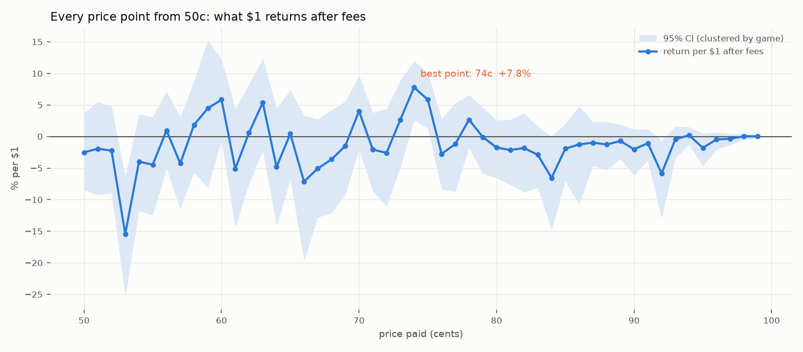

# Every price point from 50c: is there a sweet spot?

35,797,865 fills, 17,810 markets (selected on pregame volume only). Each row is one cent of price. `roi` is the return per $1 after the market's actual taker fee, with a 95% CI clustered by game.

## Every point, all sports

|      pt |        fills |      games |   avg_price |   won_pct |   edge_pts |     roi |   ci_lo |   ci_hi |
|--------:|-------------:|-----------:|------------:|----------:|-----------:|--------:|--------:|--------:|
| 50.0000 |  696393.0000 | 10603.0000 |      0.5007 |    0.4924 |    -0.0082 | -0.0250 | -0.0848 |  0.0369 |
| 51.0000 |  497836.0000 | 10190.0000 |      0.5111 |    0.5058 |    -0.0052 | -0.0194 | -0.0924 |  0.0552 |
| 52.0000 | 1078521.0000 | 11171.0000 |      0.5252 |    0.5179 |    -0.0073 | -0.0222 | -0.0895 |  0.0476 |
| 53.0000 |  238529.0000 | 10350.0000 |      0.5371 |    0.4586 |    -0.0784 | -0.1543 | -0.2539 | -0.0634 |
| 54.0000 |  507962.0000 | 11294.0000 |      0.5412 |    0.5241 |    -0.0171 | -0.0397 | -0.1177 |  0.0352 |
| 55.0000 |  585621.0000 | 11639.0000 |      0.5512 |    0.5312 |    -0.0200 | -0.0446 | -0.1244 |  0.0310 |
| 56.0000 |  593050.0000 | 11752.0000 |      0.5611 |    0.5710 |     0.0100 |  0.0098 | -0.0504 |  0.0718 |
| 57.0000 |  561425.0000 | 11809.0000 |      0.5711 |    0.5512 |    -0.0200 | -0.0427 | -0.1150 |  0.0310 |
| 58.0000 |  948762.0000 | 12343.0000 |      0.5848 |    0.6006 |     0.0158 |  0.0184 | -0.0565 |  0.0873 |
| 59.0000 |  165578.0000 | 10823.0000 |      0.5953 |    0.6274 |     0.0321 |  0.0446 | -0.0812 |  0.1531 |
| 60.0000 |  614041.0000 | 12181.0000 |      0.6012 |    0.6414 |     0.0402 |  0.0584 | -0.0060 |  0.1220 |
| 61.0000 |  514478.0000 | 11980.0000 |      0.6113 |    0.5843 |    -0.0270 | -0.0512 | -0.1436 |  0.0443 |
| 62.0000 |  453217.0000 | 12071.0000 |      0.6212 |    0.6297 |     0.0085 |  0.0060 | -0.0748 |  0.0826 |
| 63.0000 |  415656.0000 | 11879.0000 |      0.6313 |    0.6704 |     0.0391 |  0.0540 | -0.0223 |  0.1239 |
| 64.0000 |  540280.0000 | 12217.0000 |      0.6412 |    0.6146 |    -0.0267 | -0.0482 | -0.1411 |  0.0449 |
| 65.0000 |  469852.0000 | 12303.0000 |      0.6512 |    0.6585 |     0.0073 |  0.0043 | -0.0683 |  0.0734 |
| 66.0000 |  563166.0000 | 12546.0000 |      0.6617 |    0.6187 |    -0.0429 | -0.0713 | -0.1965 |  0.0335 |
| 67.0000 |  363460.0000 | 12170.0000 |      0.6711 |    0.6413 |    -0.0298 | -0.0507 | -0.1281 |  0.0278 |
| 68.0000 |  439487.0000 | 12385.0000 |      0.6811 |    0.6604 |    -0.0207 | -0.0362 | -0.1214 |  0.0416 |
| 69.0000 |  366635.0000 | 12350.0000 |      0.6913 |    0.6848 |    -0.0065 | -0.0149 | -0.0918 |  0.0559 |
| 70.0000 |  455528.0000 | 12705.0000 |      0.7010 |    0.7333 |     0.0323 |  0.0404 | -0.0201 |  0.0971 |
| 71.0000 |  369227.0000 | 12477.0000 |      0.7113 |    0.7004 |    -0.0108 | -0.0207 | -0.0864 |  0.0377 |
| 72.0000 |  434597.0000 | 12778.0000 |      0.7215 |    0.7064 |    -0.0152 | -0.0259 | -0.1106 |  0.0439 |
| 73.0000 |  315490.0000 | 12594.0000 |      0.7312 |    0.7545 |     0.0233 |  0.0265 | -0.0491 |  0.0889 |
| 74.0000 |  320511.0000 | 12513.0000 |      0.7413 |    0.8029 |     0.0616 |  0.0779 |  0.0250 |  0.1198 |
| 75.0000 |  406112.0000 | 13011.0000 |      0.7511 |    0.7984 |     0.0474 |  0.0584 |  0.0134 |  0.1013 |
| 76.0000 |  310059.0000 | 12565.0000 |      0.7612 |    0.7437 |    -0.0175 | -0.0275 | -0.0839 |  0.0281 |
| 77.0000 |  344861.0000 | 12740.0000 |      0.7715 |    0.7658 |    -0.0057 | -0.0119 | -0.0871 |  0.0534 |
| 78.0000 |  325760.0000 | 12866.0000 |      0.7813 |    0.8057 |     0.0244 |  0.0267 | -0.0178 |  0.0660 |
| 79.0000 |  277804.0000 | 12742.0000 |      0.7913 |    0.7939 |     0.0025 | -0.0008 | -0.0587 |  0.0460 |
| 80.0000 |  368785.0000 | 13274.0000 |      0.8011 |    0.7904 |    -0.0107 | -0.0174 | -0.0659 |  0.0257 |
| 81.0000 |  277856.0000 | 12721.0000 |      0.8115 |    0.7973 |    -0.0142 | -0.0213 | -0.0766 |  0.0268 |
| 82.0000 |  321426.0000 | 12938.0000 |      0.8213 |    0.8095 |    -0.0118 | -0.0182 | -0.0882 |  0.0366 |
| 83.0000 |  274253.0000 | 12792.0000 |      0.8314 |    0.8100 |    -0.0215 | -0.0290 | -0.0810 |  0.0158 |
| 84.0000 |  298666.0000 | 13081.0000 |      0.8415 |    0.7890 |    -0.0525 | -0.0654 | -0.1480 |  0.0001 |
| 85.0000 |  311143.0000 | 13403.0000 |      0.8514 |    0.8374 |    -0.0140 | -0.0192 | -0.0707 |  0.0207 |
| 86.0000 |  253891.0000 | 12767.0000 |      0.8613 |    0.8528 |    -0.0084 | -0.0125 | -0.1076 |  0.0482 |
| 87.0000 |  262666.0000 | 13027.0000 |      0.8716 |    0.8654 |    -0.0062 | -0.0097 | -0.0463 |  0.0232 |
| 88.0000 |  259710.0000 | 13141.0000 |      0.8816 |    0.8726 |    -0.0090 | -0.0126 | -0.0534 |  0.0235 |
| 89.0000 |  243597.0000 | 13042.0000 |      0.8917 |    0.8873 |    -0.0044 | -0.0071 | -0.0349 |  0.0191 |
| 90.0000 |  275947.0000 | 13534.0000 |      0.9015 |    0.8850 |    -0.0165 | -0.0203 | -0.0615 |  0.0109 |
| 91.0000 |  275650.0000 | 13151.0000 |      0.9117 |    0.9038 |    -0.0079 | -0.0104 | -0.0377 |  0.0120 |
| 92.0000 |  241652.0000 | 13257.0000 |      0.9218 |    0.8694 |    -0.0524 | -0.0586 | -0.1298 | -0.0064 |
| 93.0000 |  245126.0000 | 13245.0000 |      0.9320 |    0.9292 |    -0.0028 | -0.0045 | -0.0344 |  0.0161 |
| 94.0000 |  234540.0000 | 13332.0000 |      0.9423 |    0.9455 |     0.0031 |  0.0021 | -0.0125 |  0.0151 |
| 95.0000 |  249791.0000 | 13641.0000 |      0.9523 |    0.9362 |    -0.0161 | -0.0179 | -0.0470 |  0.0047 |
| 96.0000 |  239144.0000 | 13329.0000 |      0.9633 |    0.9596 |    -0.0036 | -0.0046 | -0.0200 |  0.0067 |
| 97.0000 |  232953.0000 | 13618.0000 |      0.9738 |    0.9710 |    -0.0028 | -0.0035 | -0.0133 |  0.0045 |
| 98.0000 |  224736.0000 | 14499.0000 |      0.9845 |    0.9852 |     0.0007 |  0.0004 | -0.0046 |  0.0044 |
| 99.0000 |  165749.0000 | 13660.0000 |      0.9911 |    0.9914 |     0.0003 |  0.0001 | -0.0037 |  0.0032 |

## The out-of-sample filter

A real sweet spot has to work in both windows. Development is before 2026-07-01, holdout after.

|   pt |   roi_dev |   ci_lo_dev |   ci_hi_dev |   roi_hold |   ci_lo_hold |   ci_hi_hold | both_positive   |
|-----:|----------:|------------:|------------:|-----------:|-------------:|-------------:|:----------------|
|   50 |   -0.0043 |     -0.0734 |      0.0633 |    -0.0990 |      -0.2015 |       0.0080 | False           |
|   51 |   -0.0025 |     -0.0784 |      0.0798 |    -0.0753 |      -0.2347 |       0.0914 | False           |
|   52 |   -0.0365 |     -0.1118 |      0.0344 |     0.0438 |      -0.1070 |       0.1900 | False           |
|   53 |   -0.1648 |     -0.2577 |     -0.0649 |    -0.1220 |      -0.3378 |       0.0982 | False           |
|   54 |   -0.0512 |     -0.1415 |      0.0382 |     0.0111 |      -0.1038 |       0.1246 | False           |
|   55 |   -0.0481 |     -0.1361 |      0.0369 |    -0.0312 |      -0.2369 |       0.1517 | False           |
|   56 |    0.0278 |     -0.0415 |      0.0943 |    -0.0561 |      -0.1785 |       0.0690 | False           |
|   57 |   -0.0179 |     -0.0975 |      0.0616 |    -0.1314 |      -0.2933 |       0.0419 | False           |
|   58 |    0.0212 |     -0.0633 |      0.1005 |     0.0065 |      -0.1166 |       0.1339 | True            |
|   59 |    0.0181 |     -0.0910 |      0.1206 |     0.1060 |      -0.2196 |       0.3437 | True            |
|   60 |    0.0680 |     -0.0101 |      0.1453 |     0.0179 |      -0.1055 |       0.1287 | True            |
|   61 |   -0.0942 |     -0.2043 |      0.0099 |     0.1288 |      -0.0131 |       0.2423 | False           |
|   62 |   -0.0246 |     -0.1163 |      0.0602 |     0.1209 |      -0.0205 |       0.2452 | False           |
|   63 |    0.0277 |     -0.0625 |      0.1103 |     0.1604 |       0.0317 |       0.2653 | True            |
|   64 |   -0.0913 |     -0.2092 |      0.0154 |     0.1268 |       0.0171 |       0.2101 | False           |
|   65 |   -0.0057 |     -0.0848 |      0.0758 |     0.0423 |      -0.1093 |       0.1703 | False           |
|   66 |   -0.0993 |     -0.2476 |      0.0304 |     0.0403 |      -0.0724 |       0.1434 | False           |
|   67 |   -0.0724 |     -0.1629 |      0.0217 |     0.0427 |      -0.0418 |       0.1284 | False           |
|   68 |   -0.0539 |     -0.1504 |      0.0384 |     0.0427 |      -0.0651 |       0.1419 | False           |
|   69 |   -0.0242 |     -0.1168 |      0.0566 |     0.0280 |      -0.0807 |       0.1279 | False           |
|   70 |    0.0282 |     -0.0447 |      0.0900 |     0.0899 |      -0.0534 |       0.2042 | True            |
|   71 |   -0.0435 |     -0.1205 |      0.0232 |     0.0703 |      -0.0163 |       0.1437 | False           |
|   72 |   -0.0575 |     -0.1566 |      0.0250 |     0.0937 |       0.0037 |       0.1700 | False           |
|   73 |    0.0146 |     -0.0749 |      0.0919 |     0.0790 |       0.0099 |       0.1367 | True            |
|   74 |    0.0823 |      0.0185 |      0.1335 |     0.0624 |      -0.0214 |       0.1369 | True            |
|   75 |    0.0558 |     -0.0037 |      0.1093 |     0.0684 |      -0.0005 |       0.1287 | True            |
|   76 |   -0.0277 |     -0.0944 |      0.0327 |    -0.0265 |      -0.1359 |       0.0726 | False           |
|   77 |   -0.0159 |     -0.1060 |      0.0602 |     0.0044 |      -0.0900 |       0.0875 | False           |
|   78 |    0.0375 |     -0.0152 |      0.0824 |    -0.0245 |      -0.1054 |       0.0471 | False           |
|   79 |    0.0143 |     -0.0421 |      0.0645 |    -0.0784 |      -0.1924 |       0.0198 | False           |
|   80 |   -0.0250 |     -0.0806 |      0.0276 |     0.0114 |      -0.0667 |       0.0730 | False           |
|   81 |   -0.0333 |     -0.0996 |      0.0222 |     0.0166 |      -0.0760 |       0.0855 | False           |
|   82 |   -0.0463 |     -0.1319 |      0.0207 |     0.0733 |       0.0013 |       0.1187 | False           |
|   83 |   -0.0306 |     -0.0848 |      0.0167 |    -0.0239 |      -0.1673 |       0.0767 | False           |
|   84 |   -0.0788 |     -0.1750 |      0.0046 |    -0.0175 |      -0.0841 |       0.0394 | False           |
|   85 |   -0.0175 |     -0.0756 |      0.0274 |    -0.0257 |      -0.1086 |       0.0392 | False           |
|   86 |    0.0384 |      0.0098 |      0.0636 |    -0.1630 |      -0.4161 |       0.0412 | False           |
|   87 |    0.0026 |     -0.0365 |      0.0348 |    -0.0519 |      -0.1487 |       0.0396 | False           |
|   88 |   -0.0191 |     -0.0693 |      0.0234 |     0.0120 |      -0.0282 |       0.0448 | False           |
|   89 |   -0.0123 |     -0.0471 |      0.0193 |     0.0128 |      -0.0284 |       0.0455 | False           |
|   90 |   -0.0307 |     -0.0788 |      0.0108 |     0.0149 |      -0.0229 |       0.0478 | False           |
|   91 |   -0.0151 |     -0.0480 |      0.0121 |     0.0071 |      -0.0221 |       0.0339 | False           |
|   92 |   -0.0757 |     -0.1618 |     -0.0096 |    -0.0029 |      -0.0399 |       0.0256 | False           |
|   93 |   -0.0094 |     -0.0457 |      0.0166 |     0.0109 |      -0.0183 |       0.0327 | False           |
|   94 |    0.0029 |     -0.0136 |      0.0171 |    -0.0008 |      -0.0295 |       0.0218 | False           |
|   95 |   -0.0069 |     -0.0338 |      0.0137 |    -0.0513 |      -0.1295 |       0.0040 | False           |
|   96 |    0.0020 |     -0.0072 |      0.0106 |    -0.0241 |      -0.0717 |       0.0105 | False           |
|   97 |   -0.0000 |     -0.0083 |      0.0072 |    -0.0133 |      -0.0405 |       0.0079 | False           |
|   98 |    0.0002 |     -0.0050 |      0.0049 |     0.0010 |      -0.0104 |       0.0093 | True            |
|   99 |   -0.0002 |     -0.0049 |      0.0033 |     0.0020 |      -0.0052 |       0.0066 | False           |

Points positive in BOTH windows: **9 of 50** (58c, 59c, 60c, 63c, 70c, 73c, 74c, 75c, 98c).

Points whose own CI clears zero after correcting for testing 50 of them: **1**.

### Why the 74-75c spike is not a sweet spot

The dollar-weighted table shows +6.8% at 74-75c, positive in both windows. It does not survive the only weighting that matters for trading - one bet per market:

| how the same 726,623 fills at 74-75c are weighted | return per $1 |
|---|---|
| dollar-weighted (the table above) | **+6.8%** [+2.8, +10.4] |
| equal-weighted per fill | +0.8% [-1.8, +3.2] |
| one bet per market (what you could actually trade) | **-0.4%** [-1.4, +0.5] |
| fills of $1,000 or more only | +2.7% [-0.3, +5.5] |

The median fill there is $11 and the largest 1% of fills carry 56% of the dollars, so the dollar-weighted number is a handful of big tickets in a handful of games, repeated across many fills of the same market. Buying the first print in a 73-76c band and holding loses in both windows (dev -0.7%, holdout -1.0%), as does every 'buy once it crosses T' threshold from 50c to 99c (see the sweep).

## Tradable: buy the first print at or above each threshold

|   threshold_pct | period   |   bets |   avg_price |   won_pct |   edge_pts |     roi |   ci_lo |   ci_hi |     pnl_usd |
|----------------:|:---------|-------:|------------:|----------:|-----------:|--------:|--------:|--------:|------------:|
|              50 | dev      |  13791 |      0.6568 |    0.6415 |    -0.0153 | -0.0286 | -0.0409 | -0.0156 | -39609.2266 |
|              50 | holdout  |   4019 |      0.6423 |    0.6417 |    -0.0006 | -0.0175 | -0.0415 |  0.0054 |  -7146.6494 |
|              51 | dev      |  13791 |      0.6575 |    0.6420 |    -0.0155 | -0.0289 | -0.0413 | -0.0160 | -40054.1758 |
|              51 | holdout  |   4019 |      0.6430 |    0.6410 |    -0.0021 | -0.0204 | -0.0439 |  0.0020 |  -8343.8311 |
|              52 | dev      |  13791 |      0.6581 |    0.6433 |    -0.0147 | -0.0274 | -0.0399 | -0.0141 | -37972.3906 |
|              52 | holdout  |   4019 |      0.6442 |    0.6405 |    -0.0037 | -0.0234 | -0.0467 | -0.0006 |  -9589.2207 |
|              53 | dev      |  13791 |      0.6595 |    0.6441 |    -0.0154 | -0.0284 | -0.0406 | -0.0152 | -39338.0156 |
|              53 | holdout  |   4019 |      0.6456 |    0.6429 |    -0.0027 | -0.0215 | -0.0446 |  0.0011 |  -8801.2510 |
|              54 | dev      |  13789 |      0.6618 |    0.6478 |    -0.0141 | -0.0258 | -0.0383 | -0.0129 | -35781.1562 |
|              54 | holdout  |   4020 |      0.6483 |    0.6450 |    -0.0033 | -0.0223 | -0.0459 | -0.0007 |  -9124.2500 |
|              55 | dev      |  13787 |      0.6649 |    0.6518 |    -0.0130 | -0.0236 | -0.0358 | -0.0110 | -32697.4258 |
|              55 | holdout  |   4020 |      0.6513 |    0.6493 |    -0.0020 | -0.0198 | -0.0423 |  0.0021 |  -8079.7363 |
|              56 | dev      |  13783 |      0.6687 |    0.6562 |    -0.0125 | -0.0225 | -0.0346 | -0.0101 | -31124.5156 |
|              56 | holdout  |   4019 |      0.6550 |    0.6479 |    -0.0070 | -0.0283 | -0.0513 | -0.0063 | -11591.2627 |
|              57 | dev      |  13774 |      0.6735 |    0.6616 |    -0.0119 | -0.0209 | -0.0324 | -0.0094 | -28986.6289 |
|              57 | holdout  |   4022 |      0.6594 |    0.6576 |    -0.0018 | -0.0190 | -0.0408 |  0.0018 |  -7773.1851 |
|              58 | dev      |  13773 |      0.6781 |    0.6676 |    -0.0105 | -0.0180 | -0.0297 | -0.0062 | -25012.5430 |
|              58 | holdout  |   4022 |      0.6646 |    0.6604 |    -0.0042 | -0.0223 | -0.0433 | -0.0015 |  -9132.3633 |
|              59 | dev      |  13769 |      0.6834 |    0.6735 |    -0.0099 | -0.0167 | -0.0287 | -0.0051 | -23101.9570 |
|              59 | holdout  |   4025 |      0.6696 |    0.6661 |    -0.0035 | -0.0208 | -0.0422 |  0.0016 |  -8488.0469 |
|              60 | dev      |  13767 |      0.6886 |    0.6786 |    -0.0100 | -0.0166 | -0.0276 | -0.0053 | -22960.3633 |
|              60 | holdout  |   4026 |      0.6752 |    0.6746 |    -0.0006 | -0.0159 | -0.0377 |  0.0053 |  -6496.4731 |
|              61 | dev      |  13763 |      0.6952 |    0.6843 |    -0.0109 | -0.0175 | -0.0285 | -0.0064 | -24144.0684 |
|              61 | holdout  |   4029 |      0.6819 |    0.6850 |     0.0031 | -0.0096 | -0.0307 |  0.0113 |  -3941.1965 |
|              62 | dev      |  13757 |      0.7008 |    0.6905 |    -0.0103 | -0.0160 | -0.0267 | -0.0049 | -22067.4609 |
|              62 | holdout  |   4029 |      0.6876 |    0.6900 |     0.0024 | -0.0105 | -0.0316 |  0.0108 |  -4300.8687 |
|              63 | dev      |  13753 |      0.7067 |    0.6951 |    -0.0116 | -0.0177 | -0.0289 | -0.0064 | -24391.1914 |
|              63 | holdout  |   4031 |      0.6937 |    0.6961 |     0.0024 | -0.0098 | -0.0291 |  0.0107 |  -3985.6458 |
|              64 | dev      |  13749 |      0.7126 |    0.6990 |    -0.0136 | -0.0205 | -0.0312 | -0.0095 | -28303.9746 |
|              64 | holdout  |   4032 |      0.6995 |    0.7056 |     0.0061 | -0.0040 | -0.0235 |  0.0158 |  -1617.7229 |
|              65 | dev      |  13746 |      0.7188 |    0.7051 |    -0.0137 | -0.0205 | -0.0312 | -0.0100 | -28164.2969 |
|              65 | holdout  |   4032 |      0.7063 |    0.7054 |    -0.0009 | -0.0141 | -0.0328 |  0.0060 |  -5758.1338 |
|              66 | dev      |  13742 |      0.7266 |    0.7106 |    -0.0160 | -0.0234 | -0.0340 | -0.0126 | -32181.8047 |
|              66 | holdout  |   4035 |      0.7142 |    0.7100 |    -0.0042 | -0.0184 | -0.0387 |  0.0004 |  -7497.5571 |
|              67 | dev      |  13741 |      0.7328 |    0.7173 |    -0.0156 | -0.0224 | -0.0330 | -0.0119 | -30833.1250 |
|              67 | holdout  |   4035 |      0.7210 |    0.7160 |    -0.0050 | -0.0191 | -0.0387 | -0.0012 |  -7808.0732 |
|              68 | dev      |  13740 |      0.7389 |    0.7241 |    -0.0148 | -0.0211 | -0.0312 | -0.0109 | -29013.4355 |
|              68 | holdout  |   4036 |      0.7276 |    0.7232 |    -0.0043 | -0.0179 | -0.0367 |  0.0002 |  -7287.0869 |
|              69 | dev      |  13737 |      0.7457 |    0.7317 |    -0.0139 | -0.0197 | -0.0296 | -0.0096 | -27163.3359 |
|              69 | holdout  |   4038 |      0.7343 |    0.7281 |    -0.0062 | -0.0203 | -0.0388 | -0.0020 |  -8307.1035 |
|              70 | dev      |  13734 |      0.7522 |    0.7395 |    -0.0127 | -0.0179 | -0.0278 | -0.0084 | -24635.3965 |
|              70 | holdout  |   4040 |      0.7410 |    0.7347 |    -0.0064 | -0.0201 | -0.0391 | -0.0021 |  -8214.9785 |
|              71 | dev      |  13731 |      0.7604 |    0.7466 |    -0.0138 | -0.0190 | -0.0287 | -0.0096 | -26176.7695 |
|              71 | holdout  |   4041 |      0.7494 |    0.7419 |    -0.0075 | -0.0212 | -0.0391 | -0.0025 |  -8666.7734 |
|              72 | dev      |  13728 |      0.7680 |    0.7542 |    -0.0138 | -0.0187 | -0.0279 | -0.0095 | -25741.0078 |
|              72 | holdout  |   4043 |      0.7577 |    0.7480 |    -0.0097 | -0.0237 | -0.0410 | -0.0073 |  -9698.3164 |
|              73 | dev      |  13727 |      0.7752 |    0.7608 |    -0.0144 | -0.0194 | -0.0291 | -0.0102 | -26676.4414 |
|              73 | holdout  |   4043 |      0.7653 |    0.7571 |    -0.0082 | -0.0211 | -0.0381 | -0.0045 |  -8625.1670 |
|              74 | dev      |  13725 |      0.7825 |    0.7682 |    -0.0143 | -0.0191 | -0.0285 | -0.0102 | -26154.9727 |
|              74 | holdout  |   4044 |      0.7723 |    0.7663 |    -0.0060 | -0.0179 | -0.0340 | -0.0008 |  -7296.8208 |
|              75 | dev      |  13725 |      0.7894 |    0.7749 |    -0.0145 | -0.0190 | -0.0282 | -0.0104 | -26144.7207 |
|              75 | holdout  |   4044 |      0.7802 |    0.7735 |    -0.0067 | -0.0181 | -0.0342 | -0.0006 |  -7370.3789 |
|              76 | dev      |  13723 |      0.7982 |    0.7813 |    -0.0169 | -0.0220 | -0.0312 | -0.0136 | -30190.4238 |
|              76 | holdout  |   4045 |      0.7895 |    0.7834 |    -0.0060 | -0.0169 | -0.0321 | -0.0002 |  -6882.4170 |
|              77 | dev      |  13719 |      0.8054 |    0.7880 |    -0.0175 | -0.0224 | -0.0304 | -0.0138 | -30777.4883 |
|              77 | holdout  |   4046 |      0.7971 |    0.7909 |    -0.0062 | -0.0167 | -0.0325 | -0.0013 |  -6794.9600 |
|              78 | dev      |  13717 |      0.8131 |    0.7954 |    -0.0177 | -0.0224 | -0.0308 | -0.0140 | -30779.3555 |
|              78 | holdout  |   4048 |      0.8050 |    0.7987 |    -0.0064 | -0.0164 | -0.0308 | -0.0009 |  -6670.2676 |
|              79 | dev      |  13715 |      0.8213 |    0.8049 |    -0.0164 | -0.0205 | -0.0283 | -0.0124 | -28138.5605 |
|              79 | holdout  |   4049 |      0.8137 |    0.8086 |    -0.0051 | -0.0144 | -0.0287 |  0.0006 |  -5866.4697 |
|              80 | dev      |  13713 |      0.8285 |    0.8120 |    -0.0165 | -0.0205 | -0.0286 | -0.0129 | -28157.5996 |
|              80 | holdout  |   4049 |      0.8213 |    0.8145 |    -0.0068 | -0.0161 | -0.0300 | -0.0015 |  -6564.1699 |
|              81 | dev      |  13712 |      0.8383 |    0.8234 |    -0.0149 | -0.0184 | -0.0259 | -0.0110 | -25182.0977 |
|              81 | holdout  |   4049 |      0.8316 |    0.8279 |    -0.0037 | -0.0120 | -0.0256 |  0.0016 |  -4899.2651 |
|              82 | dev      |  13711 |      0.8462 |    0.8287 |    -0.0175 | -0.0214 | -0.0290 | -0.0138 | -29392.5508 |
|              82 | holdout  |   4047 |      0.8400 |    0.8357 |    -0.0044 | -0.0123 | -0.0258 |  0.0006 |  -4992.7446 |
|              83 | dev      |  13708 |      0.8546 |    0.8357 |    -0.0189 | -0.0229 | -0.0299 | -0.0154 | -31421.4141 |
|              83 | holdout  |   4047 |      0.8489 |    0.8446 |    -0.0043 | -0.0117 | -0.0251 |  0.0009 |  -4766.0635 |
|              84 | dev      |  13706 |      0.8625 |    0.8439 |    -0.0186 | -0.0224 | -0.0293 | -0.0154 | -30689.5469 |
|              84 | holdout  |   4048 |      0.8571 |    0.8528 |    -0.0043 | -0.0114 | -0.0243 |  0.0004 |  -4655.9648 |
|              85 | dev      |  13703 |      0.8710 |    0.8551 |    -0.0160 | -0.0191 | -0.0258 | -0.0124 | -26176.9492 |
|              85 | holdout  |   4048 |      0.8659 |    0.8626 |    -0.0032 | -0.0097 | -0.0221 |  0.0018 |  -3959.0923 |
|              86 | dev      |  13694 |      0.8804 |    0.8640 |    -0.0164 | -0.0194 | -0.0260 | -0.0130 | -26623.0410 |
|              86 | holdout  |   4049 |      0.8755 |    0.8706 |    -0.0049 | -0.0112 | -0.0235 |  0.0002 |  -4573.1016 |
|              87 | dev      |  13690 |      0.8883 |    0.8728 |    -0.0154 | -0.0181 | -0.0247 | -0.0119 | -24751.0547 |
|              87 | holdout  |   4050 |      0.8838 |    0.8793 |    -0.0045 | -0.0104 | -0.0220 |  0.0001 |  -4233.7949 |
|              88 | dev      |  13689 |      0.8963 |    0.8805 |    -0.0158 | -0.0183 | -0.0248 | -0.0121 | -25041.6211 |
|              88 | holdout  |   4050 |      0.8930 |    0.8886 |    -0.0043 | -0.0097 | -0.0210 |  0.0010 |  -3925.2632 |
|              89 | dev      |  13687 |      0.9046 |    0.8897 |    -0.0149 | -0.0171 | -0.0232 | -0.0110 | -23370.2422 |
|              89 | holdout  |   4050 |      0.9017 |    0.8963 |    -0.0054 | -0.0105 | -0.0212 | -0.0001 |  -4255.0264 |
|              90 | dev      |  13680 |      0.9126 |    0.8993 |    -0.0133 | -0.0151 | -0.0206 | -0.0095 | -20674.7578 |
|              90 | holdout  |   4049 |      0.9100 |    0.9059 |    -0.0041 | -0.0086 | -0.0186 |  0.0011 |  -3477.5886 |
|              91 | dev      |  13662 |      0.9232 |    0.9100 |    -0.0133 | -0.0149 | -0.0202 | -0.0095 | -20385.2031 |
|              91 | holdout  |   4047 |      0.9213 |    0.9145 |    -0.0068 | -0.0110 | -0.0206 | -0.0023 |  -4472.9365 |
|              92 | dev      |  13652 |      0.9310 |    0.9171 |    -0.0139 | -0.0155 | -0.0204 | -0.0104 | -21142.6074 |
|              92 | holdout  |   4048 |      0.9291 |    0.9219 |    -0.0071 | -0.0109 | -0.0195 | -0.0025 |  -4434.3833 |
|              93 | dev      |  13640 |      0.9398 |    0.9273 |    -0.0124 | -0.0137 | -0.0182 | -0.0091 | -18663.0391 |
|              93 | holdout  |   4045 |      0.9388 |    0.9310 |    -0.0077 | -0.0111 | -0.0195 | -0.0028 |  -4483.0088 |
|              94 | dev      |  13626 |      0.9482 |    0.9373 |    -0.0109 | -0.0120 | -0.0163 | -0.0078 | -16345.6084 |
|              94 | holdout  |   4039 |      0.9473 |    0.9416 |    -0.0057 | -0.0085 | -0.0166 | -0.0011 |  -3448.2400 |
|              95 | dev      |  13598 |      0.9567 |    0.9472 |    -0.0095 | -0.0103 | -0.0141 | -0.0062 | -13996.6387 |
|              95 | holdout  |   4034 |      0.9557 |    0.9499 |    -0.0058 | -0.0081 | -0.0153 | -0.0013 |  -3289.9531 |
|              96 | dev      |  13534 |      0.9661 |    0.9566 |    -0.0095 | -0.0102 | -0.0142 | -0.0067 | -13757.6855 |
|              96 | holdout  |   4012 |      0.9655 |    0.9581 |    -0.0074 | -0.0093 | -0.0154 | -0.0033 |  -3718.6992 |
|              97 | dev      |  13424 |      0.9746 |    0.9650 |    -0.0096 | -0.0101 | -0.0133 | -0.0070 | -13624.5566 |
|              97 | holdout  |   3978 |      0.9742 |    0.9671 |    -0.0072 | -0.0086 | -0.0146 | -0.0031 |  -3419.6685 |
|              98 | dev      |  13186 |      0.9827 |    0.9754 |    -0.0074 | -0.0077 | -0.0107 | -0.0050 | -10139.4551 |
|              98 | holdout  |   3919 |      0.9826 |    0.9783 |    -0.0043 | -0.0052 | -0.0102 | -0.0008 |  -2034.8457 |
|              99 | dev      |  11581 |      0.9902 |    0.9851 |    -0.0051 | -0.0052 | -0.0077 | -0.0030 |  -6069.1270 |
|              99 | holdout  |   3371 |      0.9903 |    0.9875 |    -0.0027 | -0.0032 | -0.0073 |  0.0004 |  -1084.0547 |

## By sport

| sport             |   pt |   fills |   games |   avg_price |   won_pct |   edge_pts |     roi |   ci_lo |   ci_hi |
|:------------------|-----:|--------:|--------:|------------:|----------:|-----------:|--------:|--------:|--------:|
| tennis            |   50 |   66617 |    1388 |      0.5012 |    0.5055 |     0.0043 | -0.0083 | -0.0901 |  0.0757 |
| tennis            |   51 |   45644 |    1353 |      0.5117 |    0.4601 |    -0.0516 | -0.1158 | -0.2928 |  0.0615 |
| tennis            |   52 |  100308 |    1431 |      0.5249 |    0.5748 |     0.0499 |  0.0782 | -0.0370 |  0.2024 |
| tennis            |   53 |   23149 |    1357 |      0.5368 |    0.6147 |     0.0779 |  0.1269 | -0.0283 |  0.2668 |
| tennis            |   54 |   46130 |    1457 |      0.5420 |    0.5460 |     0.0040 | -0.0088 | -0.1165 |  0.0996 |
| tennis            |   55 |   56516 |    1497 |      0.5525 |    0.5134 |    -0.0390 | -0.0849 | -0.1928 |  0.0240 |
| tennis            |   56 |   58092 |    1535 |      0.5621 |    0.5713 |     0.0091 |  0.0015 | -0.1125 |  0.1110 |
| tennis            |   57 |   51199 |    1559 |      0.5720 |    0.5478 |    -0.0242 | -0.0572 | -0.1623 |  0.0393 |
| tennis            |   58 |   92364 |    1617 |      0.5853 |    0.5477 |    -0.0376 | -0.0785 | -0.1823 |  0.0205 |
| tennis            |   59 |   17929 |    1497 |      0.5957 |    0.5375 |    -0.0582 | -0.1107 | -0.2233 |  0.0097 |
| tennis            |   60 |   69284 |    1634 |      0.6017 |    0.5863 |    -0.0154 | -0.0388 | -0.1821 |  0.1010 |
| tennis            |   61 |   55485 |    1630 |      0.6118 |    0.6103 |    -0.0015 | -0.0146 | -0.1267 |  0.0973 |
| tennis            |   62 |   51306 |    1651 |      0.6218 |    0.6162 |    -0.0056 | -0.0213 | -0.1356 |  0.0847 |
| tennis            |   63 |   45675 |    1636 |      0.6323 |    0.6593 |     0.0270 |  0.0304 | -0.0665 |  0.1237 |
| tennis            |   64 |   55763 |    1669 |      0.6421 |    0.6153 |    -0.0268 | -0.0532 | -0.1513 |  0.0379 |
| tennis            |   65 |   49671 |    1709 |      0.6524 |    0.6098 |    -0.0426 | -0.0759 | -0.1642 |  0.0053 |
| tennis            |   66 |   63247 |    1734 |      0.6626 |    0.6807 |     0.0181 |  0.0159 | -0.0632 |  0.0929 |
| tennis            |   67 |   41073 |    1724 |      0.6722 |    0.6364 |    -0.0358 | -0.0633 | -0.2049 |  0.0597 |
| tennis            |   68 |   45081 |    1745 |      0.6820 |    0.6625 |    -0.0196 | -0.0389 | -0.1482 |  0.0627 |
| tennis            |   69 |   40057 |    1749 |      0.6920 |    0.6667 |    -0.0252 | -0.0461 | -0.1581 |  0.0567 |
| tennis            |   70 |   49714 |    1781 |      0.7019 |    0.7088 |     0.0069 |  0.0002 | -0.0827 |  0.0771 |
| tennis            |   71 |   41997 |    1780 |      0.7120 |    0.7106 |    -0.0015 | -0.0109 | -0.1010 |  0.0793 |
| tennis            |   72 |   51703 |    1821 |      0.7221 |    0.7277 |     0.0057 | -0.0010 | -0.0736 |  0.0661 |
| tennis            |   73 |   36751 |    1796 |      0.7319 |    0.7483 |     0.0164 |  0.0143 | -0.0827 |  0.0958 |
| tennis            |   74 |   36884 |    1826 |      0.7418 |    0.7555 |     0.0138 |  0.0104 | -0.0845 |  0.0847 |
| tennis            |   75 |   47022 |    1854 |      0.7519 |    0.7732 |     0.0213 |  0.0202 | -0.0384 |  0.0694 |
| tennis            |   76 |   34220 |    1837 |      0.7620 |    0.7102 |    -0.0518 | -0.0753 | -0.2139 |  0.0339 |
| tennis            |   77 |   37898 |    1854 |      0.7719 |    0.7833 |     0.0113 |  0.0071 | -0.0861 |  0.0919 |
| tennis            |   78 |   38554 |    1856 |      0.7822 |    0.7898 |     0.0075 |  0.0023 | -0.1183 |  0.0929 |
| tennis            |   79 |   33939 |    1854 |      0.7916 |    0.7865 |    -0.0052 | -0.0130 | -0.1903 |  0.1085 |
| tennis            |   80 |   44448 |    1893 |      0.8014 |    0.8562 |     0.0548 |  0.0615 | -0.0039 |  0.1104 |
| tennis            |   81 |   34158 |    1855 |      0.8117 |    0.8725 |     0.0608 |  0.0681 | -0.0230 |  0.1256 |
| tennis            |   82 |   37316 |    1873 |      0.8211 |    0.9225 |     0.1014 |  0.1167 |  0.0340 |  0.1561 |
| tennis            |   83 |   30950 |    1839 |      0.8315 |    0.8651 |     0.0335 |  0.0352 | -0.0562 |  0.0975 |
| tennis            |   84 |   34934 |    1907 |      0.8420 |    0.8208 |    -0.0212 | -0.0300 | -0.0866 |  0.0247 |
| tennis            |   85 |   37009 |    1902 |      0.8519 |    0.8585 |     0.0066 |  0.0032 | -0.0486 |  0.0483 |
| tennis            |   86 |   30000 |    1852 |      0.8617 |    0.9004 |     0.0387 |  0.0406 | -0.0243 |  0.0876 |
| tennis            |   87 |   32366 |    1869 |      0.8717 |    0.9049 |     0.0331 |  0.0339 | -0.0090 |  0.0688 |
| tennis            |   88 |   31193 |    1864 |      0.8815 |    0.9300 |     0.0485 |  0.0509 |  0.0206 |  0.0758 |
| tennis            |   89 |   27782 |    1859 |      0.8918 |    0.8690 |    -0.0228 | -0.0290 | -0.1085 |  0.0376 |
| tennis            |   90 |   34408 |    1899 |      0.9014 |    0.8536 |    -0.0478 | -0.0558 | -0.1579 |  0.0237 |
| tennis            |   91 |   45047 |    1889 |      0.9117 |    0.8820 |    -0.0297 | -0.0353 | -0.1023 |  0.0186 |
| tennis            |   92 |   35187 |    1891 |      0.9217 |    0.8413 |    -0.0804 | -0.0895 | -0.2368 |  0.0116 |
| tennis            |   93 |   31687 |    1850 |      0.9317 |    0.9260 |    -0.0057 | -0.0081 | -0.0509 |  0.0247 |
| tennis            |   94 |   29208 |    1844 |      0.9420 |    0.9336 |    -0.0084 | -0.0107 | -0.0486 |  0.0195 |
| tennis            |   95 |   30521 |    1868 |      0.9522 |    0.9348 |    -0.0174 | -0.0197 | -0.0584 |  0.0114 |
| tennis            |   96 |   28076 |    1813 |      0.9631 |    0.9507 |    -0.0124 | -0.0140 | -0.0448 |  0.0096 |
| tennis            |   97 |   27498 |    1820 |      0.9741 |    0.9620 |    -0.0121 | -0.0132 | -0.0431 |  0.0114 |
| tennis            |   98 |   24793 |    1889 |      0.9832 |    0.9645 |    -0.0187 | -0.0195 | -0.0522 |  0.0038 |
| tennis            |   99 |   11669 |    1777 |      0.9907 |    0.9859 |    -0.0048 | -0.0051 | -0.0186 |  0.0047 |
| esports           |   50 |  108948 |    1993 |      0.5007 |    0.5289 |     0.0282 |  0.0420 | -0.0339 |  0.1185 |
| esports           |   51 |   73884 |    1926 |      0.5118 |    0.4968 |    -0.0150 | -0.0429 | -0.1308 |  0.0419 |
| esports           |   52 |  157583 |    2047 |      0.5256 |    0.4764 |    -0.0492 | -0.1057 | -0.2160 | -0.0033 |
| esports           |   53 |   35770 |    1941 |      0.5369 |    0.5068 |    -0.0301 | -0.0696 | -0.2106 |  0.0736 |
| esports           |   54 |   75435 |    2068 |      0.5420 |    0.5481 |     0.0061 | -0.0019 | -0.0977 |  0.0906 |
| esports           |   55 |   91566 |    2124 |      0.5518 |    0.5143 |    -0.0375 | -0.0797 | -0.1923 |  0.0310 |
| esports           |   56 |   91362 |    2144 |      0.5614 |    0.5353 |    -0.0261 | -0.0586 | -0.1572 |  0.0410 |
| esports           |   57 |   83991 |    2173 |      0.5717 |    0.5415 |    -0.0303 | -0.0647 | -0.1665 |  0.0343 |
| esports           |   58 |  143955 |    2275 |      0.5851 |    0.5712 |    -0.0139 | -0.0363 | -0.1503 |  0.0673 |
| esports           |   59 |   29225 |    2109 |      0.5954 |    0.6115 |     0.0162 |  0.0144 | -0.1035 |  0.1319 |
| esports           |   60 |   99388 |    2312 |      0.6015 |    0.6314 |     0.0300 |  0.0393 | -0.0625 |  0.1374 |
| esports           |   61 |   76782 |    2307 |      0.6117 |    0.6472 |     0.0355 |  0.0456 | -0.0465 |  0.1306 |
| esports           |   62 |   76025 |    2355 |      0.6214 |    0.6972 |     0.0758 |  0.1094 |  0.0204 |  0.1879 |
| esports           |   63 |   74758 |    2341 |      0.6316 |    0.7117 |     0.0801 |  0.1139 |  0.0089 |  0.2070 |
| esports           |   64 |   90712 |    2390 |      0.6416 |    0.7029 |     0.0614 |  0.0854 | -0.0020 |  0.1621 |
| esports           |   65 |   82587 |    2441 |      0.6516 |    0.6301 |    -0.0215 | -0.0420 | -0.1398 |  0.0504 |
| esports           |   66 |   98559 |    2470 |      0.6621 |    0.7114 |     0.0493 |  0.0653 | -0.0117 |  0.1359 |
| esports           |   67 |   62591 |    2465 |      0.6715 |    0.7236 |     0.0520 |  0.0672 |  0.0032 |  0.1295 |
| esports           |   68 |   71044 |    2478 |      0.6815 |    0.7345 |     0.0530 |  0.0670 | -0.0254 |  0.1459 |
| esports           |   69 |   65491 |    2491 |      0.6918 |    0.7321 |     0.0403 |  0.0490 | -0.0224 |  0.1088 |
| esports           |   70 |   76547 |    2544 |      0.7014 |    0.7343 |     0.0329 |  0.0379 | -0.0354 |  0.1067 |
| esports           |   71 |   64857 |    2509 |      0.7117 |    0.6968 |    -0.0149 | -0.0290 | -0.1083 |  0.0451 |
| esports           |   72 |   74001 |    2580 |      0.7219 |    0.7744 |     0.0525 |  0.0643 | -0.0112 |  0.1274 |
| esports           |   73 |   56560 |    2545 |      0.7320 |    0.7935 |     0.0615 |  0.0765 |  0.0017 |  0.1433 |
| esports           |   74 |   57166 |    2538 |      0.7419 |    0.7718 |     0.0300 |  0.0333 | -0.0444 |  0.0985 |
| esports           |   75 |   73335 |    2616 |      0.7515 |    0.7017 |    -0.0498 | -0.0724 | -0.1534 |  0.0029 |
| esports           |   76 |   51929 |    2543 |      0.7619 |    0.7034 |    -0.0585 | -0.0833 | -0.1936 |  0.0176 |
| esports           |   77 |   54360 |    2555 |      0.7719 |    0.7657 |    -0.0062 | -0.0148 | -0.0790 |  0.0459 |
| esports           |   78 |   54796 |    2611 |      0.7819 |    0.7750 |    -0.0069 | -0.0147 | -0.0997 |  0.0577 |
| esports           |   79 |   48071 |    2585 |      0.7921 |    0.7927 |     0.0006 | -0.0044 | -0.0742 |  0.0548 |
| esports           |   80 |   59113 |    2668 |      0.8016 |    0.8248 |     0.0232 |  0.0233 | -0.0322 |  0.0718 |
| esports           |   81 |   44692 |    2560 |      0.8119 |    0.8753 |     0.0634 |  0.0733 |  0.0272 |  0.1129 |
| esports           |   82 |   48107 |    2618 |      0.8218 |    0.8287 |     0.0068 |  0.0039 | -0.0510 |  0.0525 |
| esports           |   83 |   42528 |    2574 |      0.8322 |    0.8226 |    -0.0096 | -0.0155 | -0.0823 |  0.0421 |
| esports           |   84 |   48430 |    2633 |      0.8421 |    0.8472 |     0.0050 |  0.0019 | -0.0651 |  0.0543 |
| esports           |   85 |   49294 |    2694 |      0.8519 |    0.8661 |     0.0143 |  0.0130 | -0.0280 |  0.0486 |
| esports           |   86 |   40448 |    2592 |      0.8619 |    0.8055 |    -0.0563 | -0.0689 | -0.1538 |  0.0108 |
| esports           |   87 |   44167 |    2633 |      0.8718 |    0.8166 |    -0.0552 | -0.0663 | -0.2100 |  0.0303 |
| esports           |   88 |   40397 |    2615 |      0.8818 |    0.8663 |    -0.0155 | -0.0205 | -0.1051 |  0.0391 |
| esports           |   89 |   38211 |    2628 |      0.8924 |    0.9120 |     0.0196 |  0.0193 | -0.0196 |  0.0493 |
| esports           |   90 |   42850 |    2686 |      0.9017 |    0.9308 |     0.0291 |  0.0294 |  0.0039 |  0.0501 |
| esports           |   91 |   37248 |    2563 |      0.9121 |    0.9112 |    -0.0009 | -0.0034 | -0.0452 |  0.0293 |
| esports           |   92 |   32776 |    2568 |      0.9222 |    0.9038 |    -0.0183 | -0.0220 | -0.0629 |  0.0147 |
| esports           |   93 |   33897 |    2560 |      0.9323 |    0.9398 |     0.0075 |  0.0062 | -0.0173 |  0.0269 |
| esports           |   94 |   32135 |    2560 |      0.9427 |    0.9405 |    -0.0022 | -0.0036 | -0.0399 |  0.0237 |
| esports           |   95 |   33486 |    2573 |      0.9522 |    0.9423 |    -0.0099 | -0.0116 | -0.0419 |  0.0119 |
| esports           |   96 |   29346 |    2496 |      0.9638 |    0.9533 |    -0.0105 | -0.0118 | -0.0445 |  0.0150 |
| esports           |   97 |   26769 |    2508 |      0.9738 |    0.9592 |    -0.0146 | -0.0156 | -0.0445 |  0.0077 |
| esports           |   98 |   27581 |    2692 |      0.9851 |    0.9822 |    -0.0029 | -0.0033 | -0.0154 |  0.0063 |
| esports           |   99 |   18448 |    2381 |      0.9906 |    0.9888 |    -0.0018 | -0.0020 | -0.0121 |  0.0060 |
| basketball        |   50 |  129049 |    1575 |      0.5007 |    0.4827 |    -0.0180 | -0.0389 | -0.1302 |  0.0557 |
| basketball        |   51 |   93039 |    1520 |      0.5112 |    0.4612 |    -0.0500 | -0.1006 | -0.2221 |  0.0235 |
| basketball        |   52 |  209611 |    1628 |      0.5254 |    0.5289 |     0.0035 |  0.0037 | -0.1104 |  0.1176 |
| basketball        |   53 |   48540 |    1538 |      0.5371 |    0.4325 |    -0.1046 | -0.1974 | -0.3484 | -0.0449 |
| basketball        |   54 |  105709 |    1636 |      0.5412 |    0.5040 |    -0.0372 | -0.0729 | -0.2639 |  0.1114 |
| basketball        |   55 |  115776 |    1696 |      0.5510 |    0.5116 |    -0.0394 | -0.0750 | -0.2213 |  0.0743 |
| basketball        |   56 |  129355 |    1712 |      0.5609 |    0.5898 |     0.0290 |  0.0479 | -0.0905 |  0.1719 |
| basketball        |   57 |  123785 |    1738 |      0.5710 |    0.5941 |     0.0232 |  0.0372 | -0.1097 |  0.1729 |
| basketball        |   58 |  200620 |    1809 |      0.5847 |    0.5518 |    -0.0329 | -0.0601 | -0.1786 |  0.0507 |
| basketball        |   59 |   31685 |    1691 |      0.5944 |    0.5703 |    -0.0241 | -0.0436 | -0.1439 |  0.0633 |
| basketball        |   60 |  141013 |    1835 |      0.6008 |    0.6092 |     0.0084 |  0.0100 | -0.1076 |  0.1237 |
| basketball        |   61 |  119350 |    1848 |      0.6112 |    0.5565 |    -0.0547 | -0.0924 | -0.2218 |  0.0285 |
| basketball        |   62 |   99403 |    1885 |      0.6214 |    0.5703 |    -0.0511 | -0.0849 | -0.2227 |  0.0512 |
| basketball        |   63 |   88045 |    1880 |      0.6313 |    0.5691 |    -0.0622 | -0.1001 | -0.2159 |  0.0181 |
| basketball        |   64 |  118590 |    1932 |      0.6411 |    0.5910 |    -0.0501 | -0.0800 | -0.2454 |  0.0767 |
| basketball        |   65 |  113098 |    1956 |      0.6512 |    0.6467 |    -0.0046 | -0.0102 | -0.1263 |  0.0928 |
| basketball        |   66 |  133545 |    1995 |      0.6620 |    0.6506 |    -0.0115 | -0.0200 | -0.1300 |  0.0857 |
| basketball        |   67 |   98302 |    1972 |      0.6711 |    0.6460 |    -0.0251 | -0.0393 | -0.1668 |  0.0795 |
| basketball        |   68 |  123045 |    2014 |      0.6808 |    0.5795 |    -0.1013 | -0.1513 | -0.2953 | -0.0040 |
| basketball        |   69 |   95227 |    2024 |      0.6911 |    0.7146 |     0.0236 |  0.0311 | -0.0682 |  0.1209 |
| basketball        |   70 |  123010 |    2065 |      0.7008 |    0.7203 |     0.0195 |  0.0254 | -0.0745 |  0.1174 |
| basketball        |   71 |   89641 |    2042 |      0.7112 |    0.7096 |    -0.0015 | -0.0043 | -0.0921 |  0.0793 |
| basketball        |   72 |  104920 |    2082 |      0.7211 |    0.7344 |     0.0133 |  0.0163 | -0.1047 |  0.1173 |
| basketball        |   73 |   78754 |    2067 |      0.7310 |    0.7486 |     0.0176 |  0.0221 | -0.0934 |  0.1192 |
| basketball        |   74 |   78473 |    2046 |      0.7411 |    0.8374 |     0.0963 |  0.1275 |  0.0567 |  0.1858 |
| basketball        |   75 |   99236 |    2141 |      0.7510 |    0.7944 |     0.0433 |  0.0561 | -0.0176 |  0.1200 |
| basketball        |   76 |   78020 |    2073 |      0.7609 |    0.7477 |    -0.0132 | -0.0193 | -0.1427 |  0.0823 |
| basketball        |   77 |   80063 |    2105 |      0.7712 |    0.7765 |     0.0052 |  0.0047 | -0.0773 |  0.0782 |
| basketball        |   78 |   82571 |    2117 |      0.7813 |    0.8134 |     0.0322 |  0.0389 | -0.0484 |  0.1124 |
| basketball        |   79 |   68784 |    2119 |      0.7914 |    0.7814 |    -0.0100 | -0.0143 | -0.1021 |  0.0585 |
| basketball        |   80 |   90315 |    2222 |      0.8011 |    0.7840 |    -0.0171 | -0.0227 | -0.1058 |  0.0485 |
| basketball        |   81 |   69312 |    2123 |      0.8112 |    0.7919 |    -0.0192 | -0.0248 | -0.1081 |  0.0486 |
| basketball        |   82 |   80357 |    2166 |      0.8214 |    0.7689 |    -0.0524 | -0.0650 | -0.1540 |  0.0149 |
| basketball        |   83 |   68156 |    2170 |      0.8313 |    0.8026 |    -0.0286 | -0.0354 | -0.1122 |  0.0339 |
| basketball        |   84 |   75103 |    2168 |      0.8414 |    0.7907 |    -0.0507 | -0.0611 | -0.1787 |  0.0348 |
| basketball        |   85 |   80019 |    2260 |      0.8512 |    0.7965 |    -0.0547 | -0.0654 | -0.1949 |  0.0399 |
| basketball        |   86 |   56488 |    2143 |      0.8611 |    0.8763 |     0.0152 |  0.0167 | -0.0399 |  0.0646 |
| basketball        |   87 |   62818 |    2179 |      0.8715 |    0.8697 |    -0.0018 | -0.0034 | -0.0595 |  0.0440 |
| basketball        |   88 |   59570 |    2205 |      0.8816 |    0.8174 |    -0.0642 | -0.0740 | -0.1836 |  0.0139 |
| basketball        |   89 |   56344 |    2186 |      0.8916 |    0.8184 |    -0.0732 | -0.0829 | -0.1702 | -0.0087 |
| basketball        |   90 |   62129 |    2292 |      0.9014 |    0.8613 |    -0.0401 | -0.0454 | -0.1203 |  0.0191 |
| basketball        |   91 |   60457 |    2169 |      0.9116 |    0.9057 |    -0.0059 | -0.0072 | -0.0438 |  0.0225 |
| basketball        |   92 |   50226 |    2204 |      0.9219 |    0.8977 |    -0.0242 | -0.0269 | -0.0830 |  0.0185 |
| basketball        |   93 |   50821 |    2188 |      0.9322 |    0.9194 |    -0.0127 | -0.0144 | -0.0514 |  0.0175 |
| basketball        |   94 |   46469 |    2214 |      0.9423 |    0.9448 |     0.0025 |  0.0021 | -0.0286 |  0.0254 |
| basketball        |   95 |   47349 |    2273 |      0.9519 |    0.9319 |    -0.0199 | -0.0215 | -0.0924 |  0.0223 |
| basketball        |   96 |   40466 |    2249 |      0.9631 |    0.9690 |     0.0060 |  0.0058 | -0.0103 |  0.0190 |
| basketball        |   97 |   43122 |    2297 |      0.9734 |    0.9680 |    -0.0054 | -0.0058 | -0.0257 |  0.0094 |
| basketball        |   98 |   48543 |    2429 |      0.9848 |    0.9865 |     0.0017 |  0.0016 | -0.0051 |  0.0073 |
| basketball        |   99 |   45229 |    2344 |      0.9912 |    0.9892 |    -0.0020 | -0.0021 | -0.0114 |  0.0049 |
| american_football |   50 |   22440 |     488 |      0.5005 |    0.4877 |    -0.0128 | -0.0264 | -0.1934 |  0.1456 |
| american_football |   51 |   16877 |     457 |      0.5110 |    0.5755 |     0.0645 |  0.1261 | -0.0958 |  0.3458 |
| american_football |   52 |   37224 |     500 |      0.5257 |    0.4681 |    -0.0576 | -0.1108 | -0.3739 |  0.1674 |
| american_football |   53 |    7066 |     452 |      0.5374 |    0.6142 |     0.0768 |  0.1420 | -0.1277 |  0.3715 |
| american_football |   54 |   15658 |     497 |      0.5409 |    0.4541 |    -0.0867 | -0.1618 | -0.4819 |  0.2318 |
| american_football |   55 |   18855 |     511 |      0.5511 |    0.5557 |     0.0046 |  0.0017 | -0.3565 |  0.2961 |
| american_football |   56 |   20634 |     514 |      0.5606 |    0.5623 |     0.0017 | -0.0010 | -0.3099 |  0.3104 |
| american_football |   57 |   18132 |     524 |      0.5708 |    0.6126 |     0.0418 |  0.0725 | -0.1337 |  0.2652 |
| american_football |   58 |   29953 |     553 |      0.5850 |    0.5980 |     0.0130 |  0.0207 | -0.1887 |  0.2211 |
| american_football |   59 |    5726 |     492 |      0.5950 |    0.6559 |     0.0609 |  0.1013 | -0.1772 |  0.2984 |
| american_football |   60 |   19975 |     565 |      0.6009 |    0.5517 |    -0.0492 | -0.0822 | -0.3152 |  0.1465 |
| american_football |   61 |   20048 |     546 |      0.6109 |    0.5807 |    -0.0302 | -0.0498 | -0.3247 |  0.2069 |
| american_football |   62 |   19433 |     567 |      0.6208 |    0.6568 |     0.0360 |  0.0572 | -0.2614 |  0.3018 |
| american_football |   63 |   18404 |     561 |      0.6307 |    0.6251 |    -0.0056 | -0.0093 | -0.2476 |  0.2228 |
| american_football |   64 |   22192 |     579 |      0.6412 |    0.7115 |     0.0703 |  0.1090 | -0.1527 |  0.3149 |
| american_football |   65 |   20119 |     598 |      0.6509 |    0.6710 |     0.0201 |  0.0304 | -0.2477 |  0.2399 |
| american_football |   66 |   22854 |     608 |      0.6614 |    0.6692 |     0.0079 |  0.0119 | -0.2702 |  0.2390 |
| american_football |   67 |   12844 |     587 |      0.6710 |    0.5034 |    -0.1676 | -0.2506 | -0.4609 | -0.0001 |
| american_football |   68 |   17638 |     610 |      0.6807 |    0.7315 |     0.0508 |  0.0743 | -0.3651 |  0.3046 |
| american_football |   69 |   15855 |     600 |      0.6910 |    0.7121 |     0.0211 |  0.0287 | -0.2880 |  0.2440 |
| american_football |   70 |   22145 |     629 |      0.7012 |    0.8295 |     0.1284 |  0.1769 | -0.1002 |  0.3098 |
| american_football |   71 |   15553 |     618 |      0.7110 |    0.6641 |    -0.0469 | -0.0684 | -0.2929 |  0.1200 |
| american_football |   72 |   15296 |     630 |      0.7212 |    0.7944 |     0.0732 |  0.1004 | -0.0510 |  0.2156 |
| american_football |   73 |   11017 |     636 |      0.7309 |    0.7447 |     0.0138 |  0.0182 | -0.2387 |  0.2155 |
| american_football |   74 |   11893 |     639 |      0.7408 |    0.8756 |     0.1347 |  0.1814 |  0.0497 |  0.2576 |
| american_football |   75 |   16938 |     661 |      0.7506 |    0.7925 |     0.0419 |  0.0553 | -0.1448 |  0.2028 |
| american_football |   76 |   13583 |     637 |      0.7612 |    0.6948 |    -0.0664 | -0.0876 | -0.3229 |  0.1125 |
| american_football |   77 |   13326 |     634 |      0.7714 |    0.7643 |    -0.0071 | -0.0097 | -0.2039 |  0.1379 |
| american_football |   78 |   14046 |     656 |      0.7808 |    0.7733 |    -0.0076 | -0.0101 | -0.1966 |  0.1291 |
| american_football |   79 |   12577 |     629 |      0.7914 |    0.6813 |    -0.1101 | -0.1395 | -0.3431 |  0.0495 |
| american_football |   80 |   15096 |     671 |      0.8009 |    0.6613 |    -0.1396 | -0.1745 | -0.3475 |  0.0003 |
| american_football |   81 |   10713 |     616 |      0.8113 |    0.6661 |    -0.1452 | -0.1792 | -0.4139 |  0.0469 |
| american_football |   82 |   13317 |     643 |      0.8212 |    0.7896 |    -0.0317 | -0.0390 | -0.2147 |  0.0972 |
| american_football |   83 |    8623 |     629 |      0.8314 |    0.8907 |     0.0593 |  0.0710 | -0.0097 |  0.1312 |
| american_football |   84 |    9668 |     652 |      0.8422 |    0.7860 |    -0.0561 | -0.0673 | -0.1661 |  0.0267 |
| american_football |   85 |    9094 |     662 |      0.8509 |    0.8694 |     0.0185 |  0.0214 | -0.1340 |  0.1159 |
| american_football |   86 |    8928 |     609 |      0.8610 |    0.9491 |     0.0881 |  0.1021 |  0.0446 |  0.1356 |
| american_football |   87 |    8690 |     645 |      0.8710 |    0.8988 |     0.0278 |  0.0317 | -0.0696 |  0.1009 |
| american_football |   88 |   10692 |     650 |      0.8811 |    0.9420 |     0.0609 |  0.0690 |  0.0115 |  0.1062 |
| american_football |   89 |    7459 |     634 |      0.8912 |    0.9438 |     0.0526 |  0.0587 |  0.0045 |  0.0920 |
| american_football |   90 |    8281 |     642 |      0.9011 |    0.9455 |     0.0444 |  0.0489 |  0.0002 |  0.0841 |
| american_football |   91 |    7413 |     655 |      0.9113 |    0.9315 |     0.0202 |  0.0222 | -0.0343 |  0.0616 |
| american_football |   92 |    7253 |     646 |      0.9217 |    0.8444 |    -0.0773 | -0.0841 | -0.2062 |  0.0247 |
| american_football |   93 |    7362 |     653 |      0.9324 |    0.9490 |     0.0166 |  0.0175 | -0.0289 |  0.0491 |
| american_football |   94 |    6561 |     671 |      0.9425 |    0.9744 |     0.0318 |  0.0335 |  0.0129 |  0.0492 |
| american_football |   95 |    7014 |     686 |      0.9518 |    0.9474 |    -0.0044 | -0.0050 | -0.0716 |  0.0370 |
| american_football |   96 |    6660 |     684 |      0.9634 |    0.9661 |     0.0026 |  0.0026 | -0.0361 |  0.0295 |
| american_football |   97 |    6076 |     716 |      0.9737 |    0.9834 |     0.0097 |  0.0099 | -0.0064 |  0.0213 |
| american_football |   98 |    6922 |     753 |      0.9842 |    0.9923 |     0.0080 |  0.0081 | -0.0007 |  0.0140 |
| american_football |   99 |    5581 |     724 |      0.9908 |    0.9925 |     0.0017 |  0.0017 | -0.0073 |  0.0076 |
| soccer            |   50 |  180997 |    1885 |      0.5007 |    0.4945 |    -0.0062 | -0.0241 | -0.1898 |  0.1436 |
| soccer            |   51 |  133825 |    1811 |      0.5109 |    0.5366 |     0.0257 |  0.0375 | -0.1429 |  0.2129 |
| soccer            |   52 |  277960 |    2059 |      0.5252 |    0.5521 |     0.0269 |  0.0402 | -0.1440 |  0.2189 |
| soccer            |   53 |   60027 |    1868 |      0.5370 |    0.3404 |    -0.1965 | -0.3737 | -0.5789 | -0.0886 |
| soccer            |   54 |  132012 |    2107 |      0.5408 |    0.5334 |    -0.0073 | -0.0255 | -0.2364 |  0.1777 |
| soccer            |   55 |  150150 |    2168 |      0.5509 |    0.5315 |    -0.0194 | -0.0467 | -0.2700 |  0.1672 |
| soccer            |   56 |  141693 |    2202 |      0.5610 |    0.5536 |    -0.0074 | -0.0240 | -0.1778 |  0.1279 |
| soccer            |   57 |  151096 |    2204 |      0.5711 |    0.5342 |    -0.0368 | -0.0759 | -0.2680 |  0.1329 |
| soccer            |   58 |  259377 |    2323 |      0.5848 |    0.6651 |     0.0803 |  0.1253 | -0.0709 |  0.2862 |
| soccer            |   59 |   46346 |    1914 |      0.5957 |    0.6861 |     0.0904 |  0.1407 | -0.2006 |  0.3734 |
| soccer            |   60 |  150094 |    2241 |      0.6017 |    0.7399 |     0.1382 |  0.2179 |  0.0533 |  0.3410 |
| soccer            |   61 |  142730 |    2145 |      0.6113 |    0.5782 |    -0.0332 | -0.0636 | -0.2943 |  0.1752 |
| soccer            |   62 |  115102 |    2121 |      0.6212 |    0.6393 |     0.0181 |  0.0182 | -0.1995 |  0.1946 |
| soccer            |   63 |  110804 |    2053 |      0.6314 |    0.7156 |     0.0843 |  0.1227 | -0.0416 |  0.2688 |
| soccer            |   64 |  156093 |    2142 |      0.6412 |    0.5697 |    -0.0715 | -0.1203 | -0.3374 |  0.0974 |
| soccer            |   65 |  123810 |    2153 |      0.6510 |    0.6912 |     0.0402 |  0.0517 | -0.1303 |  0.2012 |
| soccer            |   66 |  150439 |    2217 |      0.6612 |    0.5309 |    -0.1303 | -0.2050 | -0.4671 |  0.0685 |
| soccer            |   67 |   95915 |    2104 |      0.6707 |    0.6086 |    -0.0621 | -0.1007 | -0.3154 |  0.0959 |
| soccer            |   68 |  122405 |    2148 |      0.6811 |    0.6817 |     0.0006 | -0.0057 | -0.1910 |  0.1496 |
| soccer            |   69 |   99486 |    2156 |      0.6912 |    0.6562 |    -0.0350 | -0.0568 | -0.2471 |  0.1227 |
| soccer            |   70 |  116448 |    2253 |      0.7008 |    0.7109 |     0.0101 |  0.0081 | -0.1452 |  0.1497 |
| soccer            |   71 |  102305 |    2170 |      0.7111 |    0.6975 |    -0.0136 | -0.0255 | -0.1855 |  0.1252 |
| soccer            |   72 |  124232 |    2252 |      0.7217 |    0.6539 |    -0.0677 | -0.0990 | -0.3097 |  0.0817 |
| soccer            |   73 |   87114 |    2225 |      0.7308 |    0.7565 |     0.0257 |  0.0280 | -0.1500 |  0.1631 |
| soccer            |   74 |   89081 |    2161 |      0.7412 |    0.7792 |     0.0381 |  0.0439 | -0.0870 |  0.1548 |
| soccer            |   75 |  110908 |    2312 |      0.7508 |    0.8521 |     0.1013 |  0.1281 |  0.0142 |  0.2079 |
| soccer            |   76 |   90795 |    2209 |      0.7609 |    0.7823 |     0.0214 |  0.0219 | -0.0950 |  0.1152 |
| soccer            |   77 |  112909 |    2272 |      0.7713 |    0.7490 |    -0.0223 | -0.0346 | -0.2234 |  0.1189 |
| soccer            |   78 |   85359 |    2287 |      0.7808 |    0.8401 |     0.0592 |  0.0692 | -0.0186 |  0.1371 |
| soccer            |   79 |   72794 |    2284 |      0.7908 |    0.8525 |     0.0617 |  0.0726 | -0.0327 |  0.1411 |
| soccer            |   80 |  103836 |    2359 |      0.8009 |    0.8435 |     0.0426 |  0.0472 | -0.0214 |  0.1040 |
| soccer            |   81 |   74026 |    2292 |      0.8116 |    0.7965 |    -0.0151 | -0.0243 | -0.1167 |  0.0594 |
| soccer            |   82 |   93839 |    2314 |      0.8210 |    0.8281 |     0.0071 |  0.0034 | -0.1199 |  0.0944 |
| soccer            |   83 |   85490 |    2311 |      0.8310 |    0.8033 |    -0.0277 | -0.0378 | -0.1458 |  0.0569 |
| soccer            |   84 |   87052 |    2352 |      0.8409 |    0.7427 |    -0.0982 | -0.1208 | -0.3224 |  0.0443 |
| soccer            |   85 |   89501 |    2420 |      0.8513 |    0.8470 |    -0.0042 | -0.0087 | -0.0902 |  0.0612 |
| soccer            |   86 |   81651 |    2312 |      0.8609 |    0.8034 |    -0.0576 | -0.0704 | -0.3043 |  0.0887 |
| soccer            |   87 |   73010 |    2352 |      0.8714 |    0.8466 |    -0.0249 | -0.0319 | -0.1263 |  0.0452 |
| soccer            |   88 |   72887 |    2381 |      0.8816 |    0.8711 |    -0.0105 | -0.0151 | -0.1080 |  0.0516 |
| soccer            |   89 |   76194 |    2381 |      0.8916 |    0.9203 |     0.0287 |  0.0291 | -0.0153 |  0.0611 |
| soccer            |   90 |   80737 |    2496 |      0.9014 |    0.8776 |    -0.0238 | -0.0291 | -0.1263 |  0.0401 |
| soccer            |   91 |   77396 |    2465 |      0.9115 |    0.9002 |    -0.0114 | -0.0151 | -0.0879 |  0.0361 |
| soccer            |   92 |   74311 |    2486 |      0.9215 |    0.8423 |    -0.0791 | -0.0881 | -0.2536 |  0.0276 |
| soccer            |   93 |   78614 |    2505 |      0.9318 |    0.9288 |    -0.0030 | -0.0052 | -0.0895 |  0.0400 |
| soccer            |   94 |   78191 |    2529 |      0.9423 |    0.9440 |     0.0017 |  0.0002 | -0.0345 |  0.0270 |
| soccer            |   95 |   83279 |    2612 |      0.9527 |    0.9299 |    -0.0228 | -0.0253 | -0.0911 |  0.0222 |
| soccer            |   96 |   89571 |    2532 |      0.9633 |    0.9545 |    -0.0087 | -0.0102 | -0.0482 |  0.0149 |
| soccer            |   97 |   86568 |    2596 |      0.9740 |    0.9784 |     0.0044 |  0.0036 | -0.0144 |  0.0158 |
| soccer            |   98 |   78459 |    2768 |      0.9843 |    0.9897 |     0.0054 |  0.0050 | -0.0029 |  0.0109 |
| soccer            |   99 |   55326 |    2672 |      0.9914 |    0.9968 |     0.0054 |  0.0052 |  0.0017 |  0.0076 |
| cricket           |   50 |   10854 |     109 |      0.5007 |    0.5149 |     0.0142 |  0.0150 | -0.1330 |  0.1593 |
| cricket           |   51 |    7316 |     104 |      0.5109 |    0.4895 |    -0.0214 | -0.0547 | -0.2382 |  0.1207 |
| cricket           |   52 |   18458 |     110 |      0.5252 |    0.5623 |     0.0371 |  0.0576 | -0.0722 |  0.1972 |
| cricket           |   53 |    4635 |     105 |      0.5381 |    0.6299 |     0.0918 |  0.1569 |  0.0006 |  0.2989 |
| cricket           |   54 |    7605 |     110 |      0.5413 |    0.6413 |     0.1000 |  0.1714 |  0.0101 |  0.3164 |
| cricket           |   55 |   10293 |     113 |      0.5509 |    0.5192 |    -0.0317 | -0.0694 | -0.2317 |  0.0919 |
| cricket           |   56 |    9449 |     114 |      0.5610 |    0.5551 |    -0.0059 | -0.0216 | -0.2139 |  0.1643 |
| cricket           |   57 |    8477 |     117 |      0.5709 |    0.5319 |    -0.0390 | -0.0792 | -0.2738 |  0.1252 |
| cricket           |   58 |   13872 |     125 |      0.5849 |    0.6461 |     0.0612 |  0.0934 | -0.0469 |  0.2214 |
| cricket           |   59 |    3239 |     121 |      0.5934 |    0.6372 |     0.0439 |  0.0634 | -0.1069 |  0.2236 |
| cricket           |   60 |    9408 |     127 |      0.6009 |    0.6702 |     0.0693 |  0.1047 | -0.0437 |  0.2467 |
| cricket           |   61 |    7829 |     123 |      0.6109 |    0.6085 |    -0.0024 | -0.0128 | -0.1709 |  0.1428 |
| cricket           |   62 |    6928 |     124 |      0.6212 |    0.5311 |    -0.0902 | -0.1537 | -0.3397 |  0.0456 |
| cricket           |   63 |    5624 |     120 |      0.6315 |    0.6350 |     0.0036 | -0.0040 | -0.1844 |  0.1725 |
| cricket           |   64 |    7315 |     128 |      0.6413 |    0.6162 |    -0.0251 | -0.0474 | -0.2109 |  0.1146 |
| cricket           |   65 |    6376 |     130 |      0.6512 |    0.6420 |    -0.0092 | -0.0212 | -0.1597 |  0.1241 |
| cricket           |   66 |   10154 |     134 |      0.6627 |    0.5841 |    -0.0786 | -0.1261 | -0.3232 |  0.0828 |
| cricket           |   67 |    4987 |     130 |      0.6711 |    0.7419 |     0.0708 |  0.0964 | -0.0557 |  0.2327 |
| cricket           |   68 |    6701 |     129 |      0.6816 |    0.7462 |     0.0646 |  0.0861 | -0.0641 |  0.2249 |
| cricket           |   69 |    5012 |     129 |      0.6919 |    0.7358 |     0.0439 |  0.0551 | -0.0725 |  0.1817 |
| cricket           |   70 |    6887 |     133 |      0.7014 |    0.7669 |     0.0655 |  0.0855 | -0.0594 |  0.2130 |
| cricket           |   71 |    6059 |     124 |      0.7114 |    0.7586 |     0.0473 |  0.0580 | -0.0822 |  0.1744 |
| cricket           |   72 |    6491 |     129 |      0.7217 |    0.7013 |    -0.0205 | -0.0346 | -0.1875 |  0.1136 |
| cricket           |   73 |    4927 |     128 |      0.7318 |    0.6865 |    -0.0453 | -0.0678 | -0.2185 |  0.0840 |
| cricket           |   74 |    4693 |     123 |      0.7417 |    0.7547 |     0.0130 |  0.0110 | -0.1481 |  0.1435 |
| cricket           |   75 |    6076 |     128 |      0.7510 |    0.7873 |     0.0364 |  0.0423 | -0.0820 |  0.1465 |
| cricket           |   76 |    4537 |     127 |      0.7616 |    0.7709 |     0.0093 |  0.0057 | -0.1210 |  0.1275 |
| cricket           |   77 |    5260 |     133 |      0.7711 |    0.7526 |    -0.0185 | -0.0299 | -0.1733 |  0.1026 |
| cricket           |   78 |    5587 |     133 |      0.7813 |    0.7554 |    -0.0260 | -0.0388 | -0.1923 |  0.0933 |
| cricket           |   79 |    5255 |     127 |      0.7915 |    0.8427 |     0.0512 |  0.0590 | -0.0522 |  0.1434 |
| cricket           |   80 |    5961 |     136 |      0.8009 |    0.8644 |     0.0634 |  0.0739 | -0.0248 |  0.1526 |
| cricket           |   81 |    4218 |     127 |      0.8114 |    0.8789 |     0.0675 |  0.0779 | -0.0133 |  0.1473 |
| cricket           |   82 |    5065 |     138 |      0.8213 |    0.8641 |     0.0429 |  0.0471 | -0.0531 |  0.1296 |
| cricket           |   83 |    4733 |     139 |      0.8314 |    0.8234 |    -0.0080 | -0.0139 | -0.1272 |  0.0741 |
| cricket           |   84 |    5242 |     136 |      0.8419 |    0.8530 |     0.0111 |  0.0090 | -0.1163 |  0.1126 |
| cricket           |   85 |    5574 |     141 |      0.8515 |    0.8381 |    -0.0134 | -0.0196 | -0.1456 |  0.0891 |
| cricket           |   86 |    4652 |     139 |      0.8627 |    0.8998 |     0.0371 |  0.0385 | -0.0402 |  0.1001 |
| cricket           |   87 |    5504 |     139 |      0.8714 |    0.9436 |     0.0722 |  0.0795 |  0.0347 |  0.1164 |
| cricket           |   88 |    5696 |     142 |      0.8813 |    0.9463 |     0.0651 |  0.0708 |  0.0141 |  0.1113 |
| cricket           |   89 |    4934 |     137 |      0.8914 |    0.9449 |     0.0535 |  0.0569 | -0.0008 |  0.1013 |
| cricket           |   90 |    5705 |     143 |      0.9011 |    0.9159 |     0.0147 |  0.0139 | -0.0718 |  0.0842 |
| cricket           |   91 |    4818 |     142 |      0.9118 |    0.8736 |    -0.0382 | -0.0436 | -0.1606 |  0.0556 |
| cricket           |   92 |    4594 |     146 |      0.9219 |    0.9353 |     0.0134 |  0.0128 | -0.0832 |  0.0731 |
| cricket           |   93 |    4281 |     145 |      0.9316 |    0.9706 |     0.0391 |  0.0405 |  0.0027 |  0.0660 |
| cricket           |   94 |    4760 |     142 |      0.9420 |    0.9832 |     0.0411 |  0.0423 |  0.0209 |  0.0576 |
| cricket           |   95 |    5608 |     150 |      0.9524 |    0.9854 |     0.0330 |  0.0337 |  0.0080 |  0.0486 |
| cricket           |   96 |    5631 |     148 |      0.9634 |    0.9963 |     0.0329 |  0.0334 |  0.0285 |  0.0370 |
| cricket           |   97 |    6059 |     152 |      0.9738 |    0.9770 |     0.0033 |  0.0028 | -0.0301 |  0.0249 |
| cricket           |   98 |    6116 |     156 |      0.9843 |    0.9894 |     0.0051 |  0.0048 | -0.0116 |  0.0155 |
| cricket           |   99 |    4658 |     153 |      0.9915 |    1.0000 |     0.0085 |  0.0084 |  0.0080 |  0.0087 |
| baseball          |   50 |   78511 |    2008 |      0.5005 |    0.4620 |    -0.0385 | -0.0860 | -0.1813 |  0.0090 |
| baseball          |   51 |   56234 |    1958 |      0.5107 |    0.5354 |     0.0246 |  0.0369 | -0.0879 |  0.1544 |
| baseball          |   52 |  127186 |    2157 |      0.5248 |    0.4860 |    -0.0389 | -0.0854 | -0.1892 |  0.0168 |
| baseball          |   53 |   24431 |    1937 |      0.5368 |    0.4549 |    -0.0818 | -0.1632 | -0.3589 |  0.0357 |
| baseball          |   54 |   57912 |    2142 |      0.5409 |    0.5379 |    -0.0029 | -0.0157 | -0.1358 |  0.1012 |
| baseball          |   55 |   64627 |    2205 |      0.5511 |    0.5250 |    -0.0261 | -0.0573 | -0.1898 |  0.0716 |
| baseball          |   56 |   65258 |    2211 |      0.5609 |    0.6109 |     0.0500 |  0.0785 | -0.0505 |  0.1976 |
| baseball          |   57 |   57611 |    2225 |      0.5708 |    0.5416 |    -0.0292 | -0.0595 | -0.1921 |  0.0650 |
| baseball          |   58 |   93056 |    2307 |      0.5842 |    0.5611 |    -0.0231 | -0.0480 | -0.1696 |  0.0731 |
| baseball          |   59 |   14319 |    1914 |      0.5946 |    0.6113 |     0.0167 |  0.0172 | -0.2104 |  0.2120 |
| baseball          |   60 |   57305 |    2222 |      0.6007 |    0.5763 |    -0.0244 | -0.0490 | -0.1863 |  0.0834 |
| baseball          |   61 |   42977 |    2181 |      0.6108 |    0.6666 |     0.0557 |  0.0826 | -0.0556 |  0.2163 |
| baseball          |   62 |   40510 |    2168 |      0.6209 |    0.6834 |     0.0625 |  0.0928 | -0.0350 |  0.2030 |
| baseball          |   63 |   35893 |    2136 |      0.6307 |    0.6849 |     0.0542 |  0.0772 | -0.0553 |  0.1913 |
| baseball          |   64 |   42408 |    2182 |      0.6409 |    0.5569 |    -0.0841 | -0.1391 | -0.2868 |  0.0174 |
| baseball          |   65 |   37018 |    2139 |      0.6507 |    0.6444 |    -0.0062 | -0.0169 | -0.1677 |  0.1178 |
| baseball          |   66 |   41643 |    2182 |      0.6614 |    0.6108 |    -0.0506 | -0.0848 | -0.2531 |  0.0768 |
| baseball          |   67 |   25675 |    2054 |      0.6709 |    0.7192 |     0.0482 |  0.0636 | -0.0725 |  0.1891 |
| baseball          |   68 |   30266 |    2096 |      0.6809 |    0.7701 |     0.0892 |  0.1219 | -0.0163 |  0.2285 |
| baseball          |   69 |   24434 |    2055 |      0.6909 |    0.7279 |     0.0370 |  0.0479 | -0.1244 |  0.1840 |
| baseball          |   70 |   30752 |    2095 |      0.7011 |    0.7839 |     0.0828 |  0.1109 | -0.0294 |  0.2123 |
| baseball          |   71 |   24201 |    2059 |      0.7112 |    0.6770 |    -0.0342 | -0.0543 | -0.2192 |  0.0847 |
| baseball          |   72 |   29574 |    2092 |      0.7212 |    0.6577 |    -0.0635 | -0.0946 | -0.2451 |  0.0461 |
| baseball          |   73 |   20760 |    2024 |      0.7324 |    0.7331 |     0.0006 | -0.0069 | -0.1055 |  0.0777 |
| baseball          |   74 |   21362 |    2033 |      0.7417 |    0.7285 |    -0.0132 | -0.0243 | -0.1193 |  0.0649 |
| baseball          |   75 |   27629 |    2083 |      0.7511 |    0.8264 |     0.0752 |  0.0925 |  0.0008 |  0.1613 |
| baseball          |   76 |   20680 |    2002 |      0.7614 |    0.6770 |    -0.0844 | -0.1162 | -0.3156 |  0.0562 |
| baseball          |   77 |   22883 |    2051 |      0.7720 |    0.7884 |     0.0165 |  0.0148 | -0.0401 |  0.0672 |
| baseball          |   78 |   24813 |    2035 |      0.7821 |    0.7785 |    -0.0036 | -0.0107 | -0.0777 |  0.0502 |
| baseball          |   79 |   21381 |    2030 |      0.7920 |    0.7348 |    -0.0572 | -0.0775 | -0.2014 |  0.0237 |
| baseball          |   80 |   29249 |    2099 |      0.8016 |    0.8076 |     0.0060 |  0.0024 | -0.0597 |  0.0561 |
| baseball          |   81 |   22418 |    2035 |      0.8120 |    0.8125 |     0.0005 | -0.0051 | -0.0608 |  0.0443 |
| baseball          |   82 |   25912 |    2035 |      0.8219 |    0.7924 |    -0.0296 | -0.0409 | -0.0988 |  0.0096 |
| baseball          |   83 |   21589 |    1998 |      0.8326 |    0.6249 |    -0.2078 | -0.2529 | -0.5362 |  0.0263 |
| baseball          |   84 |   24756 |    2078 |      0.8418 |    0.8276 |    -0.0142 | -0.0217 | -0.0896 |  0.0361 |
| baseball          |   85 |   25028 |    2124 |      0.8516 |    0.8351 |    -0.0165 | -0.0240 | -0.1006 |  0.0360 |
| baseball          |   86 |   20301 |    2030 |      0.8622 |    0.8747 |     0.0126 |  0.0104 | -0.0343 |  0.0490 |
| baseball          |   87 |   23548 |    2039 |      0.8719 |    0.9025 |     0.0306 |  0.0309 | -0.0249 |  0.0704 |
| baseball          |   88 |   23405 |    2085 |      0.8818 |    0.8826 |     0.0008 | -0.0027 | -0.0511 |  0.0394 |
| baseball          |   89 |   20714 |    2070 |      0.8919 |    0.9213 |     0.0294 |  0.0296 | -0.0172 |  0.0619 |
| baseball          |   90 |   24808 |    2119 |      0.9019 |    0.8901 |    -0.0119 | -0.0160 | -0.0731 |  0.0287 |
| baseball          |   91 |   23261 |    2054 |      0.9122 |    0.8942 |    -0.0180 | -0.0221 | -0.0759 |  0.0230 |
| baseball          |   92 |   23255 |    2096 |      0.9223 |    0.8688 |    -0.0535 | -0.0603 | -0.2086 |  0.0410 |
| baseball          |   93 |   24850 |    2121 |      0.9321 |    0.9221 |    -0.0100 | -0.0125 | -0.0722 |  0.0298 |
| baseball          |   94 |   24391 |    2170 |      0.9426 |    0.9600 |     0.0174 |  0.0168 |  0.0006 |  0.0302 |
| baseball          |   95 |   28917 |    2260 |      0.9521 |    0.9361 |    -0.0160 | -0.0181 | -0.0509 |  0.0098 |
| baseball          |   96 |   27014 |    2193 |      0.9630 |    0.9633 |     0.0002 | -0.0009 | -0.0235 |  0.0177 |
| baseball          |   97 |   24670 |    2230 |      0.9736 |    0.9661 |    -0.0075 | -0.0084 | -0.0274 |  0.0078 |
| baseball          |   98 |   19983 |    2290 |      0.9842 |    0.9898 |     0.0056 |  0.0053 | -0.0015 |  0.0106 |
| baseball          |   99 |   13955 |    2200 |      0.9911 |    0.9925 |     0.0014 |  0.0012 | -0.0051 |  0.0059 |
| hockey            |   50 |   87749 |    1031 |      0.5006 |    0.4905 |    -0.0101 | -0.0210 | -0.1355 |  0.0962 |
| hockey            |   51 |   63085 |     942 |      0.5110 |    0.4717 |    -0.0393 | -0.0786 | -0.2286 |  0.0776 |
| hockey            |   52 |  137491 |    1106 |      0.5248 |    0.4931 |    -0.0317 | -0.0622 | -0.1952 |  0.0649 |
| hockey            |   53 |   32700 |    1033 |      0.5377 |    0.4658 |    -0.0719 | -0.1343 | -0.3667 |  0.0903 |
| hockey            |   54 |   62175 |    1147 |      0.5411 |    0.5241 |    -0.0171 | -0.0321 | -0.1875 |  0.1088 |
| hockey            |   55 |   71908 |    1188 |      0.5510 |    0.5802 |     0.0291 |  0.0517 | -0.1036 |  0.1961 |
| hockey            |   56 |   70955 |    1185 |      0.5610 |    0.5679 |     0.0069 |  0.0117 | -0.1486 |  0.1661 |
| hockey            |   57 |   61047 |    1136 |      0.5709 |    0.5192 |    -0.0518 | -0.0914 | -0.2594 |  0.0760 |
| hockey            |   58 |  105848 |    1184 |      0.5847 |    0.5746 |    -0.0101 | -0.0187 | -0.1540 |  0.1127 |
| hockey            |   59 |   15094 |     959 |      0.5949 |    0.5765 |    -0.0184 | -0.0337 | -0.2370 |  0.1465 |
| hockey            |   60 |   60568 |    1093 |      0.6006 |    0.5598 |    -0.0408 | -0.0701 | -0.2217 |  0.0734 |
| hockey            |   61 |   44384 |    1053 |      0.6111 |    0.4988 |    -0.1122 | -0.1839 | -0.3526 | -0.0095 |
| hockey            |   62 |   40839 |    1053 |      0.6207 |    0.5636 |    -0.0571 | -0.0929 | -0.2514 |  0.0628 |
| hockey            |   63 |   33187 |    1021 |      0.6306 |    0.6403 |     0.0097 |  0.0151 | -0.1682 |  0.1882 |
| hockey            |   64 |   43069 |    1045 |      0.6406 |    0.6724 |     0.0318 |  0.0488 | -0.1002 |  0.1840 |
| hockey            |   65 |   32827 |    1026 |      0.6508 |    0.6246 |    -0.0262 | -0.0421 | -0.2563 |  0.1658 |
| hockey            |   66 |   36283 |    1061 |      0.6613 |    0.6512 |    -0.0101 | -0.0157 | -0.2144 |  0.1726 |
| hockey            |   67 |   18935 |     994 |      0.6710 |    0.6475 |    -0.0235 | -0.0353 | -0.2257 |  0.1385 |
| hockey            |   68 |   19353 |    1020 |      0.6812 |    0.6073 |    -0.0739 | -0.1087 | -0.2863 |  0.0826 |
| hockey            |   69 |   16502 |    1000 |      0.6923 |    0.7779 |     0.0856 |  0.1202 | -0.0620 |  0.2572 |
| hockey            |   70 |   24267 |    1056 |      0.7005 |    0.8598 |     0.1593 |  0.2251 |  0.0998 |  0.3137 |
| hockey            |   71 |   20363 |    1024 |      0.7106 |    0.8285 |     0.1179 |  0.1620 |  0.0080 |  0.2598 |
| hockey            |   72 |   23999 |    1045 |      0.7217 |    0.7149 |    -0.0068 | -0.0102 | -0.2310 |  0.1592 |
| hockey            |   73 |   16129 |    1023 |      0.7310 |    0.6493 |    -0.0818 | -0.1127 | -0.3276 |  0.0713 |
| hockey            |   74 |   14951 |     996 |      0.7410 |    0.7758 |     0.0348 |  0.0464 | -0.1186 |  0.1603 |
| hockey            |   75 |   20372 |    1066 |      0.7511 |    0.8363 |     0.0852 |  0.1130 | -0.0127 |  0.1914 |
| hockey            |   76 |   12982 |     993 |      0.7614 |    0.8164 |     0.0550 |  0.0719 | -0.0333 |  0.1528 |
| hockey            |   77 |   15658 |     990 |      0.7724 |    0.7944 |     0.0220 |  0.0273 | -0.1233 |  0.1347 |
| hockey            |   78 |   15362 |    1031 |      0.7822 |    0.8709 |     0.0887 |  0.1122 |  0.0333 |  0.1671 |
| hockey            |   79 |   12321 |     971 |      0.7911 |    0.6555 |    -0.1356 | -0.1723 | -0.4930 |  0.1224 |
| hockey            |   80 |   14363 |    1068 |      0.8014 |    0.7168 |    -0.0846 | -0.1063 | -0.3276 |  0.0772 |
| hockey            |   81 |   10956 |     966 |      0.8114 |    0.8453 |     0.0340 |  0.0409 | -0.0779 |  0.1236 |
| hockey            |   82 |   13228 |    1007 |      0.8212 |    0.7838 |    -0.0374 | -0.0466 | -0.1944 |  0.0749 |
| hockey            |   83 |   10633 |     986 |      0.8319 |    0.8648 |     0.0330 |  0.0383 | -0.0257 |  0.0923 |
| hockey            |   84 |   11651 |    1007 |      0.8418 |    0.8390 |    -0.0028 | -0.0040 | -0.1064 |  0.0759 |
| hockey            |   85 |   13612 |    1051 |      0.8518 |    0.8857 |     0.0339 |  0.0392 | -0.0161 |  0.0859 |
| hockey            |   86 |    9412 |     955 |      0.8619 |    0.8701 |     0.0082 |  0.0089 | -0.0394 |  0.0499 |
| hockey            |   87 |   10325 |    1023 |      0.8719 |    0.8687 |    -0.0033 | -0.0040 | -0.0894 |  0.0601 |
| hockey            |   88 |   12946 |    1048 |      0.8818 |    0.8980 |     0.0162 |  0.0181 | -0.0420 |  0.0627 |
| hockey            |   89 |   10059 |    1004 |      0.8921 |    0.8639 |    -0.0282 | -0.0321 | -0.1043 |  0.0263 |
| hockey            |   90 |   14762 |    1106 |      0.9014 |    0.9359 |     0.0344 |  0.0378 | -0.0032 |  0.0678 |
| hockey            |   91 |   17536 |    1068 |      0.9124 |    0.9552 |     0.0428 |  0.0465 |  0.0170 |  0.0670 |
| hockey            |   92 |   12217 |    1073 |      0.9225 |    0.9456 |     0.0231 |  0.0247 | -0.0162 |  0.0506 |
| hockey            |   93 |   12006 |    1089 |      0.9319 |    0.9319 |     0.0001 | -0.0002 | -0.0739 |  0.0452 |
| hockey            |   94 |   11190 |    1059 |      0.9422 |    0.9295 |    -0.0126 | -0.0136 | -0.0681 |  0.0241 |
| hockey            |   95 |   11844 |    1083 |      0.9525 |    0.9740 |     0.0214 |  0.0223 |  0.0069 |  0.0347 |
| hockey            |   96 |   10720 |    1062 |      0.9630 |    0.9624 |    -0.0007 | -0.0008 | -0.0261 |  0.0183 |
| hockey            |   97 |   10714 |    1162 |      0.9739 |    0.9693 |    -0.0047 | -0.0049 | -0.0261 |  0.0113 |
| hockey            |   98 |   10775 |    1352 |      0.9859 |    0.9821 |    -0.0038 | -0.0039 | -0.0137 |  0.0044 |
| hockey            |   99 |    9411 |    1259 |      0.9906 |    0.9921 |     0.0015 |  0.0014 | -0.0037 |  0.0058 |
| mma_boxing        |   50 |    9101 |      94 |      0.5005 |    0.5025 |     0.0020 | -0.0068 | -0.1938 |  0.1737 |
| mma_boxing        |   51 |    6836 |      87 |      0.5106 |    0.3513 |    -0.1593 | -0.3217 | -0.7417 |  0.3177 |
| mma_boxing        |   52 |    8427 |      97 |      0.5230 |    0.4575 |    -0.0655 | -0.1368 | -0.6180 |  0.4144 |
| mma_boxing        |   53 |    1473 |      86 |      0.5377 |    0.4792 |    -0.0585 | -0.1192 | -0.6808 |  0.5416 |
| mma_boxing        |   54 |    2830 |      93 |      0.5408 |    0.4766 |    -0.0642 | -0.1275 | -0.6522 |  0.3875 |
| mma_boxing        |   55 |    3443 |     101 |      0.5508 |    0.5182 |    -0.0326 | -0.0639 | -0.4725 |  0.4217 |
| mma_boxing        |   56 |    4400 |      98 |      0.5609 |    0.5288 |    -0.0321 | -0.0592 | -0.5534 |  0.4278 |
| mma_boxing        |   57 |    4509 |      96 |      0.5709 |    0.4618 |    -0.1090 | -0.1965 | -0.6475 |  0.3078 |
| mma_boxing        |   58 |    5382 |     109 |      0.5848 |    0.7856 |     0.2008 |  0.3328 | -0.3652 |  0.5677 |
| mma_boxing        |   59 |    1601 |      89 |      0.5978 |    0.8664 |     0.2686 |  0.4429 | -0.3943 |  0.6174 |
| mma_boxing        |   60 |    5040 |     112 |      0.6008 |    0.7237 |     0.1229 |  0.1965 | -0.2059 |  0.4673 |
| mma_boxing        |   61 |    3233 |     109 |      0.6105 |    0.3613 |    -0.2492 | -0.4134 | -0.7554 |  0.1834 |
| mma_boxing        |   62 |    2435 |     111 |      0.6207 |    0.5210 |    -0.0997 | -0.1685 | -0.5238 |  0.2689 |
| mma_boxing        |   63 |    2318 |     100 |      0.6309 |    0.6501 |     0.0192 |  0.0225 | -0.4018 |  0.3680 |
| mma_boxing        |   64 |    2629 |     113 |      0.6409 |    0.7841 |     0.1432 |  0.2099 | -0.3312 |  0.4380 |
| mma_boxing        |   65 |    2525 |     113 |      0.6503 |    0.8972 |     0.2469 |  0.3608 | -0.1489 |  0.4755 |
| mma_boxing        |   66 |    4937 |     111 |      0.6612 |    0.8475 |     0.1863 |  0.2713 | -0.1147 |  0.4290 |
| mma_boxing        |   67 |    2342 |     106 |      0.6704 |    0.6648 |    -0.0056 | -0.0167 | -0.6191 |  0.4272 |
| mma_boxing        |   68 |    3022 |     108 |      0.6821 |    0.1992 |    -0.4829 | -0.7098 | -0.8898 |  0.0559 |
| mma_boxing        |   69 |    2856 |     112 |      0.6906 |    0.0955 |    -0.5950 | -0.8629 | -0.9509 | -0.1421 |
| mma_boxing        |   70 |    4254 |     113 |      0.7003 |    0.3828 |    -0.3175 | -0.4563 | -0.8180 |  0.1435 |
| mma_boxing        |   71 |    3036 |     113 |      0.7109 |    0.6200 |    -0.0909 | -0.1334 | -0.7572 |  0.3030 |
| mma_boxing        |   72 |    3487 |     110 |      0.7217 |    0.5059 |    -0.2158 | -0.3034 | -0.8327 |  0.3157 |
| mma_boxing        |   73 |    2575 |     112 |      0.7311 |    0.8693 |     0.1382 |  0.1833 | -0.2768 |  0.3236 |
| mma_boxing        |   74 |    4865 |     112 |      0.7404 |    0.9463 |     0.2060 |  0.2722 | -0.0458 |  0.3303 |
| mma_boxing        |   75 |    3353 |     113 |      0.7509 |    0.7815 |     0.0306 |  0.0367 | -0.3306 |  0.2841 |
| mma_boxing        |   76 |    1968 |     107 |      0.7612 |    0.8091 |     0.0480 |  0.0555 | -0.3167 |  0.2461 |
| mma_boxing        |   77 |    1390 |     105 |      0.7706 |    0.7898 |     0.0192 |  0.0161 | -0.4789 |  0.2283 |
| mma_boxing        |   78 |    2787 |      97 |      0.7809 |    0.4694 |    -0.3114 | -0.4016 | -0.8225 |  0.2201 |
| mma_boxing        |   79 |    1834 |     102 |      0.7918 |    0.7014 |    -0.0904 | -0.1194 | -0.3930 |  0.1642 |
| mma_boxing        |   80 |    5093 |     110 |      0.8003 |    0.1693 |    -0.6310 | -0.7899 | -0.9237 |  0.1971 |
| mma_boxing        |   81 |    6425 |     101 |      0.8104 |    0.1713 |    -0.6391 | -0.7897 | -0.9438 |  0.1552 |
| mma_boxing        |   82 |    3333 |     100 |      0.8202 |    0.0988 |    -0.7213 | -0.8804 | -0.9777 |  0.1461 |
| mma_boxing        |   83 |     845 |     104 |      0.8324 |    0.5696 |    -0.2628 | -0.3184 | -0.6129 |  0.0643 |
| mma_boxing        |   84 |    1130 |     103 |      0.8436 |    0.7321 |    -0.1116 | -0.1358 | -0.5729 |  0.1342 |
| mma_boxing        |   85 |    1190 |     104 |      0.8517 |    0.8122 |    -0.0395 | -0.0492 | -0.3064 |  0.1242 |
| mma_boxing        |   86 |    1085 |      92 |      0.8614 |    0.9410 |     0.0797 |  0.0915 | -0.1509 |  0.1457 |
| mma_boxing        |   87 |    1003 |     103 |      0.8716 |    0.9450 |     0.0735 |  0.0823 | -0.1038 |  0.1266 |
| mma_boxing        |   88 |    1442 |     104 |      0.8817 |    0.7036 |    -0.1781 | -0.2048 | -0.5997 |  0.1115 |
| mma_boxing        |   89 |    1095 |      98 |      0.8917 |    0.9239 |     0.0322 |  0.0345 | -0.0877 |  0.0952 |
| mma_boxing        |   90 |    1471 |     104 |      0.9027 |    0.9053 |     0.0026 |  0.0015 | -0.1755 |  0.0943 |
| mma_boxing        |   91 |    1014 |      98 |      0.9115 |    0.9246 |     0.0131 |  0.0131 | -0.1678 |  0.0850 |
| mma_boxing        |   92 |     825 |      99 |      0.9242 |    0.9607 |     0.0365 |  0.0377 | -0.0105 |  0.0662 |
| mma_boxing        |   93 |     660 |      90 |      0.9336 |    0.9020 |    -0.0316 | -0.0350 | -0.1600 |  0.0498 |
| mma_boxing        |   94 |     792 |      97 |      0.9438 |    0.8135 |    -0.1303 | -0.1385 | -0.3760 |  0.0464 |
| mma_boxing        |   95 |     831 |      89 |      0.9522 |    0.8556 |    -0.0966 | -0.1023 | -0.2324 |  0.0062 |
| mma_boxing        |   96 |     767 |     103 |      0.9639 |    0.9454 |    -0.0185 | -0.0198 | -0.0841 |  0.0243 |
| mma_boxing        |   97 |     553 |      88 |      0.9731 |    0.8748 |    -0.0983 | -0.1015 | -0.2418 |  0.0251 |
| mma_boxing        |   98 |     654 |     122 |      0.9849 |    0.9765 |    -0.0084 | -0.0089 | -0.0609 |  0.0153 |
| mma_boxing        |   99 |     693 |     100 |      0.9903 |    0.8820 |    -0.1083 | -0.1095 | -0.2608 |  0.0098 |
| other             |   50 |    2127 |      32 |      0.4996 |    0.5092 |     0.0096 |  0.0180 | -0.3339 |  0.2894 |
| other             |   51 |    1096 |      32 |      0.5108 |    0.2280 |    -0.2828 | -0.5550 | -0.7980 |  0.0255 |
| other             |   52 |    4273 |      36 |      0.5254 |    0.5871 |     0.0617 |  0.1178 | -0.3873 |  0.5550 |
| other             |   53 |     738 |      33 |      0.5374 |    0.4970 |    -0.0404 | -0.0761 | -0.5530 |  0.5542 |
| other             |   54 |    2496 |      37 |      0.5421 |    0.5915 |     0.0494 |  0.0928 | -0.4418 |  0.5330 |
| other             |   55 |    2487 |      36 |      0.5516 |    0.6866 |     0.1350 |  0.2442 | -0.2475 |  0.5960 |
| other             |   56 |    1852 |      37 |      0.5615 |    0.6101 |     0.0486 |  0.0872 | -0.4657 |  0.6108 |
| other             |   57 |    1578 |      37 |      0.5723 |    0.5457 |    -0.0266 | -0.0455 | -0.5482 |  0.4201 |
| other             |   58 |    4335 |      41 |      0.5862 |    0.7954 |     0.2092 |  0.3551 | -0.0724 |  0.6027 |
| other             |   59 |     414 |      37 |      0.5930 |    0.7608 |     0.1678 |  0.2834 | -0.1278 |  0.5747 |
| other             |   60 |    1966 |      40 |      0.6012 |    0.6837 |     0.0825 |  0.1356 | -0.4551 |  0.5866 |
| other             |   61 |    1660 |      38 |      0.6115 |    0.7953 |     0.1838 |  0.2993 | -0.1237 |  0.5127 |
| other             |   62 |    1236 |      36 |      0.6227 |    0.7442 |     0.1215 |  0.1926 | -0.3254 |  0.4966 |
| other             |   63 |     948 |      31 |      0.6306 |    0.7736 |     0.1429 |  0.2250 | -0.2935 |  0.4942 |
| other             |   64 |    1509 |      37 |      0.6421 |    0.5189 |    -0.1232 | -0.1928 | -0.6044 |  0.2612 |
| other             |   65 |    1821 |      38 |      0.6522 |    0.5864 |    -0.0658 | -0.1021 | -0.5546 |  0.3471 |
| other             |   66 |    1505 |      34 |      0.6629 |    0.4913 |    -0.1716 | -0.2597 | -0.8106 |  0.4067 |
| other             |   67 |     796 |      34 |      0.6702 |    0.5549 |    -0.1154 | -0.1727 | -0.8108 |  0.4066 |
| other             |   68 |     932 |      37 |      0.6818 |    0.5122 |    -0.1697 | -0.2481 | -0.7086 |  0.3796 |
| other             |   69 |    1715 |      34 |      0.6915 |    0.4976 |    -0.1939 | -0.2798 | -0.8207 |  0.3627 |
| other             |   70 |    1504 |      36 |      0.7021 |    0.5522 |    -0.1499 | -0.2152 | -0.7427 |  0.3805 |
| other             |   71 |    1215 |      38 |      0.7119 |    0.4916 |    -0.2203 | -0.3107 | -0.8862 |  0.3862 |
| other             |   72 |     894 |      37 |      0.7207 |    0.6350 |    -0.0858 | -0.1199 | -0.5138 |  0.2942 |
| other             |   73 |     903 |      38 |      0.7312 |    0.7734 |     0.0422 |  0.0569 | -0.2843 |  0.3267 |
| other             |   74 |    1143 |      39 |      0.7416 |    0.9154 |     0.1737 |  0.2337 |  0.0855 |  0.3127 |
| other             |   75 |    1243 |      37 |      0.7528 |    0.9239 |     0.1712 |  0.2270 | -0.1179 |  0.3193 |
| other             |   76 |    1345 |      37 |      0.7605 |    0.9629 |     0.2024 |  0.2662 |  0.0970 |  0.3084 |
| other             |   77 |    1114 |      41 |      0.7726 |    0.9782 |     0.2056 |  0.2661 |  0.2262 |  0.2855 |
| other             |   78 |    1885 |      43 |      0.7805 |    0.9985 |     0.2180 |  0.2792 |  0.2695 |  0.2813 |
| other             |   79 |     848 |      41 |      0.7914 |    0.9825 |     0.1911 |  0.2415 |  0.1855 |  0.2617 |
| other             |   80 |    1311 |      48 |      0.8007 |    0.9548 |     0.1542 |  0.1922 |  0.0709 |  0.2458 |
| other             |   81 |     938 |      46 |      0.8121 |    0.9815 |     0.1694 |  0.2085 |  0.1596 |  0.2283 |
| other             |   82 |     952 |      44 |      0.8237 |    0.9799 |     0.1562 |  0.1895 |  0.1141 |  0.2141 |
| other             |   83 |     706 |      42 |      0.8310 |    0.9715 |     0.1404 |  0.1691 | -0.0322 |  0.2024 |
| other             |   84 |     700 |      45 |      0.8442 |    0.9391 |     0.0950 |  0.1116 | -0.0378 |  0.1745 |
| other             |   85 |     822 |      45 |      0.8512 |    0.9422 |     0.0910 |  0.1067 | -0.0300 |  0.1657 |
| other             |   86 |     926 |      43 |      0.8611 |    0.9694 |     0.1083 |  0.1255 |  0.0459 |  0.1604 |
| other             |   87 |    1235 |      45 |      0.8719 |    0.8819 |     0.0100 |  0.0113 | -0.2412 |  0.1374 |
| other             |   88 |    1482 |      47 |      0.8810 |    0.9448 |     0.0639 |  0.0725 | -0.0797 |  0.1291 |
| other             |   89 |     805 |      45 |      0.8915 |    0.9432 |     0.0518 |  0.0583 | -0.0732 |  0.1182 |
| other             |   90 |     796 |      47 |      0.9040 |    0.8607 |    -0.0434 | -0.0486 | -0.2665 |  0.0953 |
| other             |   91 |    1460 |      48 |      0.9112 |    0.9482 |     0.0370 |  0.0406 | -0.0876 |  0.0969 |
| other             |   92 |    1008 |      48 |      0.9213 |    0.9784 |     0.0571 |  0.0621 |  0.0201 |  0.0856 |
| other             |   93 |     948 |      44 |      0.9315 |    0.9847 |     0.0532 |  0.0571 |  0.0097 |  0.0735 |
| other             |   94 |     843 |      46 |      0.9424 |    0.9897 |     0.0472 |  0.0501 |  0.0226 |  0.0613 |
| other             |   95 |     942 |      47 |      0.9528 |    0.9795 |     0.0267 |  0.0281 | -0.0300 |  0.0501 |
| other             |   96 |     893 |      49 |      0.9647 |    0.9921 |     0.0273 |  0.0282 |  0.0160 |  0.0351 |
| other             |   97 |     924 |      49 |      0.9752 |    0.9759 |     0.0008 |  0.0007 | -0.0654 |  0.0260 |
| other             |   98 |     910 |      48 |      0.9842 |    0.9652 |    -0.0190 | -0.0194 | -0.1035 |  0.0168 |
| other             |   99 |     779 |      50 |      0.9906 |    0.9841 |    -0.0066 | -0.0066 | -0.1031 |  0.0098 |
