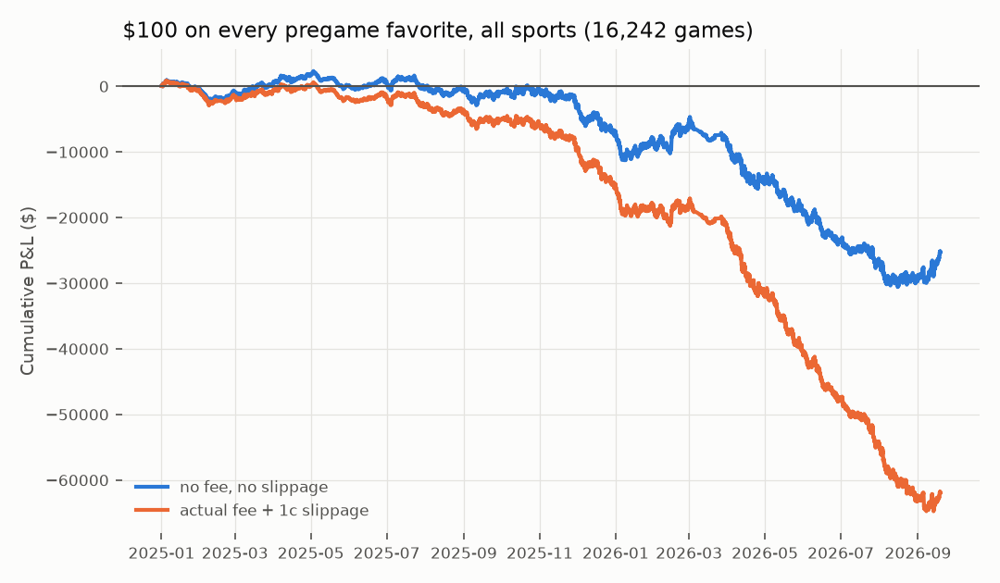

# Bet every pregame favorite and hold to the end (all sports)

16,242 games, 2025-01-01 to 2026-09-18: Polymarket sports moneylines with >= $25,000 of taker volume *before* the start (selection uses no post-start information). Pregame price = median fill in the last 10 minutes before the start. ROI is per $1 staked; `actual fee` = the market's own taker fee (0 in 2025, 3-5% in 2026) plus 1c slippage; `5pct` = today's 5% sports fee on every game. `*_at_ask` columns price each bet at the median price takers actually *paid* for that side in the last 10 minutes (executable), with the actual fee and no extra slippage; the underdog columns are the mirror bet (two-way markets).

**Headline:** favorites won **61.8%** of games at an average price of **62.7%**. Holding every favorite to the end returned **-1.55%** per $1 before costs and **-3.81%** after the fees actually charged plus 1c (**-4.87%** at today's 5% fee). $100 on every game = **$-61,886** total.

## Overall

| scope   |   games |   avg_fav_price |   fav_win_rate |   gap_win_minus_price |   roi_no_fee_no_slip | roi_no_fee_ci   |   roi_actual_fee_1c |   roi_5pct_fee_1c | roi_5pct_ci    |   pnl_$100_per_game_actual_fee |   fav_roi_at_ask_actual_fee | fav_at_ask_ci   |   underdog_roi_at_ask_actual_fee | underdog_at_ask_ci   |
|:--------|--------:|----------------:|---------------:|----------------------:|---------------------:|:----------------|--------------------:|------------------:|:---------------|-------------------------------:|----------------------------:|:----------------|---------------------------------:|:---------------------|
| ALL     |   16242 |           0.627 |          0.618 |                -0.009 |               -0.016 | -0.028..-0.003  |              -0.038 |            -0.049 | -0.060..-0.037 |                     -61886.175 |                      -0.028 | -0.041..-0.016  |                           -0.007 | -0.034..+0.018       |

### Why not all 32k games? A selection trap

Selecting on *total* volume (>= $50k, which includes in-play trading) makes underdogs look profitable, because upsets draw more in-play volume and thin markets clear the cut more often when the underdog wins. The underdog edge on that sample grows with total volume (+2% at $100-250k up to +22% at $5M+) and vanishes (-2% to -3%) once games are selected on pregame volume only. Biased full sample, for reference:

| scope   |   games |   avg_fav_price |   fav_win_rate |   gap_win_minus_price |   roi_no_fee_no_slip | roi_no_fee_ci   |   roi_actual_fee_1c |   roi_5pct_fee_1c | roi_5pct_ci    |   pnl_$100_per_game_actual_fee |   fav_roi_at_ask_actual_fee | fav_at_ask_ci   |   underdog_roi_at_ask_actual_fee | underdog_at_ask_ci   |
|:--------|--------:|----------------:|---------------:|----------------------:|---------------------:|:----------------|--------------------:|------------------:|:---------------|-------------------------------:|----------------------------:|:----------------|---------------------------------:|:---------------------|
| ALL     |   32729 |           0.632 |          0.615 |                -0.017 |               -0.018 | -0.027..-0.009  |              -0.042 |            -0.051 | -0.060..-0.043 |                    -136241.664 |                      -0.032 | -0.041..-0.023  |                            0.044 | +0.025..+0.064       |

## By sport

| family            |   games |   avg_fav_price |   fav_win_rate |   gap_win_minus_price |   roi_no_fee_no_slip | roi_no_fee_ci   |   roi_actual_fee_1c |   roi_5pct_fee_1c | roi_5pct_ci    |   pnl_$100_per_game_actual_fee |   fav_roi_at_ask_actual_fee | fav_at_ask_ci   |   underdog_roi_at_ask_actual_fee | underdog_at_ask_ci   |
|:------------------|--------:|----------------:|---------------:|----------------------:|---------------------:|:----------------|--------------------:|------------------:|:---------------|-------------------------------:|----------------------------:|:----------------|---------------------------------:|:---------------------|
| american_football |     845 |           0.685 |          0.686 |                 0.001 |                0.001 | -0.049..+0.047  |              -0.015 |            -0.029 | -0.077..+0.015 |                      -1292.907 |                      -0.007 | -0.054..+0.043  |                           -0.042 | -0.155..+0.068       |
| baseball          |    2626 |           0.573 |          0.551 |                -0.022 |               -0.038 | -0.072..-0.006  |              -0.064 |            -0.074 | -0.107..-0.044 |                     -16682.512 |                      -0.053 | -0.086..-0.020  |                            0.020 | -0.024..+0.065       |
| basketball        |    2544 |           0.684 |          0.686 |                 0.003 |                0.006 | -0.021..+0.034  |              -0.011 |            -0.024 | -0.050..+0.003 |                      -2776.493 |                      -0.002 | -0.030..+0.026  |                           -0.041 | -0.103..+0.022       |
| cricket           |     166 |           0.659 |          0.654 |                -0.006 |               -0.008 | -0.126..+0.102  |              -0.031 |            -0.040 | -0.153..+0.068 |                       -509.197 |                      -0.027 | -0.140..+0.086  |                           -0.037 | -0.264..+0.224       |
| esports           |    3058 |           0.663 |          0.655 |                -0.009 |               -0.014 | -0.039..+0.012  |              -0.037 |            -0.044 | -0.069..-0.019 |                     -11359.259 |                      -0.030 | -0.056..-0.005  |                            0.005 | -0.051..+0.063       |
| hockey            |    1569 |           0.589 |          0.570 |                -0.020 |               -0.036 | -0.077..+0.005  |              -0.053 |            -0.071 | -0.110..-0.031 |                      -8300.108 |                      -0.041 | -0.085..+0.000  |                            0.016 | -0.047..+0.078       |
| mma_boxing        |     168 |           0.651 |          0.601 |                -0.050 |               -0.076 | -0.194..+0.038  |              -0.096 |            -0.105 | -0.220..+0.004 |                      -1611.652 |                      -0.089 | -0.204..+0.028  |                            0.146 | -0.087..+0.391       |
| other             |      54 |           0.592 |          0.685 |                 0.093 |                0.158 | -0.068..+0.384  |               0.136 |             0.115 | -0.101..+0.330 |                        733.828 |                       0.153 | -0.072..+0.378  |                           -0.655 |                      |
| soccer            |    2980 |           0.554 |          0.548 |                -0.006 |               -0.012 | -0.047..+0.022  |              -0.040 |            -0.051 | -0.085..-0.019 |                     -11918.596 |                      -0.026 | -0.063..+0.006  |                           -0.067 |                      |
| tennis            |    2232 |           0.677 |          0.670 |                -0.007 |               -0.012 | -0.041..+0.017  |              -0.037 |            -0.042 | -0.069..-0.013 |                      -8169.278 |                      -0.027 | -0.055..+0.003  |                           -0.030 | -0.108..+0.048       |

## By season

|   season |   games |   avg_fav_price |   fav_win_rate |   gap_win_minus_price |   roi_no_fee_no_slip | roi_no_fee_ci   |   roi_actual_fee_1c |   roi_5pct_fee_1c | roi_5pct_ci    |   pnl_$100_per_game_actual_fee |   fav_roi_at_ask_actual_fee | fav_at_ask_ci   |   underdog_roi_at_ask_actual_fee | underdog_at_ask_ci   |
|---------:|--------:|----------------:|---------------:|----------------------:|---------------------:|:----------------|--------------------:|------------------:|:---------------|-------------------------------:|----------------------------:|:----------------|---------------------------------:|:---------------------|
|     2025 |    5191 |           0.644 |          0.636 |                -0.008 |               -0.014 | -0.035..+0.009  |              -0.029 |            -0.045 | -0.066..-0.024 |                     -15081.768 |                      -0.020 | -0.042..+0.002  |                           -0.009 | -0.051..+0.034       |
|     2026 |   11051 |           0.620 |          0.610 |                -0.010 |               -0.016 | -0.032..-0.001  |              -0.042 |            -0.050 | -0.065..-0.035 |                     -46804.407 |                      -0.032 | -0.047..-0.017  |                           -0.007 | -0.038..+0.028       |

## By how big a favorite (two-way markets)

| bucket        |   games |   avg_fav_price |   fav_win_rate |   gap_win_minus_price |   roi_no_fee_no_slip | roi_no_fee_ci   |   roi_actual_fee_1c |   roi_5pct_fee_1c | roi_5pct_ci    |   pnl_$100_per_game_actual_fee |   fav_roi_at_ask_actual_fee | fav_at_ask_ci   |   underdog_roi_at_ask_actual_fee | underdog_at_ask_ci   |
|:--------------|--------:|----------------:|---------------:|----------------------:|---------------------:|:----------------|--------------------:|------------------:|:---------------|-------------------------------:|----------------------------:|:----------------|---------------------------------:|:---------------------|
| (0.499, 0.55] |    3258 |           0.526 |          0.512 |                -0.014 |               -0.026 | -0.057..+0.004  |              -0.052 |            -0.066 | -0.096..-0.037 |                     -17035.690 |                      -0.040 | -0.070..-0.009  |                            0.007 | -0.028..+0.043       |
| (0.55, 0.6]   |    2964 |           0.577 |          0.566 |                -0.011 |               -0.019 | -0.050..+0.009  |              -0.043 |            -0.056 | -0.085..-0.028 |                     -12810.600 |                      -0.033 | -0.063..-0.002  |                            0.004 | -0.037..+0.044       |
| (0.6, 0.65]   |    1975 |           0.627 |          0.610 |                -0.017 |               -0.027 | -0.062..+0.006  |              -0.049 |            -0.060 | -0.093..-0.028 |                      -9589.367 |                      -0.040 | -0.072..-0.006  |                            0.016 | -0.043..+0.072       |
| (0.65, 0.7]   |    1497 |           0.677 |          0.673 |                -0.004 |               -0.007 | -0.044..+0.028  |              -0.027 |            -0.036 | -0.072..-0.003 |                      -3991.349 |                      -0.020 | -0.055..+0.016  |                           -0.017 | -0.089..+0.056       |
| (0.7, 0.75]   |    1118 |           0.728 |          0.734 |                 0.007 |                0.009 | -0.027..+0.044  |              -0.009 |            -0.018 | -0.052..+0.017 |                      -1025.197 |                       0.001 | -0.034..+0.035  |                           -0.062 | -0.153..+0.032       |
| (0.75, 0.8]   |     842 |           0.779 |          0.764 |                -0.015 |               -0.018 | -0.054..+0.019  |              -0.034 |            -0.041 | -0.076..-0.005 |                      -2889.839 |                      -0.030 | -0.064..+0.006  |                            0.034 | -0.083..+0.156       |
| (0.8, 0.9]    |    1168 |           0.850 |          0.843 |                -0.007 |               -0.009 | -0.033..+0.015  |              -0.023 |            -0.027 | -0.051..-0.004 |                      -2630.649 |                      -0.016 | -0.040..+0.007  |                           -0.029 | -0.166..+0.107       |
| (0.9, 1.0]    |     410 |           0.938 |          0.941 |                 0.004 |                0.004 | -0.019..+0.028  |              -0.007 |            -0.009 | -0.032..+0.014 |                       -305.944 |                      -0.000 | -0.027..+0.023  |                           -0.164 | -0.517..+0.231       |

## Two-way vs three-way (soccer, draw loses)

| kind               |   games |   avg_fav_price |   fav_win_rate |   gap_win_minus_price |   roi_no_fee_no_slip | roi_no_fee_ci   |   roi_actual_fee_1c |   roi_5pct_fee_1c | roi_5pct_ci    |   pnl_$100_per_game_actual_fee |   fav_roi_at_ask_actual_fee | fav_at_ask_ci   |   underdog_roi_at_ask_actual_fee | underdog_at_ask_ci   |
|:-------------------|--------:|----------------:|---------------:|----------------------:|---------------------:|:----------------|--------------------:|------------------:|:---------------|-------------------------------:|----------------------------:|:----------------|---------------------------------:|:---------------------|
| 3-way (draw loses) |    3010 |           0.553 |          0.549 |                -0.005 |               -0.010 | -0.045..+0.025  |              -0.039 |            -0.050 | -0.083..-0.016 |                     -11607.541 |                      -0.025 | -0.057..+0.010  |                          nan     |                      |
| two-way            |   13232 |           0.644 |          0.634 |                -0.010 |               -0.017 | -0.030..-0.003  |              -0.038 |            -0.048 | -0.061..-0.035 |                     -50278.634 |                      -0.029 | -0.042..-0.015  |                           -0.007 | -0.034..+0.018       |
