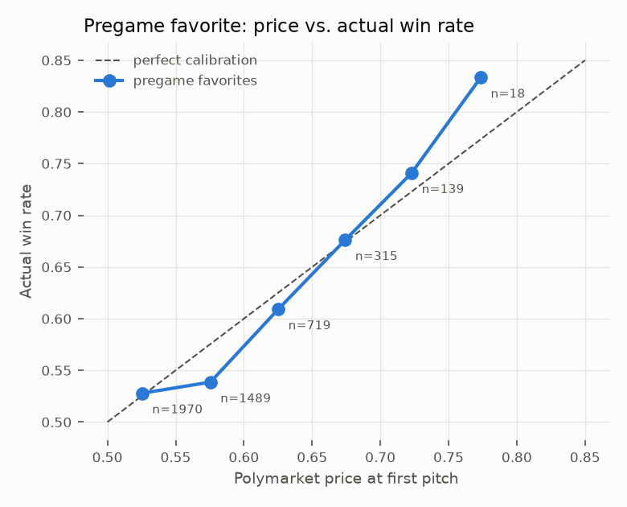
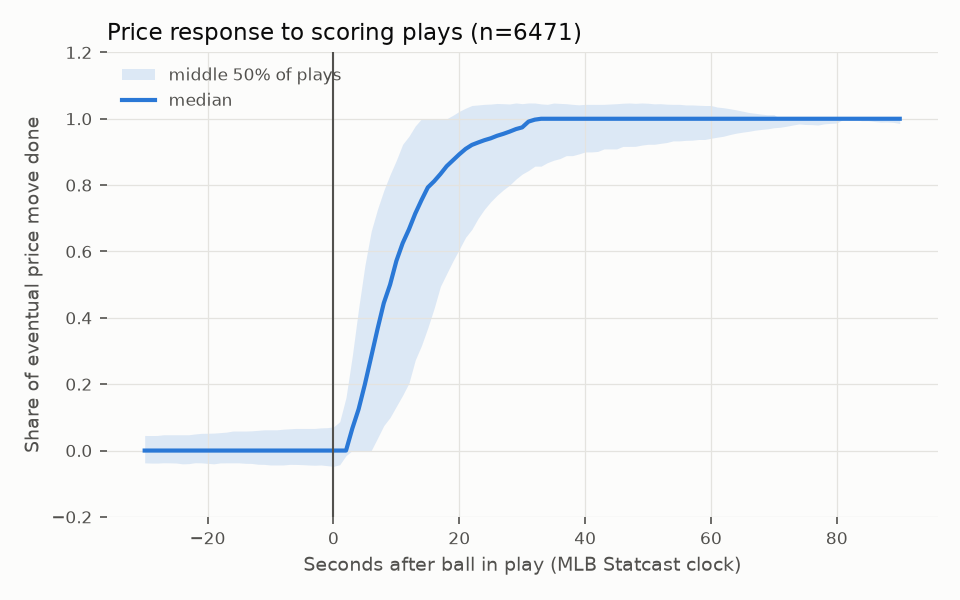

# MLB hypothesis report (2026-09-23)

Corrected historical research; the evaluated history has already been explored. No result here proves an executable or prospective trading edge. Generated by `python -m pmsports report`.

## Data and timing

- 4,650 pregame price/outcome observations; 267,781 game states and 60,301 half-inning checkpoints.
- Descriptive baseline: 14,379 games, seasons 2021–2026.
- State references use raw transaction timestamps strictly before the decision; H2/H3 require a reference no older than 120 seconds. Terminal and phantom duplicate states are removed.
- H3 entries require the first later acquired-side print strictly after five seconds and before state expiry; printed size and a $100 fee-inclusive game cap limit allocation. Failed and partial entries remain counted. The five seconds start at a retrospective play clock: actual receipt latency and available book depth are unknown.

## H1 — Pregame calibration

Descriptive pregame-price calibration and synthetic cost sensitivities; no available quote/size is established.

Favorites won 56.2% at mean reference probability 57.4%. Calibration slope 0.85 (standard error 0.08), intercept +0.034; market Brier 0.2434.

| bucket        |   games |   implied |   actual | ci95        |   actual_minus_implied |
|:--------------|--------:|----------:|---------:|:------------|-----------------------:|
| (0.499, 0.55] |    1970 |     0.525 |    0.528 | 0.506-0.550 |                  0.002 |
| (0.55, 0.6]   |    1489 |     0.575 |    0.539 | 0.513-0.564 |                 -0.037 |
| (0.6, 0.65]   |     719 |     0.625 |    0.609 | 0.573-0.644 |                 -0.016 |
| (0.65, 0.7]   |     315 |     0.674 |    0.676 | 0.623-0.725 |                  0.002 |
| (0.7, 0.75]   |     139 |     0.723 |    0.741 | 0.662-0.807 |                  0.018 |
| (0.75, 1.0]   |      18 |     0.774 |    0.833 | 0.608-0.942 |                  0.060 |

|   season |   games |   fav_price |   fav_win |
|---------:|--------:|------------:|----------:|
|     2025 |    2363 |       0.579 |     0.559 |
|     2026 |    2287 |       0.568 |     0.564 |

Synthetic equal-dollar reference-price benchmarks follow. Their `bets` column counts observations, not executable fills. Zero/5% fee-rate and 0/1c adjustments are explicit cost scenarios, not per-contract historical fees or evidence of available depth. See [FAVORITES.md](FAVORITES.md) for later-print, size-limited execution.

| strategy     | fee           |   slippage |   bets |   win_rate |   avg_price |   roi_per_$ | roi_ci95         |
|:-------------|:--------------|-----------:|-------:|-----------:|------------:|------------:|:-----------------|
| bet favorite | no fee        |      0.000 |   4650 |      0.562 |       0.574 |      -0.021 | -0.048 to +0.003 |
| bet favorite | no fee        |      0.010 |   4650 |      0.562 |       0.574 |      -0.038 | -0.064 to -0.014 |
| bet favorite | 5% sports fee |      0.000 |   4650 |      0.562 |       0.574 |      -0.042 | -0.068 to -0.018 |
| bet favorite | 5% sports fee |      0.010 |   4650 |      0.562 |       0.574 |      -0.058 | -0.083 to -0.034 |
| bet underdog | no fee        |      0.000 |   4650 |      0.438 |       0.426 |       0.030 | -0.004 to +0.065 |
| bet underdog | no fee        |      0.010 |   4650 |      0.438 |       0.426 |       0.006 | -0.027 to +0.041 |
| bet underdog | 5% sports fee |      0.000 |   4650 |      0.438 |       0.426 |       0.001 | -0.032 to +0.036 |
| bet underdog | 5% sports fee |      0.010 |   4650 |      0.438 |       0.426 |      -0.022 | -0.054 to +0.012 |
| bet home     | no fee        |      0.000 |   4650 |      0.536 |       0.532 |       0.011 | -0.017 to +0.038 |
| bet home     | no fee        |      0.010 |   4650 |      0.536 |       0.532 |      -0.008 | -0.035 to +0.019 |
| bet home     | 5% sports fee |      0.000 |   4650 |      0.536 |       0.532 |      -0.012 | -0.039 to +0.014 |
| bet home     | 5% sports fee |      0.010 |   4650 |      0.536 |       0.532 |      -0.030 | -0.057 to -0.004 |
| bet away     | no fee        |      0.000 |   4650 |      0.464 |       0.468 |      -0.003 | -0.034 to +0.029 |
| bet away     | no fee        |      0.010 |   4650 |      0.464 |       0.468 |      -0.025 | -0.055 to +0.007 |
| bet away     | 5% sports fee |      0.000 |   4650 |      0.464 |       0.468 |      -0.029 | -0.059 to +0.002 |
| bet away     | 5% sports fee |      0.010 |   4650 |      0.464 |       0.468 |      -0.049 | -0.079 to -0.019 |

## H2 — Prices and outcomes by state

The first table describes historical win frequencies, including the evaluated season; it is not a causal forecasting model. Trading rules use strictly prior seasons. Rows are the inning about to start; columns are absolute lead (six means six or more).

|   inning |     1 |     2 |     3 |     4 |     5 |     6 |
|---------:|------:|------:|------:|------:|------:|------:|
|        2 | 0.617 | 0.733 | 0.821 | 0.864 | 0.866 | 0.92  |
|        3 | 0.63  | 0.749 | 0.81  | 0.875 | 0.937 | 0.948 |
|        4 | 0.638 | 0.758 | 0.831 | 0.902 | 0.92  | 0.969 |
|        5 | 0.669 | 0.776 | 0.851 | 0.925 | 0.922 | 0.99  |
|        6 | 0.678 | 0.803 | 0.877 | 0.929 | 0.961 | 0.988 |
|        7 | 0.711 | 0.843 | 0.911 | 0.952 | 0.979 | 0.992 |
|        8 | 0.758 | 0.881 | 0.946 | 0.971 | 0.984 | 0.997 |
|        9 | 0.855 | 0.935 | 0.98  | 0.991 | 0.995 | 0.999 |

The market table compares outcomes and prices on the same priced, non-stale observations. Residual confidence intervals resample whole games. These descriptive, overlapping cells do not provide independent confirmatory significance tests.

|   inning |   lead |        n |   mkt_mean |   mkt_std |   mkt_p10 |   mkt_p90 |   actual_win |   edge_actual_minus_mkt |   residual_ci_lo |   residual_ci_hi |   baseline_win |
|---------:|-------:|---------:|-----------:|----------:|----------:|----------:|-------------:|------------------------:|-----------------:|-----------------:|---------------:|
|    2.000 |  1.000 | 1012.000 |      0.612 |     0.097 |     0.490 |     0.730 |        0.612 |                  -0.000 |           -0.030 |            0.031 |          0.617 |
|    2.000 |  2.000 |  451.000 |      0.713 |     0.092 |     0.590 |     0.830 |        0.732 |                   0.019 |           -0.023 |            0.059 |          0.733 |
|    2.000 |  3.000 |  245.000 |      0.796 |     0.071 |     0.700 |     0.880 |        0.816 |                   0.020 |           -0.029 |            0.070 |          0.821 |
|    2.000 |  4.000 |   80.000 |      0.857 |     0.055 |     0.790 |     0.920 |        0.850 |                  -0.007 |           -0.096 |            0.071 |          0.864 |
|    3.000 |  1.000 | 1146.000 |      0.623 |     0.092 |     0.510 |     0.740 |        0.620 |                  -0.004 |           -0.032 |            0.024 |          0.630 |
|    3.000 |  2.000 |  601.000 |      0.728 |     0.081 |     0.630 |     0.830 |        0.755 |                   0.027 |           -0.007 |            0.061 |          0.749 |
|    3.000 |  3.000 |  321.000 |      0.811 |     0.067 |     0.720 |     0.900 |        0.801 |                  -0.010 |           -0.054 |            0.032 |          0.810 |
|    3.000 |  4.000 |  155.000 |      0.876 |     0.049 |     0.810 |     0.930 |        0.871 |                  -0.005 |           -0.060 |            0.045 |          0.875 |
|    3.000 |  5.000 |  101.000 |      0.913 |     0.041 |     0.870 |     0.960 |        0.970 |                   0.057 |            0.022 |            0.086 |          0.937 |
|    3.000 |  6.000 |   99.000 |      0.950 |     0.023 |     0.920 |     0.980 |        0.960 |                   0.009 |           -0.032 |            0.043 |          0.948 |
|    4.000 |  1.000 | 1103.000 |      0.630 |     0.083 |     0.520 |     0.730 |        0.610 |                  -0.020 |           -0.050 |            0.008 |          0.638 |
|    4.000 |  2.000 |  676.000 |      0.739 |     0.080 |     0.640 |     0.840 |        0.749 |                   0.009 |           -0.022 |            0.042 |          0.758 |
|    4.000 |  3.000 |  430.000 |      0.830 |     0.059 |     0.750 |     0.900 |        0.814 |                  -0.016 |           -0.054 |            0.020 |          0.831 |
|    4.000 |  4.000 |  243.000 |      0.891 |     0.043 |     0.830 |     0.940 |        0.893 |                   0.002 |           -0.038 |            0.041 |          0.902 |
|    4.000 |  5.000 |  159.000 |      0.932 |     0.029 |     0.900 |     0.962 |        0.943 |                   0.011 |           -0.025 |            0.044 |          0.920 |
|    4.000 |  6.000 |  161.000 |      0.956 |     0.022 |     0.930 |     0.986 |        0.969 |                   0.013 |           -0.018 |            0.037 |          0.969 |
|    5.000 |  1.000 | 1044.000 |      0.645 |     0.079 |     0.549 |     0.749 |        0.660 |                   0.015 |           -0.014 |            0.043 |          0.669 |
|    5.000 |  2.000 |  724.000 |      0.763 |     0.069 |     0.670 |     0.843 |        0.771 |                   0.008 |           -0.023 |            0.040 |          0.776 |
|    5.000 |  3.000 |  425.000 |      0.847 |     0.069 |     0.780 |     0.910 |        0.824 |                  -0.024 |           -0.060 |            0.012 |          0.851 |
|    5.000 |  4.000 |  301.000 |      0.909 |     0.034 |     0.860 |     0.950 |        0.940 |                   0.031 |            0.003 |            0.058 |          0.925 |
|    5.000 |  5.000 |  185.000 |      0.940 |     0.026 |     0.910 |     0.970 |        0.924 |                  -0.016 |           -0.055 |            0.019 |          0.922 |
|    5.000 |  6.000 |  250.000 |      0.969 |     0.034 |     0.950 |     0.990 |        0.984 |                   0.015 |           -0.000 |            0.028 |          0.990 |
|    6.000 |  1.000 |  934.000 |      0.664 |     0.081 |     0.570 |     0.760 |        0.657 |                  -0.006 |           -0.037 |            0.023 |          0.678 |
|    6.000 |  2.000 |  710.000 |      0.788 |     0.063 |     0.705 |     0.860 |        0.811 |                   0.023 |           -0.006 |            0.051 |          0.803 |
|    6.000 |  3.000 |  499.000 |      0.866 |     0.052 |     0.800 |     0.920 |        0.882 |                   0.016 |           -0.014 |            0.043 |          0.877 |
|    6.000 |  4.000 |  360.000 |      0.927 |     0.027 |     0.890 |     0.960 |        0.939 |                   0.012 |           -0.013 |            0.035 |          0.929 |
|    6.000 |  5.000 |  253.000 |      0.951 |     0.020 |     0.930 |     0.972 |        0.949 |                  -0.003 |           -0.032 |            0.022 |          0.961 |
|    6.000 |  6.000 |  278.000 |      0.975 |     0.021 |     0.950 |     0.992 |        0.986 |                   0.011 |           -0.005 |            0.023 |          0.988 |
|    7.000 |  1.000 |  858.000 |      0.700 |     0.076 |     0.590 |     0.790 |        0.713 |                   0.014 |           -0.018 |            0.044 |          0.711 |
|    7.000 |  2.000 |  708.000 |      0.821 |     0.062 |     0.740 |     0.890 |        0.855 |                   0.034 |            0.007 |            0.058 |          0.843 |
|    7.000 |  3.000 |  511.000 |      0.897 |     0.040 |     0.840 |     0.940 |        0.910 |                   0.013 |           -0.012 |            0.037 |          0.911 |
|    7.000 |  4.000 |  389.000 |      0.941 |     0.026 |     0.910 |     0.970 |        0.961 |                   0.020 |            0.001 |            0.038 |          0.952 |
|    7.000 |  5.000 |  260.000 |      0.964 |     0.019 |     0.940 |     0.980 |        0.965 |                   0.001 |           -0.024 |            0.021 |          0.979 |
|    7.000 |  6.000 |  313.000 |      0.980 |     0.029 |     0.962 |     0.994 |        0.984 |                   0.004 |           -0.011 |            0.017 |          0.992 |
|    8.000 |  1.000 |  838.000 |      0.749 |     0.070 |     0.660 |     0.830 |        0.761 |                   0.012 |           -0.017 |            0.040 |          0.758 |
|    8.000 |  2.000 |  698.000 |      0.869 |     0.050 |     0.800 |     0.920 |        0.868 |                  -0.001 |           -0.027 |            0.023 |          0.881 |
|    8.000 |  3.000 |  525.000 |      0.930 |     0.032 |     0.890 |     0.960 |        0.950 |                   0.021 |            0.001 |            0.038 |          0.946 |
|    8.000 |  4.000 |  385.000 |      0.959 |     0.030 |     0.930 |     0.980 |        0.966 |                   0.008 |           -0.012 |            0.025 |          0.971 |
|    8.000 |  5.000 |  250.000 |      0.976 |     0.017 |     0.960 |     0.990 |        0.992 |                   0.016 |            0.002 |            0.025 |          0.984 |
|    8.000 |  6.000 |  302.000 |      0.987 |     0.008 |     0.977 |     0.994 |        0.993 |                   0.006 |           -0.004 |            0.014 |          0.997 |
|    9.000 |  1.000 |  792.000 |      0.830 |     0.071 |     0.739 |     0.900 |        0.855 |                   0.025 |            0.000 |            0.049 |          0.855 |
|    9.000 |  2.000 |  665.000 |      0.921 |     0.042 |     0.870 |     0.960 |        0.925 |                   0.004 |           -0.017 |            0.024 |          0.935 |
|    9.000 |  3.000 |  529.000 |      0.960 |     0.033 |     0.930 |     0.988 |        0.979 |                   0.019 |            0.006 |            0.030 |          0.980 |
|    9.000 |  4.000 |  329.000 |      0.979 |     0.016 |     0.960 |     0.991 |        0.991 |                   0.012 |           -0.000 |            0.021 |          0.991 |
|    9.000 |  5.000 |  210.000 |      0.987 |     0.009 |     0.979 |     0.994 |        1.000 |                   0.013 |            0.012 |            0.014 |          0.995 |
|    9.000 |  6.000 |  160.000 |      0.991 |     0.005 |     0.987 |     0.995 |        0.988 |                  -0.003 |           -0.022 |            0.010 |          0.999 |

## H3 — Model-versus-market settlement tests

Training before 2026-01-01: 2,358 games/115,064 states. Historical evaluation: 2,210 games/152,683 states. Each training state's baseline rate excludes that state's season; the evaluation baseline is frozen before the split year. Logistic inputs are baseline expectancy, pregame price and game progress.

| predictor                                 |   log_loss |   brier |
|:------------------------------------------|-----------:|--------:|
| causal pre-decision transaction reference |     0.4948 |  0.1662 |
| model (pregame price + state)             |     0.4977 |  0.1667 |
| baseline win expectancy only              |     0.5007 |  0.1678 |
| pregame price only                        |     0.6860 |  0.2465 |

Descriptive evaluation-set stacking coefficient on model-minus-market: +0.358, game-clustered standard error 0.067. This fitted diagnostic is not a deployed trading rule.

First eligible signal per game at each declared threshold; later-print entry plus 1c sensitivity and actual contract fee; settlement exit. ROI divides total P&L by actual allocated capital.

|   threshold | fee               |   signals |   bets |   unfilled |   partial |   win_rate |   avg_price_paid |   capital_usd |   pnl_usd |   roi_per_$ | roi_ci95         |
|------------:|:------------------|----------:|-------:|-----------:|----------:|-----------:|-----------------:|--------------:|----------:|------------:|:-----------------|
|       0.020 | historical actual |      2210 |   2037 |        173 |      1741 |      0.488 |            0.496 |     51248.834 | -4816.813 |      -0.094 | -0.167 to -0.022 |
|       0.040 | historical actual |      2208 |   2045 |        163 |      1769 |      0.482 |            0.486 |     49746.365 | -3019.865 |      -0.061 | -0.142 to +0.019 |
|       0.060 | historical actual |      2204 |   2071 |        133 |      1841 |      0.504 |            0.501 |     44409.375 | -2170.740 |      -0.049 | -0.128 to +0.034 |
|       0.080 | historical actual |      2144 |   2043 |        101 |      1846 |      0.506 |            0.510 |     40987.590 | -3226.656 |      -0.079 | -0.158 to +0.003 |
|       0.100 | historical actual |      1972 |   1903 |         69 |      1712 |      0.524 |            0.521 |     39049.334 | -1221.860 |      -0.031 | -0.114 to +0.056 |

The historical cell-average rule below uses training-period mean/std by inning, half, score difference and pregame price bucket. It holds to settlement. The requested literal exit at the mean is tested separately against received book depth in [LIVE_EXECUTION.md](research/LIVE_EXECUTION.md).

|   k_std | fee               |   signals |   bets |   unfilled |   win_rate |   avg_price_paid |   capital_usd |   pnl_usd |   roi_per_$ | roi_ci95         |
|--------:|:------------------|----------:|-------:|-----------:|-----------:|-----------------:|--------------:|----------:|------------:|:-----------------|
|   1.000 | historical actual |      2180 |   1998 |        182 |      0.445 |            0.463 |     41994.687 | -3226.926 |      -0.077 | -0.162 to +0.008 |
|   1.500 | historical actual |      2014 |   1925 |         89 |      0.464 |            0.475 |     38425.912 |  -683.953 |      -0.018 | -0.111 to +0.077 |
|   2.000 | historical actual |      1622 |   1567 |         55 |      0.493 |            0.511 |     31234.137 |  -903.382 |      -0.029 | -0.116 to +0.061 |

Optimistic5s from retrospective state clock; receipt latency and actual book unknown. Settlement exits only; no literal mean-reversion exit tested.

## H4 — Retrospective price response

This descriptive event study selects scoring events with a subsequent price move. It compares retrospective Statcast contact times with transaction timestamps shifted 2.5 seconds earlier using an estimated chain lag. That shift is not used for H3 execution. A stale historical print does not prove liquidity remained for a newly submitted order. Actual received-feed/book timing and hypothetical depth-crossing P&L are reported separately in [LIVE_EXECUTION.md](research/LIVE_EXECUTION.md).

| events            |    n |   median move |   t50 median (s) |   t50 p90 (s) |   t90 median (s) |
|:------------------|-----:|--------------:|-----------------:|--------------:|-----------------:|
| all scoring plays | 6471 |          0.12 |              7   |          27.1 |             14.7 |
| home runs         | 2133 |          0.14 |              6.7 |          26.8 |             12.1 |

| seconds after contact   | all scoring plays: share of plays with a stale fill   | home runs: share of plays with a stale fill   |
|:------------------------|:------------------------------------------------------|:----------------------------------------------|
| 0-5s                    | 49.8%                                                 | 55.7%                                         |
| 5-10s                   | 19.1%                                                 | 21.4%                                         |
| 10-20s                  | 10.1%                                                 | 10.8%                                         |
| 20-30s                  | 2.1%                                                  | 1.6%                                          |
| 30-45s                  | 0.7%                                                  | 0.7%                                          |
| 45-60s                  | 0.2%                                                  | 0.2%                                          |

## Limits

The corpus has legacy volume/window selection and incomplete market coverage. Reference transactions are not order-book asks/bids. Next-state expiry is analytical censoring, not verified cancellation during a sports order delay. Unknown fees fail closed in execution. H1 synthetic scenarios are separate from H3's recovered contract-specific historical fees. Nominal intervals do not correct for the many already inspected variants. No live orders were placed.
